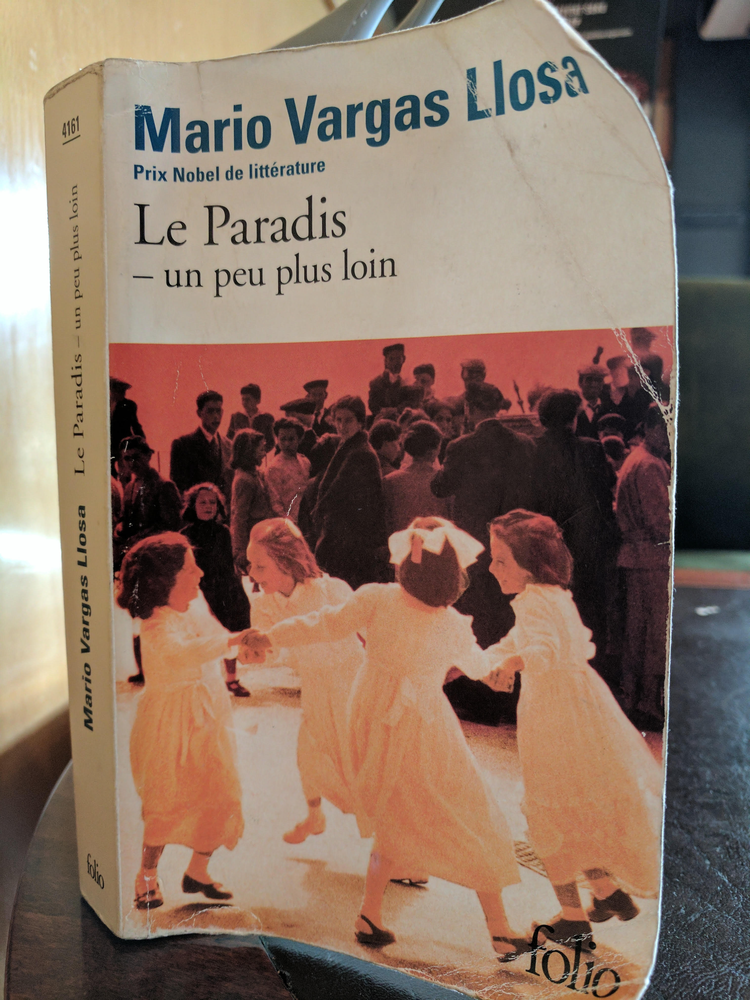

% (At Least) 12 Books in 12 Months - 2017
% Rushi Shah
% 1 April 2017

<link href="https://afeld.github.io/emoji-css/emoji.css" rel="stylesheet">

#(At Least) 12 Books in 12 Months - 2017

### *Anna Karenina* by Leo Tolstoy (January)

> "Another row, and yet another row, followed—long rows and short rows,
with good grass and with poor grass. Levin lost all sense of time, and
could not have told whether it was late or early now. A change began to
come over his work, which gave him immense satisfaction. In the midst of
his toil there were moments during which he forgot what he was doing,
and it came all easy to him, and at those same moments his row was
almost as smooth and well cut as Tit’s. But so soon as he recollected
what he was doing, and began trying to do better, he was at once
conscious of all the difficulty of his task, and the row was badly mown."   (Part III, Chapter 4)

I actually consumed this book as an audio-book and boy was it long. It was a 27 hour long audiobook and I listened at 1.8 or 2 times speed depending on how much background noise I was around. While I was reading I felt like ther wasn't much happening but as I went back and looked for quotes I liked I realized that the book covered a lot of ground. Tolstoy was able to weave in very interesting musings that were widely applicable in a way that never felt heavy-handed. The book was just about Russian high-society with affairs and communism and what-not that seemed designed to entertain the reader. And yet the seemingly straightforward plotline shadowed an intricate web of social, religious, interpersonal, and political commentary. I wasn't impressed at the time, but looking back I certainly am now.

### *L'Étranger* by Albert Camus (February)

> "Aujourd’hui, maman est morte. Ou peut-être hier, je ne sais pas. J’ai reçu un télégramme de l’asile : «Mère décédée. Enterrement demain. Sentiments distingués.» Cela ne veut rien dire. C’était peut-être hier."   (Chapter 1 - opening lines)

There's a bit of contreversary around the translation but I remember the first time I read the gist I got was something like this:

> "Today my mother died. Or maybe yesterday, I don't really know. I got a telegram from the hospice: 'Mom deceased. Burial tomorrow. Distinguished sentiments.' There's no way to know. It might have been yesterday."

I was supposed to read this book junior year of high-school for my AP French class, but I pretty much just spark-noted it. To this day I've felt bad about that so I decided to go back and give it another swing and I'm glad I did. I feel like the general interpretation of the book is that Mersault, the main character, is this depressed existential dude. But when I read the book for real I didn't get that sense.

In fact I think a central question of the book is "Is Mersault happy?". Most people would say no, or at the very least would say he shouldn't be. But I really think he is. Perhaps he shouldn't be, but I just can't bring myself to blame him for being so happy-go-lucky all the damn time. To me he just seemed like the literary embodiment of ¯\\\_(ツ)\_/¯. He's just out here living his life and I respect him for that. In fact I relate to him more than I would like to admit, and that is a very scary thought. [^footnote1]

[^footnote1]: It is possible that something just got lost in translation and I am completely misinterpreting the entire novel.

### *Slaughterhouse-Five* by Kurt Vonnegut (February Bonus Round!)

> "Over the years, people I’ve met have often asked me what I’m working on, and I’ve usually replied that the main thing was a book about Dresden.
  I said that to Harrison Starr, the movie-maker, one time, and he raised his eyebrows and inquired, ‘Is it an anti-war book?’
 ‘Yes,’ I said. ‘I guess.’
  ‘You know what I say to people when I hear they're writing anti-war books?’
  ‘No. What do you say, Harrison Starr?’
  ‘I say, “Why don't you write an anti-glacier book instead?”’
  What he meant, of course, was that there would always be wars, that they were as easy to stop as glaciers. I believe that too."
  (Chapter 1)

I was feeling a bit down and out reading the news all the time in light of Trump's legislative agenda so somehow I ended up with this book in my hands. It was weird and not at all what I expected. I don't really relate to Billy Pilgrim at all, but I do worry about how hard it is for me to find fault with the whole "so it goes" nonsense. The point of the book is to hyperbolize that mentality to demonstrate its flaws but I worry that I can't immediately recognize the flaws. So it goes.

### *Partials* by Dan Wells (March)

> "But I should have been with you," he said, his voice hard. "I should have been there to protect you. I love you, Kira."  
"I love you too," she said softly, but a voice in the back of her head said, *You didn't need to be protected*.
  (Chapter 19)

I participated in a Secret Santa gift exchange way back during the holiday season of 2016 and asked for a copy of my Secret Santa's favorite book. Luckily mine was [Smitha Nagar](https://www.linkedin.com/in/smitha-nagar-32434baa/) and she gave me a copy of this dystopian sci-fi book. It took me a while to get around to reading it and its not my typical genre but I definitely got into it by the end. With that being said, I really dislike reading books that make me sad (a personal flaw of mine I haven't gotten around to working on) and the beginning of this book was really hard for me to derive pleasure from reading. For the first few times I read a few chapters at a time I would put down the book and just feel a wave of exhaustion roll over me. But I'm really glad I got through it, I definitely think reading it was a valuable experience. In classic dystopian sci-fi series fashion the book ended on an intense cliff-hanger that made it really hard to not immediately go seek out the next book but thankfully I resisted the temptation.

### *I Am Malala* by Malala Yousafzai (April)

This book was given to me by one of my closest friends ([Shohini Gupta](https://www.linkedin.com/in/shohini-gupta)) as we both went off to college because I was always talking her ear off about feminism.

Being completely honest I had a bit of trouble getting into the book in the beginning.
<!-- I started it a while ago but it wasn't until I got about 150 pages in that I didn't just read a chapter at a time.  -->
It contained a lot of background factual information and I noticed as I read I would just end up concentrating on Malala the person and the fact that we're about the same age. I am not proud of this but I couldn't stop comparing myself to her.

I started the book a while ago and until about 100 pages in I didn't read more than about a chapter at a time. But when the book got good, it got really good. At some point Malala found her groove in her writing and that really shifted the reading experience. I picked up the book today at about 125 pages in and just finished all 300 something pages. Somewhere along the way I stopped just thinking about Malala's life and started to think about the ideas that were being presented. By the time I got to the climax of the book I felt genuine sadness not just because she was shot but because I understood the implications of her being shot. I comprehended how many factors are at play and how complicated the situation is and recognize how insurmountable everything seems but how critical it is for us to try to fix stuff anyways. And yes, I cried.

Blending what I was thinking earlier in the book with what I was thinking later in the book I was struck by a particular quote in the epiloge:

> "I don't want to be thought of as the 'girl who was shot by the Taliban' but 'the girl who fought for education'"
  (Epilogue)

As you can see from the picture this lies in a stark juxtaposition with the tagline on the front cover that says

>I Am Malala  
THE GIRL WHO STOOD UP FOR EDUCATION  
AND WAS SHOT BY THE TALIBAN

This dilemma is something I struggle with, too. How do you balance keeping it real and staying true to yourself with being realistic and doing what you need to do/saying what you need to say to get where you need to be? I think Malala genuinely wants to be remembered as "the girl who fought for education" but at the end of the day she doesn't necessarily get the final word. Although she can influence her legacy (the education thing was the first thing mentioned), she doesn't get to totally choose how she gets remembered. After all it would be unreasonable to not mention the fact that she was shot by the Taliban on the cover. But I still think its a damn shame that she doesn't get complete creative control over shaping her own narrative.

### *A Clockwork Orange* by Anthony Burgess (April Bonus Round!)

I read the original version of this book and later found out about the contreversary surrounding the last chapter. When it was published in America the publisher thought the book would sell better without the last chapter so they convinved the author to cut it out. I think this reflects classic American cognitive dissonance:

**This paragraph is about to contain spoilers so beware**. In a book that is about literal mind-control, they worry that readers won't be able to believe the protagonist ends the book as a "good-guy". The book is an inherently ridiculous work of fiction and THAT is the part that is unbelievable? Also the mindset that one can just entirely ignore chapters of a book if they don't like them, regardless of the role the chapters play in the overarching themes the author intended to convey. As my friend who recommended the book to me (Shamika Kurian) mentioned: taking out the last chapter turned the novel into just another (questionably) amusing sequence of events when it was really meant to be a coming-of-age story that explains the concept of growing up. **End spoilers**

Anyways I really really disliked the book ultra-violence in the book, it made me very uncomfortable and I stopped reading the book for a few months the first time I read twelve pages. But it was all redeemed by the last chapter so in the end I was satisfied.

### *Jane Eyre* by Charlotte Brontë (May)

Kind of like Anna Karenina I knew I wasn't going to pay as much attention to the details of this book if I didn't listen to it as an audiobook. Given a historical context for Charlotte Brontë's writing I suppose I shouldn't have been surprised, but I was underwhelmed with the feminist potential for the book. I have more thoughts (espeically about how frustrating St. John River's character was!), but I read this during my month-long backpacking trip through Spain, France, and Morrocco so I have not had much of a chance to write it all down.

### *Le Paradis - un peu plus loin* by Mario Vargas Llosa (June/July)

</img>

Mario Vargas Llosa (the 2010 Nobel Laureate for Literature) originally wrote this book in Spanish. I happened to stumble upon a French translation (by Albert Bensoussan) in a hostel book exchange in Granada. It's a fascinating double-biography on Paul Gauguin (the famous painter) and his great-grandmother Flora Tristan (an early contributor to feminist theory).

This was far-and-away the most challenging book I have ever read -- I picked it up honestly not expecting to finish it. Even in english it would be close to the top of my reading level (about 600 pages of biographical non-fiction literature) and on top of that I read it in a language that I don't natively speak. It is one of those books that would have been very easy for me to accidentally put down for a week only to never return to it. Around the turn of the month I was only about 300 pages through it so there was no way I could stay on track to complete it in the month of June. I decided that come hell or high water I was going to finish it anyways and decided to make it my June/July book to make sure I didn't rush through it. It is now July 21st and I am proud to say that I just finished the book last night <i class="em em-blush"></i>

Since its a double biography, the book is structured such that every other chapter is about one of the characters and covers a small event that happens in their life. Paul Gauguin's life-long quest was for painting master-pieces ("chef d'œuvres") and how THE masterpiece is always just slightly out of reach. Some of the notable paintings the book covers include [^footnote2]:

[^footnote2]: The pictures of Gauguin's work I posted are all from <a href="https://www.wikiart.org/en/paul-gauguin" style="font-size: 20px;">WikiArt</a>

<!-- 
 -->

<!-- 

 -->

Flora Tristan, on the other hand, dreams even bigger. She dedicates her life to creating a utopian worker's union (l'Union Ouvrier) that will join the feminist cause with the worker's cause. In order to do so she writes a few books and travels through France meeting factory workers trying to drum up support and idenitify leaders for local committees within the union.

Paul is the ultimate unredeemable character. He is so problematic I don't know where to begin. In fact, there's a whole book about how bad he is, in which you will find, among other things, tales of his numerous sexual escapades with 13 and 14 year old native girls. Although Paul isn't meant to be someone you respect at all, his character does offer one feel-good moral to the story. At 30 he had it all, a loving family, plenty of money, a stable job, etc. But he threw it all away when he discovered that the _only_ thing (other than drugs/sex/alcohol) he truly enjoyed was painting. Taking it to his extreme is definitely not the move, but his storyline certainly made me think about what it means to follow your passion.

Flora, on the other hand, is the ultimate redeemable character. Its not that she never did anything wrong (she probably didn't really love her biological daughter), but her motivations were consistently pure. Life threw just about every curveball at her it possibly could. For example, it was legally impossible for her to escape her crazy husband (the one molesting her daughter) until he decided to shoot her. But she just kept chugging along trying to solve the world's problems and all you wanted was for her to succeed. Which is sad because you know (spoiler alert!) her work did not solve societal sexism. Her storyline left me conflicted: with a sense of purpose and direction and motivation to fix the world through a sheer force of will, but also with a sense of pessimism that at the end of the day a sheer force of will can't be enough and there's nothing you can do about it.
