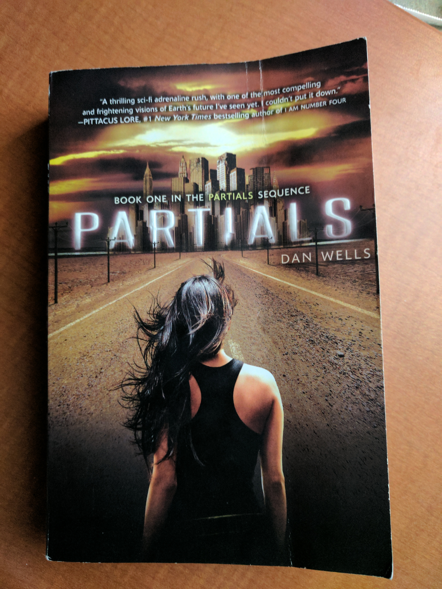

% (At Least) 12 Books in 12 Months - 2017
% Rushi Shah
% 1 April 2017

#(At Least) 12 Books in 12 Months - 2017

### *Anna Karenina* by Leo Tolstoy (January)

> "Another row, and yet another row, followed—long rows and short rows,
with good grass and with poor grass. Levin lost all sense of time, and
could not have told whether it was late or early now. A change began to
come over his work, which gave him immense satisfaction. In the midst of
his toil there were moments during which he forgot what he was doing,
and it came all easy to him, and at those same moments his row was
almost as smooth and well cut as Tit’s. But so soon as he recollected
what he was doing, and began trying to do better, he was at once
conscious of all the difficulty of his task, and the row was badly mown."   Part III, Chapter 4

I actually consumed this book as an audio-book and boy was it long. It was a 27 hour long audiobook and I listened at 1.8 or 2 times speed depending on how much background noise I was around. While I was reading I felt like ther wasn't much happening but as I went back and looked for quotes I liked I realized that the book covered a lot of ground. Tolstoy was able to weave in very interesting musings that were widely applicable in a way that never felt heavy-handed way. The book was just about Russian high-society with affairs and communism and what-not that seemed designed to entertain the reader. And yet the seemingly straightforward plotline shadowed an intricate web of social, religious, interpersonal, and political commentary. I wasn't impressed at the time, but looking back I certainly am now. 

### *L'Étranger* by Albert Camus (February)

> "Aujourd’hui, maman est morte. Ou peut-être hier, je ne sais pas. J’ai reçu un télégramme de
l’asile : « Mère décédée. Enterrement demain. Sentiments distingués. » Cela ne veut rien dire.
C’était peut-être hier."   Chapter 1 (opening lines)

There's a bit of contreversary around the translation but I remember the first time I read the gist I got was something like this:

> "Today my mother died. Or maybe yesterday, I don't really know. I got a telegram from the hospice: 'Mom deceased. Burial tomorrow. Distinguished sentiments.' There's no way to know. It might have been yesterday."

I was supposed to read this book junior year of high-school for my AP French class, but I pretty much just spark-noted it. To this day I've felt bad about that so I decided to go back and give it another swing and I'm glad I did. I feel like the general interpretation of the book is that Mersault, the main character, is this depressed existential dude. But when I read the book for real I didn't get that sense. 

In fact I think a central question of the book is "Is Mersault happy?". Most people would say no, or at the very least would say he shouldn't be. But I really think he is. Perhaps he shouldn't be, but I just can't bring myself to blame him for being so happy-go-lucky all the damn time. To me he just seemed like the literary embodiment of ¯\\\_(ツ)\_/¯. He's just out here living his life and I respect him for that. In fact I relate to him more than I would like to admit, and that is a very scary thought. [^footnote]

[^footnote]: It is possible that something just got lost in translation and I am completely misinterpreting the entire novel.

### *Slaughterhouse-Five* by Kurt Vonnegut (Bonus Round!)

> "Over the years, people I’ve met have often asked me what I’m working on, and I’ve usually replied that the main thing was a book about Dresden. 
  I said that to Harrison Starr, the movie-maker, one time, and he raised his eyebrows and inquired, ‘Is it an anti-war book?’
 ‘Yes,’ I said. ‘I guess.’
  ‘You know what I say to people when I hear they're writing anti-war books?’
  ‘No. What do you say, Harrison Starr?’
  ‘I say, “Why don't you write an anti-glacier book instead?”’
  What he meant, of course, was that there would always be wars, that they were as easy to stop as glaciers. I believe that too."
  Chapter 1

I was feeling a bit down and out reading the news all the time in light of Trump's legislative agenda so somehow I ended up with this book in my hands. It was weird and not at all what I expected. I don't really relate to Billy Pilgrim at all, but I do worry about how hard it is for me to find fault with the whole "so it goes" nonsense. The point of the book is to hyperbolize that mentality to demonstrate its flaws but I worry that I can't immediately recognize the flaws. So it goes. 

### *Partials* by Dan Wells (March)

> "But I should have been with you," he said, his voice hard. "I should have been there to protect you. I love you, Kira."  
"I love you too," she said softly, but a voice in the back of her head said, *You didn't need to be protected*.

I participated in a Secret Santa gift exchange way back during the holiday season of 2016 and asked for a copy of my Secret Santa's favorite book. Luckily mine was [Smitha Nagar](https://www.linkedin.com/in/smitha-nagar-32434baa/) and she gave me a copy of this dystopian sci-fi book. It took me a while to get around to reading it and its not my typical genre but I definitely got into it by the end. With that being said, I really dislike reading books that make me sad (a personal flaw of mine I haven't gotten around to working on) and the beginning of this book was really hard for me to derive pleasure from reading. For the first few times I read a few chapters at a time I would put down the book and just feel a wave of exhaustion roll over me. But I'm really glad I got through it, I definitely think reading it was a valuable experience.   

### *I Am Malala* by Malala Yousafzai (April - Planned)

In progress.
