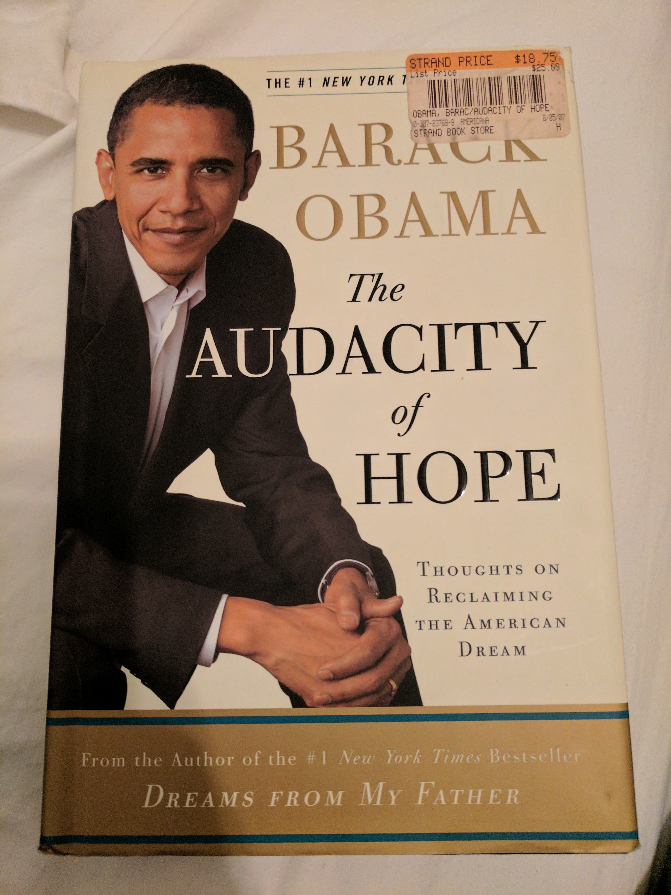
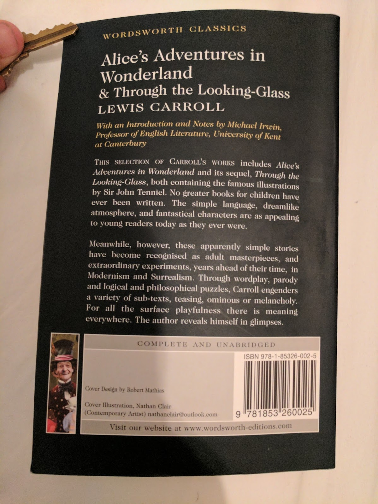

% (At Least) 12 Books in 12 Months - 2017
% Rushi Shah
% 1 April 2017

<link href="https://afeld.github.io/emoji-css/emoji.css" rel="stylesheet">

#(At Least) 12 Books in 12 Months - 2017

### *Anna Karenina* by Leo Tolstoy (January)

> "Another row, and yet another row, followed—long rows and short rows,
with good grass and with poor grass. Levin lost all sense of time, and
could not have told whether it was late or early now. A change began to
come over his work, which gave him immense satisfaction. In the midst of
his toil there were moments during which he forgot what he was doing,
and it came all easy to him, and at those same moments his row was
almost as smooth and well cut as Tit’s. But so soon as he recollected
what he was doing, and began trying to do better, he was at once
conscious of all the difficulty of his task, and the row was badly mown."   (Part III, Chapter 4)

I actually consumed this book as an audio-book and boy was it long. It was a 27 hour long audiobook and I listened at 1.8 or 2 times speed depending on how much background noise I was around. While I was reading I felt like ther wasn't much happening but as I went back and looked for quotes I liked I realized that the book covered a lot of ground. Tolstoy was able to weave in very interesting musings that were widely applicable in a way that never felt heavy-handed. The book was just about Russian high-society with affairs and communism and what-not that seemed designed to entertain the reader. And yet the seemingly straightforward plotline shadowed an intricate web of social, religious, interpersonal, and political commentary. I wasn't impressed at the time, but looking back I certainly am now.

### *L'Étranger* by Albert Camus (February)

> "Aujourd’hui, maman est morte. Ou peut-être hier, je ne sais pas. J’ai reçu un télégramme de l’asile : «Mère décédée. Enterrement demain. Sentiments distingués.» Cela ne veut rien dire. C’était peut-être hier."   (Chapter 1 - opening lines)

There's a bit of contreversary around the translation but I remember the first time I read the gist I got was something like this:

> "Today my mother died. Or maybe yesterday, I don't really know. I got a telegram from the hospice: 'Mom deceased. Burial tomorrow. Distinguished sentiments.' There's no way to know. It might have been yesterday."

I was supposed to read this book junior year of high-school for my AP French class, but I pretty much just spark-noted it. To this day I've felt bad about that so I decided to go back and give it another swing and I'm glad I did. I feel like the general interpretation of the book is that Mersault, the main character, is this depressed existential dude. But when I read the book for real I didn't get that sense.

In fact I think a central question of the book is "Is Mersault happy?". Most people would say no, or at the very least would say he shouldn't be. But I really think he is. Perhaps he shouldn't be, but I just can't bring myself to blame him for being so happy-go-lucky all the damn time. To me he just seemed like the literary embodiment of ¯\\\_(ツ)\_/¯. He's just out here living his life and I respect him for that. In fact I relate to him more than I would like to admit, and that is a very scary thought. [^footnote1]

[^footnote1]: It is possible that something just got lost in translation and I am completely misinterpreting the entire novel.

### *Slaughterhouse-Five* by Kurt Vonnegut (February Bonus Round!)

> "Over the years, people I’ve met have often asked me what I’m working on, and I’ve usually replied that the main thing was a book about Dresden.
  I said that to Harrison Starr, the movie-maker, one time, and he raised his eyebrows and inquired, ‘Is it an anti-war book?’
 ‘Yes,’ I said. ‘I guess.’
  ‘You know what I say to people when I hear they're writing anti-war books?’
  ‘No. What do you say, Harrison Starr?’
  ‘I say, “Why don't you write an anti-glacier book instead?”’
  What he meant, of course, was that there would always be wars, that they were as easy to stop as glaciers. I believe that too."
  (Chapter 1)

I was feeling a bit down and out reading the news all the time in light of Trump's legislative agenda so somehow I ended up with this book in my hands. It was weird and not at all what I expected. I don't really relate to Billy Pilgrim at all, but I do worry about how hard it is for me to find fault with the whole "so it goes" nonsense. The point of the book is to hyperbolize that mentality to demonstrate its flaws but I worry that I can't immediately recognize the flaws. So it goes.

### *Partials* by Dan Wells (March)

> "But I should have been with you," he said, his voice hard. "I should have been there to protect you. I love you, Kira."  
"I love you too," she said softly, but a voice in the back of her head said, *You didn't need to be protected*.
  (Chapter 19)

I participated in a Secret Santa gift exchange way back during the holiday season of 2016 and asked for a copy of my Secret Santa's favorite book. Luckily mine was [Smitha Nagar](https://www.linkedin.com/in/smitha-nagar-32434baa/) and she gave me a copy of this dystopian sci-fi book. It took me a while to get around to reading it and its not my typical genre but I definitely got into it by the end. With that being said, I really dislike reading books that make me sad (a personal flaw of mine I haven't gotten around to working on) and the beginning of this book was really hard for me to derive pleasure from reading. For the first few times I read a few chapters at a time I would put down the book and just feel a wave of exhaustion roll over me. But I'm really glad I got through it, I definitely think reading it was a valuable experience. In classic dystopian sci-fi series fashion the book ended on an intense cliff-hanger that made it really hard to not immediately go seek out the next book but thankfully I resisted the temptation.

### *I Am Malala* by Malala Yousafzai (April)

This book was given to me by one of my closest friends ([Shohini Gupta](https://www.linkedin.com/in/shohini-gupta)) as we both went off to college because I was always talking her ear off about feminism.

Being completely honest I had a bit of trouble getting into the book in the beginning.
<!-- I started it a while ago but it wasn't until I got about 150 pages in that I didn't just read a chapter at a time.  -->
It contained a lot of background factual information and I noticed as I read I would just end up concentrating on Malala the person and the fact that we're about the same age. I am not proud of this but I couldn't stop comparing myself to her.

I started the book a while ago and until about 100 pages in I didn't read more than about a chapter at a time. But when the book got good, it got really good. At some point Malala found her groove in her writing and that really shifted the reading experience. I picked up the book today at about 125 pages in and just finished all 300 something pages. Somewhere along the way I stopped just thinking about Malala's life and started to think about the ideas that were being presented. By the time I got to the climax of the book I felt genuine sadness not just because she was shot but because I understood the implications of her being shot. I comprehended how many factors are at play and how complicated the situation is and recognize how insurmountable everything seems but how critical it is for us to try to fix stuff anyways. And yes, I cried.

Blending what I was thinking earlier in the book with what I was thinking later in the book I was struck by a particular quote in the epiloge:

> "I don't want to be thought of as the 'girl who was shot by the Taliban' but 'the girl who fought for education'"
  (Epilogue)

As you can see from the picture this lies in a stark juxtaposition with the tagline on the front cover that says

>I Am Malala  
THE GIRL WHO STOOD UP FOR EDUCATION  
AND WAS SHOT BY THE TALIBAN

This dilemma is something I struggle with, too. How do you balance keeping it real and staying true to yourself with being realistic and doing what you need to do/saying what you need to say to get where you need to be? I think Malala genuinely wants to be remembered as "the girl who fought for education" but at the end of the day she doesn't necessarily get the final word. Although she can influence her legacy (the education thing was the first thing mentioned), she doesn't get to totally choose how she gets remembered. After all it would be unreasonable to not mention the fact that she was shot by the Taliban on the cover. But I still think its a damn shame that she doesn't get complete creative control over shaping her own narrative.

### *A Clockwork Orange* by Anthony Burgess (April Bonus Round!)

I read the original version of this book and later found out about the contreversary surrounding the last chapter. When it was published in America the publisher thought the book would sell better without the last chapter so they convinved the author to cut it out. I think this reflects classic American cognitive dissonance:

**This paragraph is about to contain spoilers so beware**. In a book that is about literal mind-control, they worry that readers won't be able to believe the protagonist ends the book as a "good-guy". The book is an inherently ridiculous work of fiction and THAT is the part that is unbelievable? Also the mindset that one can just entirely ignore chapters of a book if they don't like them, regardless of the role the chapters play in the overarching themes the author intended to convey. As my friend who recommended the book to me (Shamika Kurian) mentioned: taking out the last chapter turned the novel into just another (questionably) amusing sequence of events when it was really meant to be a coming-of-age story that explains the concept of growing up. **End spoilers**

Anyways I really really disliked the book ultra-violence in the book, it made me very uncomfortable and I stopped reading the book for a few months the first time I read twelve pages. But it was all redeemed by the last chapter so in the end I was satisfied.

### *Jane Eyre* by Charlotte Brontë (May)

Kind of like Anna Karenina I knew I wasn't going to pay as much attention to the details of this book if I didn't listen to it as an audiobook. Given a historical context for Charlotte Brontë's writing I suppose I shouldn't have been surprised, but I was underwhelmed with the feminist potential for the book. I have more thoughts (espeically about how frustrating St. John River's character was!), but I read this during my month-long backpacking trip through Spain, France, and Morrocco so I have not had much of a chance to write it all down.

### *Le Paradis - un peu plus loin* by Mario Vargas Llosa (June/July)

</img>

Mario Vargas Llosa (the 2010 Nobel Laureate for Literature) originally wrote this book in Spanish. I happened to stumble upon a French translation (by Albert Bensoussan) in a hostel book exchange in Granada. It's a fascinating double-biography on Paul Gauguin (the famous painter) and his great-grandmother Flora Tristan (an early contributor to feminist theory).

This was far-and-away the most challenging book I have ever read -- I picked it up honestly not expecting to finish it. Even in english it would be close to the top of my reading level (about 600 pages of biographical non-fiction literature) and on top of that I read it in a language that I don't natively speak. It is one of those books that would have been very easy for me to accidentally put down for a week only to never return to it. Around the turn of the month I was only about 300 pages through it so there was no way I could stay on track to complete it in the month of June. I decided that come hell or high water I was going to finish it anyways and decided to make it my June/July book to make sure I didn't rush through it. It is now July 21st and I am proud to say that I just finished the book last night <i class="em em-blush"></i>

Since its a double biography, the book is structured such that every other chapter is about one of the characters and covers a small event that happens in their life. Paul Gauguin's life-long quest was for painting master-pieces ("chef d'œuvres") and how THE masterpiece is always just slightly out of reach. Some of the notable paintings the book covers include [^footnote2]:

[^footnote2]: The pictures of Gauguin's work I posted are all from <a href="https://www.wikiart.org/en/paul-gauguin" style="font-size: 20px;">WikiArt</a>

<!-- 

 -->

Flora Tristan dreams even bigger. She dedicates her life to creating a utopian worker's union (l'Union Ouvrier) that will join the feminist cause with the worker's cause. In order to do so she writes a few books and travels through France meeting factory workers trying to drum up support and idenitify leaders for local committees within the union.

Paul is the ultimate unredeemable character. He is so problematic I don't know where to begin. In fact, there's a whole book about how bad he is, in which you will find, among other things, tales of his numerous sexual escapades with 13 and 14 year old native girls. Although Paul isn't meant to be someone you respect at all, his character does offer one feel-good moral to the story. At 30 he had it all, a loving family, plenty of money, a stable job, etc. But he threw it all away when he discovered that the _only_ thing (other than drugs/sex/alcohol) he truly enjoyed was painting. Taking it to his extreme is definitely not the move, but his storyline certainly made me think about what it means to follow your passion.

Flora, in contrast, is the ultimate redeemable character. Its not that she never did anything wrong (she probably didn't really love her biological daughter), but her motivations were consistently pure. Life threw just about every curveball at her it possibly could. For example, it was legally impossible for her to escape her crazy husband (the one molesting her daughter) until he decided to shoot her. But she just kept chugging along trying to solve the world's problems and all you wanted was for her to succeed. Which is sad because you know (spoiler alert!) her work did not solve societal sexism. Her storyline left me conflicted: with a sense of purpose and direction and motivation to fix the world through a sheer force of will, but also with a sense of pessimism that at the end of the day a sheer force of will can't be enough and there's nothing you can do about it.

<!-- https://www.theguardian.com/books/2003/nov/15/fiction.art -->

### *[Here is New York](http://www.travel-studies.com/sites/default/files/White,%20Here%20Is%20New%20York.pdf)* by E. B. White (July Makeup Round)

Since I fell a bit behind with my June book I picked up an extended essay for what little remains of July as a makeup round. By the same author that brought you *Charlotte's Web* and *Stuart Little* this charming essay perfectly packages up what it's like to be in NYC. Even though it was written in 1949 it was frighteningly accurate (feat. scary foreshadowing for 9/11). White is a far more skilled writer than I am so I will let him speak for himself:

<!-- I really appreciated two concepts in the book
 - the peculiar loneliness of New York that is unlike the loneliness of any other place or situation.
 - the sense of how one can find eighteen inches of privacy anywhere in the city
 - what NYC provides for people who have no spirit -->

 > "New York is peculiarly constructed to absorb almost anything that comes along (whether a thousand-foot liner out the East or a twenty-thousand-man convention out of the West) without inflicting the event on its inhabitants; so that every event is, in a sense, optional, and the inhabitant is in the happy posotion of being able to chose his spectacle and so conserve his soul."

 New York, from an outside perspective seems overwhelming because of the sheer amount of stuff that is constantly going on. And yet when you actually get here you find yourself at a loss for what to do. Everything must be explicitly opted into -- no event is wholly thrust upon you. If it was not for a fear of missing out it would be far too easy to just not opt into anything. But since everybody around you seems to be moving so quickly you feel as though you're falling behind so you quicken your step. That pressure is what is valuable about New York (for a time, at least).

> "Although New York often imparts a feeling of great forlornness or forsakenness, it seldom seems dead or unresourceful; and you always feel that either by shifting your location ten blocks or by reducing your fortune by five dollars you can experience rejuvenation"

My New York experience has been the first time in my life I have ever felt \~loneliness\~. It has been an experience I appreciate, and my current position is unlike any other moment in my life. As White mentions, I could avoid this feeling by keeping myself so busy I don't have time to reflect on being alone. But I've realized that savoring this feeling might be part of the reason I'm here. I do not think I will seek out experiences like this in the future, so might as well enjoy this one while it lasts.

### *The Audacity of Hope* by Barack Obama (July Bonus Round!)

Like I mentioned I'm staying in New York City this summer. My furnished apartment had a bookshelf upon which I found *Here is New York* which I finished in two sittings. I also found *The Audacity of Hope* on the bookshelf so with about a week left in July I picked it up unsure about whether it would be my July book or my August book. It is August 2nd and I finished it this morning so granted a day or two grace period I'm going to count this as a bonus round for July!

I was hesitant when I started because I wondered how much Obama had actually written and how much had been ghost-written. But after I read a few chapters and thought about it a bit I realized it didn't matter who wrote the book. It was written when Obama was still a senator for Illinois but after he gave the speech that brought him into the public spotlight at the 2004 democratic national convention. This all meant that the book boiled down to long form campaign literature. It gave Obama an opportunity to outline his policy platform in a coherent and interesting format. I wasn't looking for genuine-ness, I wasn't looking for a memoir. By not wasting energy thinking about who was behind the book I was left alone with the content.

The book made me feel conflicted. On one hand I was hit with regret that I am not actively pursuing policy. On the other hand just reading the book left me frustrated with how imprecise and hand-wavey and subjective policy intrinsically is.

Maybe this is just my ego talking but I've always been very curious about how I would fare in politics. Would I be able to handle it? When I think about it I imagine how bothered I would get that progress is so messy and unlike the black-and-white answers in CS. But then I consider that politics wouldn't be any neater when anybody else does it than it would be when I do it (in fact it could be significantly worse) so that can't be my excuse for not participating. I still haven't figured out whether or not its something I want to pursue at any point in my life. Who knows, but luckily nothing is stopping me from going into local policy making in the future so there's no need to get ahead of myself.

There were a couple of points in the book when I noticed how unexpectedly jarring it sounds to me when masculine pronouns are used as placeholders. More than once I noted that Obama said something along the lines of "when a senator does <blank> **he** has to <blank>". This can be contrasted with the language in academic papers that, by convention, use **she** instead (which tickled me pink the first time I saw it). Unconciously I usually end up using **they**, not because I'm policing my own language, but because it comes the most naturally to me (I'm talking about senators in general, why would I make the instance unnecessarily specific, singular, and gendered?). Do I think this is a big deal or speaks to how Obama is a closet sexist? No of course not. I'm not trying to overreact to his word choice. As I was reading the masculine pronouns just jumped out to me because I'm so unacustommed to them. I don't really know what else to say about it, but since I found myself thinking about more than once  I thought I should at least mention it here.

Overall I thought the book was pretty standard. Not a waste of time or anything: I know more now about Indonesia than I did before. But nothing life changing. I'll happily discuss what I thought if it ever comes up in conversation, but I don't think it will be very high on my list of books I actively recommend to people when they ask for suggestions, you know?

### *Polite Lies* by Kyoko Mori (August)

I have the privelege to travel a lot. Every time I visit a new country (even if it is another developed nation) I feel a strange mix between home-sickness and patriotism. It makes me appreciate the little everyday things that I've come to take for granted in the US, like free water in restaurants. But when I went to Japan during the spring break of my senior year of high school, for the first time, I thought to myself "you know, maybe America can learn a thing or two from Japanese society". There was something about the courtesy of society that I really appreciated. It felt like everybody was constantly thinking "how will what I do influence the people around me", which is something I don't think people elsewhere (myself included) think about often enough. Japan was the first country I've ever visited that I could clearly imagine myself living my day to day life in. I left Japan a little bit infatuated: to me it was this idyllic utopia that I imagine could only exist in such a perfect state because it is such a geographically isolated and tiny island.

This book shattered that illusion. Mori lived her first 20 years in Japan and her latter 20 years in the American Midwest so in her book she explores the similarities and differences between the two societies. Coming to America to study was nothing short of an escape for her from her life in Japan so the book was openly critical of aspects of Japanese society. Reading the book made me realize that there is (surprise!) no such thing as an enlightened society. I was forced to consider that the "courtesy" I witnessed in Japan stifles individuals who actually live with it and is merely a veneer as part of an elaborate hoax that every member of society is pushed to be in on.

The author faced hard times in Japan, which the book describes. I experienced nothing but vacation in Japan. It is hard to read criticism of something you originally admired, but it was valuable to hear a perspective that I did not have access to as a tourist. The book did not completely villainize Japan in my mind, but it definitely knocked it off whatever pedestel I had put Japan on before. As cliché as it may sound I now have a nuanced view somewhere in the middle, which I guess is what growing up is all about. This was an important book for me personally to read.

### *Alice's Adventures in Wonderland* and *Through the Looking-Glass* by Lewis Carroll (August Bonus Rounds)

This book was hard to decipher. The sentences were awkward, the punctuation felt odd, and there were italics and emphasis in all the wrong places. And overwhelmingly I just felt like I was missing something. I suppose that is the point of surrealism: you're not supposed to just get it. What would be the fun in that?

My trouble reading it got in my way of enjoying these books, especially at first. But by the end of the second book I had gotten the hang of the writing style, just in time for there to be nothing left to read. Although it was frustrating to read at the time, in retrospect I remember enjoying parts of the book. Once or twice I found myself smiling at the book, like after I read the footnote for [the joke about the different tenses for the word "jam" in latin](https://en.wikipedia.org/wiki/Jam_tomorrow). 

A close friend I made while spending the summer in NYC suggested this book to me. *Through the Looking-Glass* was one of her favorite books, and although I don't think I liked it quite as much as she did, I'm glad I branched out a bit. It was a pleasant and welcome change of pace from the more traditional books I usually end up reading.

Once I finished the book I read the Introduction (how's that for a contradiction), which I appreciated. If only other confusing things (like abstract art) came with an explanation all spelled out for me. But then again, maybe it's the not knowing that counts. 

### *The Fountainhead* by Ayn Rand (August Bonus Round #3)

Yet another obnoxiously long audiobook. I had downloaded it onto my phone from my local library long ago but only gotten about halfway through it. After I finished *Through the Looking Glass* I wanted to consume more literature but it was late at night. I spark-noted to refresh my memory up to where I had stopped, redownloaded *The Fountainhead*, and started listening. 

In the process of exploring NYC I went into two or three bookstores. Everytime I asked the clerk where to find *The Fountainhead* in the store because I was hunting for a cheap physical copy. But I felt a little embarassed everytime I had to say what book I was looking for. I also told two of my friends I was listening to it. Neither had read it before but they both had strong reactions. One jokingly asked "oh are you a libertarian now?". The other said "don't waste your time on a book like that". I thought about their comments when the first bookstore pointed me to the "banned books" shelf. 

Around the time Gail Wynand was introduced (3/4 of the way through the book) I was really enjoying the writing. I felt very guilty about it. I knew I was supposed to hate the book and I noted every time the book raised a red flag about how problematic it was. I also saw exactly why some people loved the book so much. It made them feel like they were one of the select few who was a real special snowflake in the world. I just liked the writing and thought it was an amusing and intriguing story. The book was structured as follows:

Part 1: Peter Keating

Part 2: Ellsworth Toohey

Part 3: Gail Wynand

Part 4: Howard Roark

I don't remember parts 1 and 2 well enough to say much about them. They were good enough to remind me to pick up the book again after all these months, but they were bad enough to allow me to put down the book in the first place. Part 3 is where I think this book really shined. More than once I found myself appreciating Rand's skill as a writer: not just about the story she crafted but about the way she had with words. She wrote the book to make people see themselves in Roark. I never did but absolutely saw how others could. Instead I saw myself in Gail Wynand [^footnote3]. 

It wasn't until the fourth part of the book that I finally had the visceral reaction to the book that liberals usually do. I was so satisfied with the book up until this part. Parts 1, 2, and 3 were a beautifully written exposé glorifying an opinion I might not have shared, but could have at least respected. In part 4, however, Rand threw away such a good setup for some weak attempt at libertarian pathos. The ending didn't try. It felt lazy. It felt like she was a writer for the Banner paid off by the libertarian version of Toohey to plug this whole individualistic thing. Just plug it well enough to sound good until you really thought about it, with the expectation that no one would ever really think about it. 

I was afraid I was gonna end up being one of those people that really liked the Fountainhead. I'm glad Part 4 saved me from having that opinion. 

With that being said I think there were still really interesting parts of the book! I think there is a wealth of analysis to be had on Wynand's character, mainly because of how closesly I related to him. This is one of the reasons I'm still impressed by Ayn Rand, irrespective of the ending: she has a peculiarly effective way of writing characters that makes you really feel like you *get* them. If I still had humanities classes to take I would have written a bomb literary essay on Wynand and maybe even what qualities of myself I see in him. 

I was scared by my hesitation to like the book and my friend's reactions about it. In transcribing their quotes I am sure I blew what they were saying out of proportion, and my hesitation with the book clerks is just a personal fear that they would go back to their cool liberal friends and paint a caricature of the entitled Indian boy who came into the store today only asking for an Ayn Rand book. And I get the complaints with the book, along with dissapointment in the subtly flawed viewpoints of Ayn Rand. I also see where liberal frustration comes into play: it basically tells libertarians that they are justified but don't have to justify themselves to anyone else. It just gives them permission to go about their daily lives with a false sense of superiority. 

But I don't think reading the book was a waste of time. Of all the books on I've read so far this year I think I would recommend this one to my friends the quickest. Not because I am or think they should become libertarians, but because I think this is one of the books I got the most out of in an intellectual sense. Regardless of whether you agree with the characters, you can value the book as a piece of literature. It was well written, it brought up interesting (read: contreversial) viewpoints, and it gave me insight into a perspective that wouldn't have been immediately obvious to me otherwise. 

I guess what I'm trying to say, to justify to you as much as myself, is this: I dig this book, but that doesn't make me problematic. 

[^footnote3]: There's a high chance someone will throw that comparison in my face at some point 

