% (At Least) 12 Books in 12 Months - 2018
% Rushi Shah
% 4 January 2018

<link href="https://afeld.github.io/emoji-css/emoji.css" rel="stylesheet">

# (At Least) 12 Books in 12 Months - 2018

```
The Importance of Being Earnest by Oscar Wilde (January)
On Civil Disobedience by Henry David Thoreau (January Bonus Round!)
A River Runs Through It & Other Stories by Norman Maclean (January Bonus Rounds!)
The New Jim Crow by Michelle Alexander (February)
Between the World and Me by Ta-Nehisi Coates (March)
The Kite Runner by Khaled Hosseini (March Bonus Round!)
En Attendant Godot by Samuel Beckett (April)
The Martian by Andy Weir (May)
Pride and Prejudice by Jane Austen (June)
Kitchen & Moonlight Shadow by Banana Yoshimoto (June Bonus Rounds!)
After Dark by Haruki Murakami (July)
Shoe Dog by Phil Knight (July Bonus Round!)
The Setting Sun by Osamu Dazai (July Bonus Round!)
No Longer Human by Osamu Dazai (July Bonus Round!)
Stories of Your Life and Others by Ted Chiang (August)
Hiroshima Mon Amour by Marguerite Duras (August Bonus Round!)
In Fed We Trust by David Wessel (August Bonus Round!)
The Samurai's Garden by Gail Tsukiyama (September)
Naruto by Masashi Kishimoto (October/November)
Negroes With Guns by Robert F. Williams (November)
A Little Life by Hanya Yanagihara (December)
```

See also:  
 - [(At Least) 12 Books in 12 Months - 2017](12-books-12-months-2017.html)  
 - [(At Least) 12 Books in 12 Months - 2019](12-books-12-months-2019.html)  
 - [(At Least) 12 Books in 12 Months - 2020](12-books-12-months-2020.html)  
 - [(At Least) 12 Books in 12 Months - 2021](12-books-12-months-2021.html)  
 - [(At Least) 12 Books in 12 Months - 2022](12-books-12-months-2022.html)  
 - [(At Least) 12 Books in 12 Months - 2023](12-books-12-months-2023.html)  
 - [(At Least) 12 Books in 12 Months - 2024](12-books-12-months-2024.html)

### *The Importance of Being Earnest* by Oscar Wilde (January)

> "If I am occasionally a little over-dressed, I make up for it by being always immensely over-educated" <br> Algernon (Act II, Page 25)

What a way to start off the year, this play was so good! I was tickled pink by how the dialogue and scenarios were perfectly absurd.

This play was perfect for me because I was looking for something lighthearted, I really enjoyed reading Wilde's *A Picture of Dorian Gray* back in the day, and I get public domain books like this for free on my Amazon Kindle. Needless to say, I was not disappointed at all. Because I enjoyed both of Oscar Wilde's pieces so much, I read up a bit on him and his literature. This led me to learn about the role of a "dandy" in Wilde's work. From [this Guardian article](https://www.theguardian.com/books/booksblog/2007/sep/18/theimportanceofbeingdandy) we can learn that "A dandy is, of course, a man overwhelmingly preoccupied with appearance and whose life is presented as a work of art". I love it. The dandy aesthetic is something I can absolutely get on board with. 

### *On Civil Disobedience* by Henry David Thoreau (January Bonus Round!)

I had high hopes for this book. I remember how highly my AP US History teacher in high school spoke about transcendentalism and how she lamented that she didn't have more time to go over the work of Henry David Thoreau and his contemporaries. This was another book I found for free on my Amazon Kindle because it is public domain, so I decided to give it a shot. 

Unfortunately I was less than impressed. I knew I wasn't going to be on board with everything Thoreau said when the first words in the extended essay were:

> I heartily accept the motto, "That government is best which governs least"; and I should like to see it acted up to more rapidly and systematically. Carried out, it finally amounts to this, which also I believe -- "That government is best which governs not at all"; and when men are prepared for it, that will be the kind of government which they will have.  

Thoreau goes on to make the following argument: If the government is doing something wrong, you should disagree with the government. If you disagree with the government you should do *everything* in your power to stop the government from doing wrong (not just vote, but truly everything in your power).

Even after reading this extended essay I still haven't made up my mind about where I stand on civil disobedience as a concept. On one hand, I recognize that de jure solutions to unjust laws are doomed to be inneffectual, I admire John Lewis's practice of #GoodTrouble, and (in extreme cases like the abolition of slavery) I see the value in revoking the consent of the governed. On the other hand I tend to think of the government as more good than it is bad, I do not think that opposing certain facets of the government warrants opposing the government entirely, and I am far more confident in traditional methods of civic engagement (voting, etc.) than Thoreau is.  

<!-- I really like the idea of taxes, and I am more receptive to "adopting the ways the State has provided for remedying the evil" than -->

I think it is important to note the privilege from which I am speaking. Slavery has been abolished, and I cannot think of a similarly divisive issue that threatens to plunge the US into a civil war. Similarly, the military conflicts we are presently engaged in are far further out of sight and mind than the Mexican American War was for Thoreau. I think I'm pretty dovish, but in my short life I've never been directly faced with the realities of international military conflict; I can't definitively say one way or the other how hawkish I really am. Thus, the policy questions I am weighing today feel less all-or-nothing than those of Thoreau's era. 

But I also think it is important to note the privilege from which Thoreau is speaking: "For my own part, I should not like to think that I ever rely on the protection of the State". The role and scope of government has changed since this article was written in 1849 -- now there are people who, due to circumstances out of their control, do rely on the protection of the State. They do not have the flexibility to accept the motto "that government is best which governs least". Thoreau did not consider this population in his essay because he was before their time, but that does not mean modern discussion can similarly disregard this group. 

In general, I think I agree with most of the specific things Henry David Thoreau said about the problems of his time and his responses. However, I hesitate to generalize them past his specific scenario and I would be skeptical of arguments for modern issues that build on his words. 

### *A River Runs Through It & Other Stories* by Norman Maclean (January Bonus Rounds!)

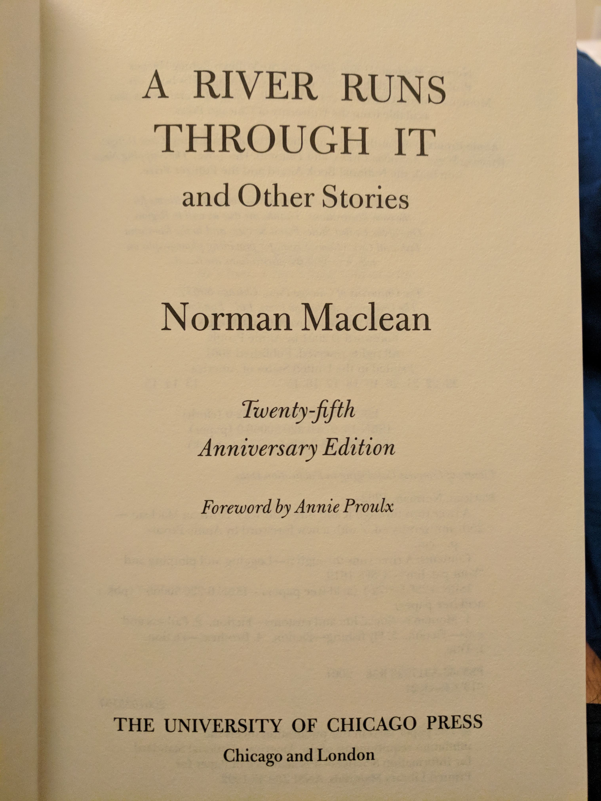

<!-- Recommended to me by Connor Chewning; Avni Nandu said it was like a great book she really liked. -->

These stories are about Montana, and fly fishing, and having a preacher for a father, and whores, and the US Forest Service. As a affluent Indian kid attending college in the middle of a big city, I can relate to approximately none of those subjects. Obviously there is value to reading stories outside of your sphere of knowledge and yadda yadda. But I still almost quit after the first short story, not wanting to read the other two. 

These books reminded me of my childhood in the Appalachian mountains on the border of Ohio and West Virginia. Here's a weird memory from middle school: every year we would all be required to submit to an essay contest where the only prompt was "I am a child of Appalachia". It was interesting to write because I didn't identify as a child of Appalachia, but I did identify as the kind of child who would win essay contests [^footnote1]. 

We were also required to read a remarkable amount of what I can best classify as "wilderness literature" (*The Red Pony*, *Hatchet*, *Tom Sawyer*, *Where the Red Fern Grows*, etc.). Again, I never really felt like I could relate, but in retrospect some elements of my childhood were pretty rugged. I dirt-biked on weekends because that was the normal activity to spend a Saturday morning doing. There was a hill next to my house that my friends and I would bike to and then climb -- once we were there we would pick the burrs off our clothes, skip rocks in the pond for hours, and forage through the honeysuckle vines. All the license plates in the area had the phrase "WV: Wild and Wonderful" on them, and I think that's surprisingly accurate. 

Because of reading *Where the Red Fern Grows* I know more about 'coon hunting than you would expect someone in my demographic to know. Similarly, now that I've read this book I guess I know a surprising amount about fly fishing for the fact that I have never (and will never) go fishing. But also just like *Where the Red Fern Grows*, this book wasn't just about killing animals. It was about a boy growing up in the presence of nature. And I like to think that is something I can identify with. 


### *The New Jim Crow* by Michelle Alexander (February)


<!-- Recommended by Jo Bridgewater -->

> "The unfortunate reality we must face is that racism manifests itself not only in individual attitudes and stereotypes, but also in the basic structure of society" <br> (Page 184)

On a surface level, I knew America had obviously not vanquished the racism that has perennialy plagued us. But until I read this book I did not truly appreciate the magnitude to which racism permeates the very fabric of society today. The book outlined the ways in which our current criminal justice system is inexcusably structured to oppress communities of color, and demonstrated the broader impact this has on every aspect of life in America. 

I only had a hazy understanding of the following concepts before this book, but now I can clearly articulate what each one is really about: 

 - Mandatory minimum drug sentences  
 <!-- I had heard the tag-line "mandatory minimums are racist" from the West Wing. I agreed that the statistics presented seemed pretty damning. I was able to register that fact in my brain, ignore it, and continue with my day-to-day life. But then this book really drove the point home. Here's a quick rundown. Crack cocaine and powder cocaine are chemically the same drug. The difference is how they are ingested (injected versus snorted, respectively). Because they are (chemically speaking) the same drug, they have the same effect on the body. Traditionally, crack cocaine was primarily used by communities of color and powder cocaine was primarily used by caucasians. It takes 100 times the amount of  -->
 - For-profit prisons  
 - The unfairness of plea "bargains"  
 - Disenfranchisement of communities of color  
 - The War on Drugs  

I tried to tie each of these concepts together into a quick overview for people unfamiliar (or only vaguely familiar) with the topic. I stopped because I kept remembering connected concepts that I would also need to add for context. Pretty quickly I realized that I would need an entire book to survey everything wrong with the current situation, and that whole book was sitting on the table right in front of me. I can't recommend this book highly enough. Read this book. Trust me. 

As I read the book I was mainly just angry. Not sad or disappointed, but angry and frustrated. The most frustrating part was that the system is *not* unfair to me, or even to anyone I know for that matter. If I hadn't read this book, I would be able to live my whole life living in blissful ignorance of how dire the situation is. I feel tricked. 

I am a part of a non-partisan civic engagement organization called TX Votes, which basically just registers people to vote and distributes non-partisan voting information in my area. *The New Jim Crow* has convinced me that TX Votes should concentrate some amount of effort to registering ex-felons to vote. For context, felons lose the right to vote in Texas, and only regain it after they have completed their sentence. There is a process to get re-registered (filling out a form), and I'm guessing no one reminds them to do so, which leads me to believe the voter registration rates for ex-felons is pretty low. This low rate is a tool of voter disenfranchisement, which hopefully I can help combat with this new project idea. Everything is still very much in the planning/research stage, but I've taken a few steps to get the ball rolling and hopefully we can get the plan implemented. It would be really valuable, so I really hope I follow through with this idea. 

<!-- Reading this book made me angry that the system is so unfair. What made me particularly angry was that the system is *not* unfair to me, or even to anyone I know for that matter. -->

<!-- things I needed to add  -->

<!-- racism this book exposes is not just the obvious actions of racist people, but rather the type of racism that permeates every aspect of many people's lives. -->

<!-- I don't just understand sexism, I *understand* sexism. I understand how sexism permeates every aspect of many people's lives and is not just reflected in the actions of explicitly misogynistic people. I understood racism, but this book helped me really *understand* racism. It outlined the ways in which our current criminal justice system is inexcusably structured to oppress communities of color. The racism this book exposes is not just the obvious actions of racist people, but rather the type of racism that permeates every aspect of many people's lives. -->

<!-- The strength of this book is in its effective use of logos. There are 33 pages filled with reference after reference to reputable sources to support the claims made in the body of the book. This is helpful because some of the claims are unbelievable. Unfortunately, the claims are indeed true, and things really are that bad.  -->
<!-- http://politics-reader.blogspot.com/2012/11/mandatory-minimums-west-wing-us.html -->
<!-- https://americanaddictioncenters.org/cocaine-treatment/differences-with-crack/ -->

<!-- Black history month -->

### *Between the World and Me* by Ta-Nehisi Coates (March)

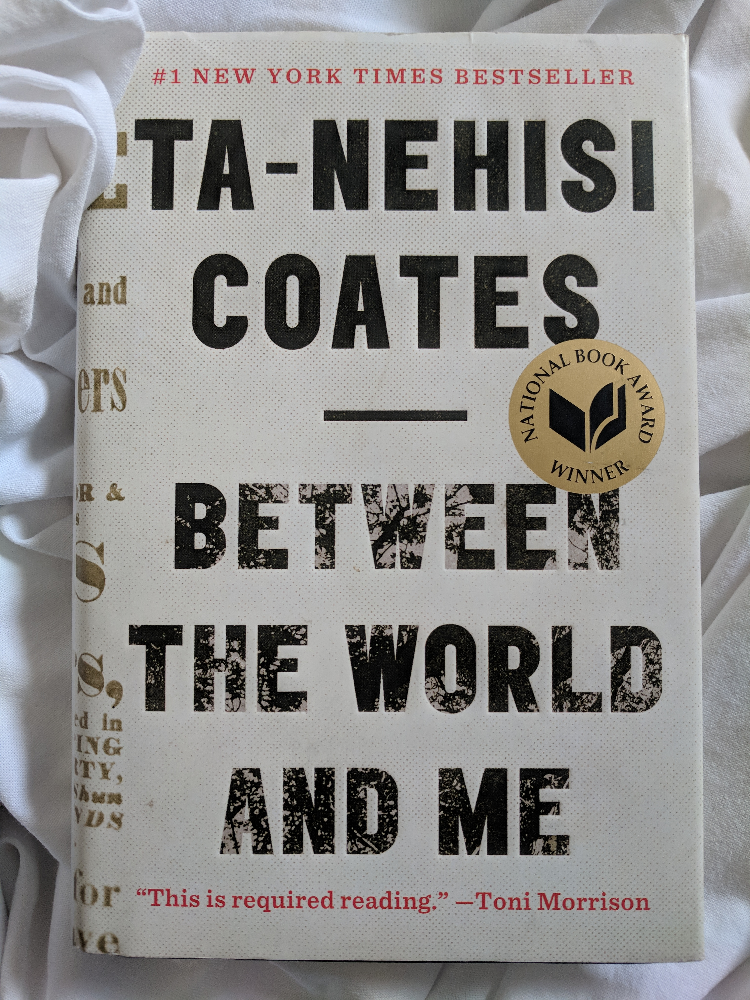

<!-- Recommended by Audrey -->

<!-- page 141: Prince Jones went to TAMS -->

> "[...] exulting non-violence for the weak and the biggest guns for the strong" <br> (Page 131)

The last book I read was *The New Jim Crow*, which gave me mountains of cold, hard facts and evidence about the effect of racism in America today on a macroscopic scale. *Between the World and Me* was a short memoir that helped me form a more complete image by providing insight on a personal scale from someone's lived experience.

I really enjoyed reading the book, and was very impressed with the writing. Coates structured the book as a letter to his son about his life as a black man in America. It was a good supplement to *The New Jim Crow* so I'm really glad I read them back-to-back. 

Once again, I'm having trouble summarizing what I liked about the book without just rewriting the whole book on this page. I really did think it was a good book, though, and it was pretty small so it is definitely worth the read if you're interested in memoir style books or race relations. 

### *The Kite Runner* by Khaled Hosseini (March Bonus Round!)

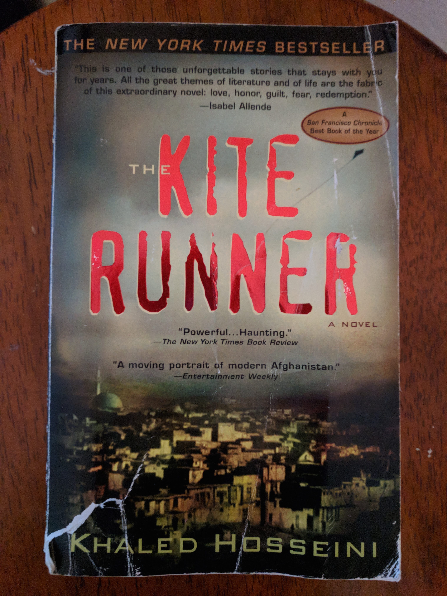

> "You probably lived in a big two- or three-story house with a nice back yard that your gardener filled with flowers and fruit trees. All gated, of course. Your father drove an American car. You had servants, probably Hazaras. Your parents hired workers to decorate the house for the fancy *mehmanis* they threw, so their friends would come over to drink and boast about their travels to Europe or America." [...] He pointed to an old man dressed in ragged clothes trudging down a dirt path, a large burlap pack filled with scrub grass tied to his back. "That's the real Afghanistan, Agha sahib. That's the Afghanistan I know. You? You've always been a tourist here, you just didn't know it." <br> (Chapter 19)

I'm glad I read this book because I think it was an important part of pop-culture that I no longer feel excluded from. FOMO [^footnote2] is an interesting motive for reading: is it a good utilization of the cultural phenomenon of FOMO or is it a bastardization of reading as a tool for fulfillment? 

I did not enjoy reading this book. Maybe this isn't the type of book you're supposed to enjoy reading. But speaking more broadly, I don't really like fiction books. Terrible things happened to the characters of this book, and in turn they did terrible things. Stories like this are meant to reflect life's unfortunate realitites, and the characters are just a vessel for the story. But I had trouble finding empathy for the scenarios because it was easy for me to dismiss them as contrived. 

<!-- World-building is not interesting to me, even though it is supposed to be the most intriguing part of sci-fi books. In the same way, I have trouble investing myself in the characters of this book because I know they don't exist.  -->

<!-- This book is supposed to be powerful. Moving, even. And sure, it was cool to read. But there were times when I would read about actions the main character would take and it would just make me feel sick. Stories are meant to teach you something about life, but I felt like when I was reading this book I was just reading the story to entertain rather than to learn. And I wasn't even being entertained, so like what's the point?  -->

<!-- The quote about "you never really lived in Afghanistan because of your walled house, etc" -->

<!-- Send this to Emily Tallman when you're done -->

### *En Attendant Godot* by Samuel Beckett (April)

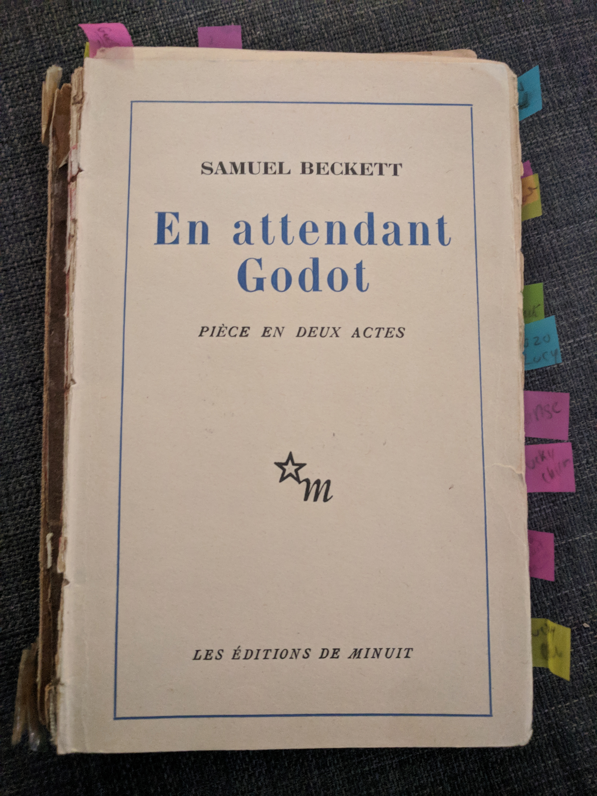

I went to the library to find this peculiar play, and I had to ask the front desk where to find it because the online catalog listed its location as "Library Reserves". Turns out some class was using it, so I was informed me I would only be able to check it out for a maximum of two hours. I wasn't sure if I was even going to commit to reading it, so I checked it out and found a cozy spot to read. I opened it up and found that the book I had checked out was actually just a collection of newspaper clippings about the play that I had actually intended to read. Because the book was in french, neither I nor the librarian looked too closely at it to realize something was up. I returned it and asked where to find the actual book. After searching up and down in the wrong aisle for way too long, I finally found it. When I picked it up, I thought it was a VHS tape or something at first. 

<!-- 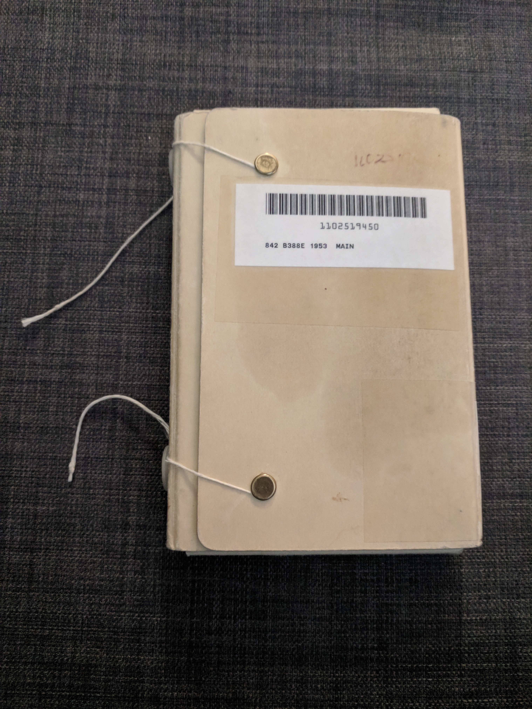 -->


I sat down and opened it up before checking it out this time. I opened it up and found the coolest thing ever. This copy of the book is like from 1953 or something, and literally falling apart. The case it comes in is meant to tie together all the loose pages that constitute the book. Everytime you start reading it is like you have to unrwap a little present.

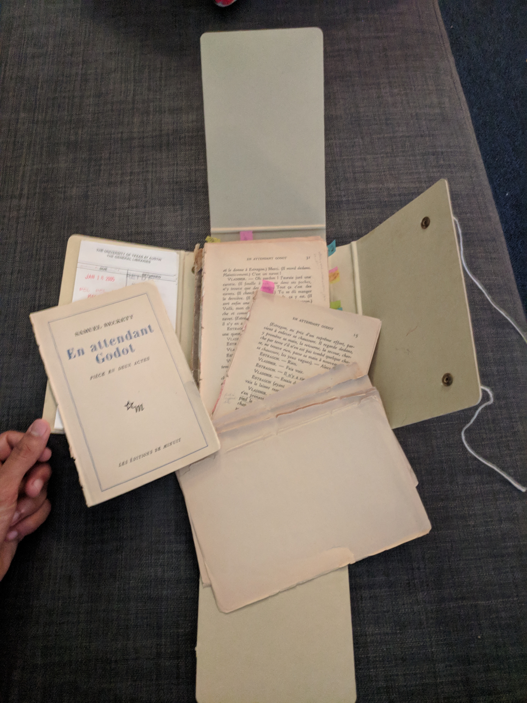

The pages were so covered in penciled in notes that you would think the previous owner was the Half Blood Prince. But it worked out really well, because whoever did make the markings had about the same level of French vocabulary as I do. They penciled in translations for all the words I didn't know[^footnote3], which was very convenient for me. 

This book was so ridiculous. On one hand I just want to leave it at that. On the other hand I want to suggest an interpretation. Godot is God. Vladimir and Estragon are you and I (not necessarily respectively). They are waiting for God. What are they doing in the meantime. Does it matter? They're not searching very hard or anything. Just kind of doing their own thing until God shows himself to them. What if they give up on waiting for God. Well there won't be much left to do at all. Their purpose is to wait, and if they decide that purpose is no longer enough, they might as well just off themselves. 

But the status quo is so much easier. Finding a rope to go with the tree is so much effort. It is so much more convenient to just keep waiting. Right?

With that being said, I have no idea what Pozzo and Lucky represent. Maybe nothing. Maybe they were just the elements of randomness in our day to day lives. The whole point is life is pretty weird. It doesn't really make sense. It doesn't really have to. It's the not knowing that counts. 

### *The Martian* by Andy Weir (May)

> "We can rescue him with Ares 4. It's very risky. We ran the idea by the Ares 4 crew. Not only are they willing to do it, but now they're really pushing hard for it." 
<br>
> "Naturally," Teddy said. "Astronauts are inherently insane. And really noble. What's the idea?"

For the next three months, I will be interning with Amazon in their Tokyo office. I don't speak any Japanese, I can't eat at most restaurants here because I'm vegetarian, and I don't know a soul in this timezone. I started and finished this book on my flight from USA to Japan. Oddly fitting, hmm.  

The book itself is a work of fiction about a NASA astronaut who gets stranded on Mars when his crew accidentally vacates the planet without him. The tale catalogues the steps he takes (by combining his background as a botanist and a mechanical engineer) to try to survive long enough for someone to rescue him. 

I've talked before about how I'm not really a science fiction kind of guy. But this book struck a chord with me. It gave me a vessel with which I was able to explore my thoughts/feelings/nerves about my impending summer in Japan. Loneliness. Hunger. Isolation. Exhilaration. Homesickness. The planets aligned and I read this book at exactly when I needed to.

<!-- Emily recommended it -->
<!-- Quotes from kindle -->

### *Pride and Prejudice* by Jane Austen (June)

<!-- > "There are few people whom I really love, and still fewer of whom I think well. The more I see of the world, the more am I dissatisfied with it; and every day confirms my belief of the inconsistency of all human characters, and of the little dependence that can be placed on the appearance of either merit or sense." <br> Volume II, Chapter I, Page 133 -->

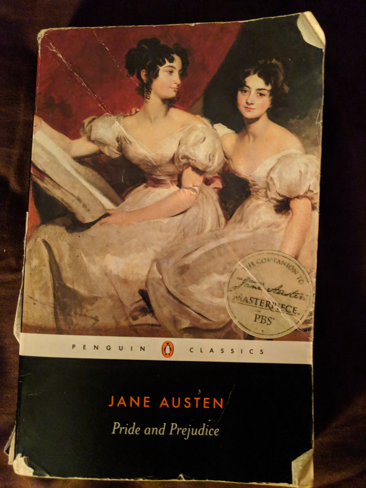

> "[...] where other powers of entertainment are wanting, the true philosopher will derive benefit from such as are given." <br> Volume II, Chapter XIX, Page 228

I hate to embody a trope, but the beginning of this book was *so boring*. As the storyline was being set up, I felt like I knew exactly how everything would play out and I was dreading the process of trudging through the remaining 250 or so pages. I understood how some of the dialogue was clever, but couldn't see what all the hype was about. Namely, I borrowed this book from the "stubborn and prejudiced", but "independent and confident" [Avni Nandu](https://www.linkedin.com/in/avni-nandu-92149013a/) who said it was her favorite book[^footnote4]. Not only that, but on two occassions I complained to two people about how boring the book was, and they both cited it as one of their favorite stories, too.

As soon as I was ready to give up, the book got good. Everything completely turned around when a major plot twist ignited the story-line. From there, the book was a delight to read. I was eating cheesecake at a swanky restaurant in the Roppongi District of Japan on a Friday night and couldn't help but laughing from joy when I finished it. 

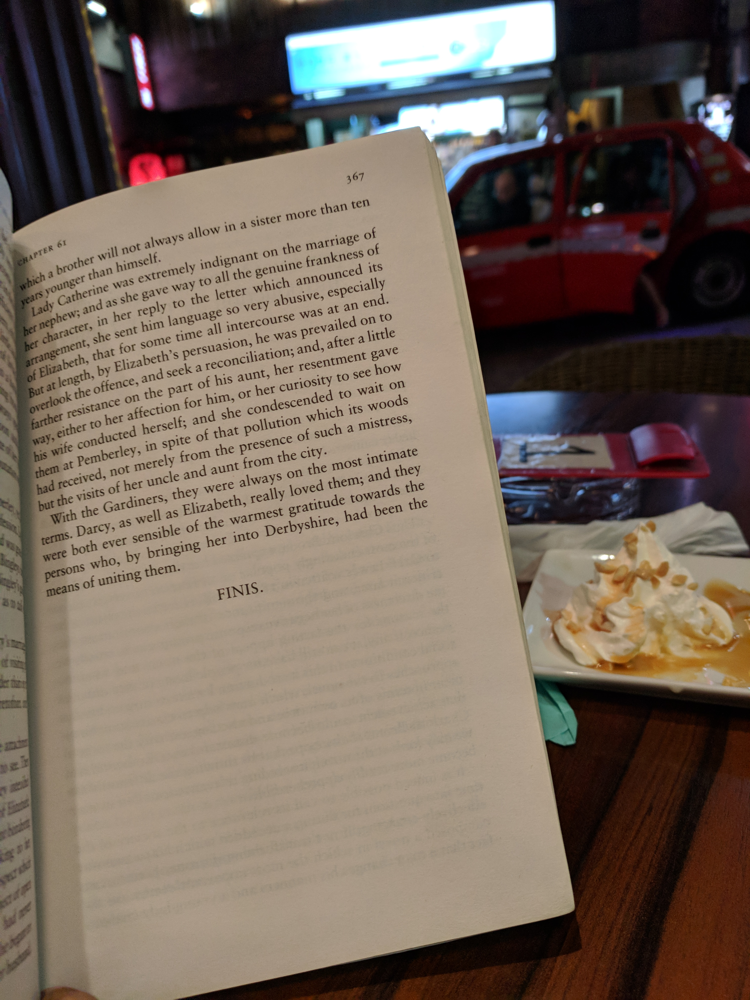

The book itself is about some English family and their marriage prospects. Like I said, it's entertaining to read once you get into it. You know how its going to end, it's just fun to read about all the drama along the way. 

Here are some cool quotes that stuck out to me as I was reading:

> "Upon the whole, therefore, she found, what had been sometimes found before, that an event to which she had looked forward with impatient desire, did not in taking place, bring all the satisfaction she had promised herself. It was consequently necessary to name some other period for the commencement of actual felicity; to have some other point on which her wishes and hopes might be fixed, and by again enjoying the pleasure of anticipation, console herself for the present, and prepare for another disappointment." <br> Volume II, Chapter XIX, Page 229

That's what happened to me when I moved to Tokyo. It was supposed to be everything anyone has ever dreamed of -- the culmination of my life thus far. I don't know how to explain how I felt, but basically after I got here I just felt really lonely, lost, and overwhelmingly sad. 

> "You must learn some of my philosophy. Think only of the past as its remembrance gives you pleasure." <br> Volume III, Chapter XVI, Page 348

With that being said, things are better now! When I look through my photos I realize all the cool things I've done here that seemed so normal at the time. I'm twenty years old. And living in Tokyo. Like living, breathing, sleeping, and existing in one of the most unique societies in the world. When I describe my life to myself in my head I can't even believe it. I certainly won't forget the ways in which I was unhappy here. But I think I'll probably just condense all my negative thoughts into one summary of how I felt, acknowledge it, and move on. From there, I'll concentrate so much more on remembering the parts of my experience that give me pleasure (like this book! and cheesecake!).

### *Kitchen* & *Moonlight Shadow* by Banana Yoshimoto (June Bonus Rounds!)

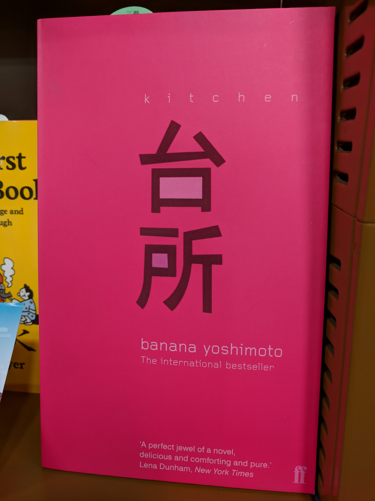

> "For a very long time there was something I wanted to say in a novel, and I wanted, no matter what it took, to continue writing until I got the saying of it out of my system. This book is what resulted from that history of persistance." (Preface, page vii)

> "Now only the kitchen and I are left. It's just a little nicer than being all alone." (Part I, page 4)

> "Her power was the brilliance of her charm and it had brought her to where she was now. I had the feeling that neither her wife nor her son could diminish it. That quality must have condemned her to an ice-cold loneliness." (Part I, page 19)

> "As we decided where to meet, I looked up at the window. The sky outside was a dull gray. Waves of clouds were being pushed around by the wind with amazing force. In this world there is no place for sadness. No place; not one." (Part I, page 23)

> "After this you and I may end up seeing nothing but suffering, difficulty, and ugliness, but if only you'll agree to it, I want for us to go on to more difficult places, happier places, whatever comes, together." (Part III, page 101)

I wanted to read Japanese literature while I was in Japan. I went to a used book store chain called Book Off, and they had a whole section on their english shelf with books by Japanese authors. I had heard an author called Haruki Murakami existed and he was Japanese. But other than that I didn't really know where to start. So I googled "Japanese authors" and cross-listed the authors there with the authors on the shelf. I narrowed it down to this book and *After Dark* by Haruki Murakami. Short of any other reason to pick one over the other, I opted for *Kitchen* by Banana Yoshimoto first in an effort to elevate female voices. 

That Friday night, I went to a cafe, ordered some cheesecake (subpar, unfortunately), and cracked open the book. I finished it within 24 hours. It hit the spot. Since it is such a short book, saying anything about the plot is essentially a spoiler. I really appreciated a few quotes in particular, which I highlighted above. 

The book is small and mighty, which is why I think it is definitely worth taking a crack at if you're looking for a book. I think I'll go back and read it again soon to see what else I get out of it. When I try to think back to the book now, the most overwhelming memory I have isn't about the story itself, but the very specific feeling I felt when I was reading it. The feeling is hard to capture and describe, but the quotes I selected come the closest I think I'm gonna get. 

### *After Dark* by Haruki Murakami (July)

This book catalogued the events of one night in modern-day Tokyo from the perspective of two or three characters. It was cool because each of the chapters were specific times in the night, and each chapter heading had a drawing of a clock with the corresponding times. The book was interesting, but I was surprised this was the author I had heard such a fuss about. 

In Tokyo, the trains stop at midnight and don't start again until 5am. Since they are the dominating form of transport (no ride-sharing, and taxis don't feel worth it), you're pretty much stuck to walking distance in between that time. Going clubbing becomes an all-or-nothing affair. And even tame socializing events face an early demise. One time I thought I was safe because I made it on my last train, but the train stopped for the night three stations away from where I needed to go, so I had to walk the rest of the way home. 

This combines with the fact that there is nowhere to go to just *be*. You always have to be doing something or paying someone. There aren't park benches everywhere like there were in NYC last summer. Things also close pretty early. I wanted to read this book, but all the cafes in my area were closing. The metro near my house is the Yamanote line, which just makes a big circle through the main parts of Tokyo. One loop takes about one hour. So I just got on, found a seat, and made a big loop. That mirrored the experience of the main character in this novel: the story opens on her posted up at a 24 hour cafe with her nose in a book because she doesn't want to go home that night.

I should read more by Murakami before I judge, but I wasn't blown away by this piece. 

### *Shoe Dog* by Phil Knight (July Bonus Round!)

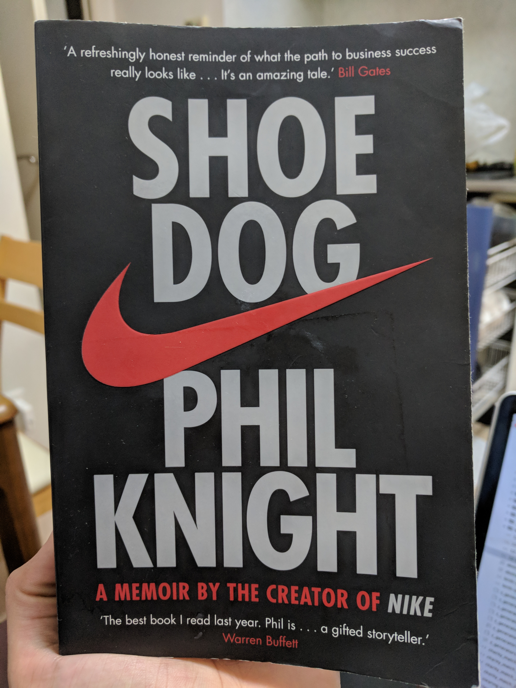

I took a break in between reading Japanese authors to read a book that I expected to be wholly American: a memoir by the founder of Nike, Phil Knight. I quickly realized that the book actually stayed consistent with my Japanese theme because Nike started as an effort to import low-cost shoes manufactured from Japan into American markets. The book was obviously about a lot more than that, but Japan did come up a good number of times, which I found amusing. 

I also realized that I really enjoy reading memoirs. I can't think of a single time I've been impressed with the quality of the writing in a memoir, but they always seem to move me in a way no other genre can. Fiction seems to far away, and I can't emotionally connect to any non-fiction book that centers on a subject rather than a person. It is cool to hear from someone about something they've dedicated their whole lives to. The book can dive deeply into a niche topic, while also letting the reader breathe every so often as it describes the drama of a person's day-to-day life.

One cool thing I appreciated about Knight's writing was the way he incorporated quotes that influenced his life into his book. He is a well-read dude, so he introduced a few quotes early in the book and weaved them into the rest of his tale. For example, he often agonized over MacArthur's claim that "You are remembered for the rules you break". He found hometown pride as a descendant of the the Oregon trail in saying that "The cowards never started and the weak died along the way -- that leaves us."

One thing I couldn't shake when I was reading this was the influence of privilege in success. Sometimes he acknowledged his privilege, but mostly it was just woven into his story as seamlessly as it was woven into his life. In the early chapters he describes where he was when he was my age; I noted that I'm starting out at basically the same place as him in terms of privilege. Which is to say I am rather privileged, but I'll still get to claim any of my success is ostensibly "self-made". I don't know what my conclusion of this train of thought is, but I've been thinking about stuff like this for a while. How can I do right by my privilege? What can the path of other privileged people teach me? Does privilege tinge success? How much credit can the privileged reasonably take for their success? Where do I think he lived up to his responsibilities, and when do I think he should have done more?  

<!-- travel, reading, state school then prestigous grad-school, school snobbery, "finding yourself" -->


<!-- Quoted in Shoe Dog

> "The man who moves a mountain begins by carrying away small stones" analects of Confucius, first quoted in Shoe Dog on page 31

> "You are remembered for the rules you break." MacArthur, first quoted in Shoe Dog on page 32

> "Lead me from the unreal to the real" The Upanishads, first quoted in Shoe Dog on page 33

> "Don't go to sleep one night, what you most want will come to you then." Rūmī, first quoted in Shoe Dog on page 34

> "Don't tell people how to do things, tell them what to do and let them surprise you with their results." Patton, first quoted in Shoe Dog on page 36

>  "The cowards never started and the weak died along the way -- that leaves us." 

> "From the profane to the sacred" talking about tori gates

Quotes from Shoe Dog

> "It's simply not right, he insisted, or feasible, that a shoe worker makes more than a medical doctor".

Indicative of a rigid class system that is geographically segregated. 

Quotes about Shoe Dog

> "I look inside the mirror and think Phil Knight tricked us all" Wing$ by Macklemore & Ryan Lewis -->

### *The Setting Sun* by Osamu Dazai (July Bonus Round!)

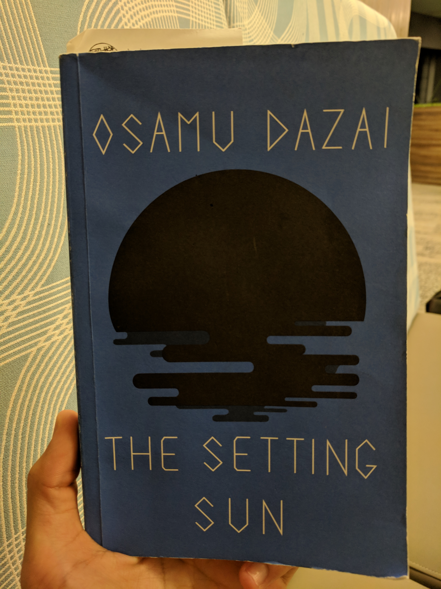

> "'Last year nothing happened // <br> The year before nothing happened // <br> And the year before that nothing happened.'
<br>
An amusing poem to this effect appeared in a newspaper just after the war ended. Of course all kinds of things actually did take place, but when I try to recall them now, I experience that same feeling that nothing happened."
<br>(Page 37)

The title of this novel refers to the decline of the Japanese aristocracy as World War II draws to a close. The book itself follows the life of a formerly-wealthy family: the elegant but dying mother, the aimless son, and the steeled daughter.

Japan during the war seems a world away from the Japan I see today. Because of my history lessons in school, I know what to imagine when I think of how America transformed itself for the war effort. But I can't similarly project the change Japanese society must have undergone to mount their attempted imperialism. I liked reading this book because it doesn't speak of the Japan of old (samurai and the like), nor does it speak of the Japan of today (love-hotels, salarymen, and the like). It speaks to a time that is rarely brought up in pleasant conversation. 

It is worth noting that although my primary takeaways from the book were about the war, Dazai treats this theme with a very light hand. I'm not even sure this book was about the war (I think it was primarily about the futility of existence?). But this style seems representative of a traditional Japanese mindset. The theme is only alluded to, but the details that are selected are meant to speak volumes. 

### *No Longer Human* by Osamu Dazai (July Bonus Round!)

I cannot relate to the main character of this book. My friend who recommended it to me did so precisely she they didn't think I would be able to. The book catalogues the actions and feelings of a troubled Japanese man in three stages in his life. As I was reading I constantly felt like I was missing something because his perspective is so foreign to me. I think that is partially the point of the book, because that is how the narrator feels about the world around him and all his friends. 

I liked *The Setting Sun* better, but they both felt like very different types of books. *The Setting Sun* took a much more high level view of the events it described. It gave overarching symbolism and motifs throughout the book. It described the network of characters and fleshed out their interactions and hopes and dreams and actions and feelings. *No Longer Human* explicitly did not do that. It described one character's thought, and highlighted his failure to comprehend the people around him, their interactions, their hopes, their dreams, their actions, and their feelings. 

### *Stories of Your Life and Others* by Ted Chiang (August)

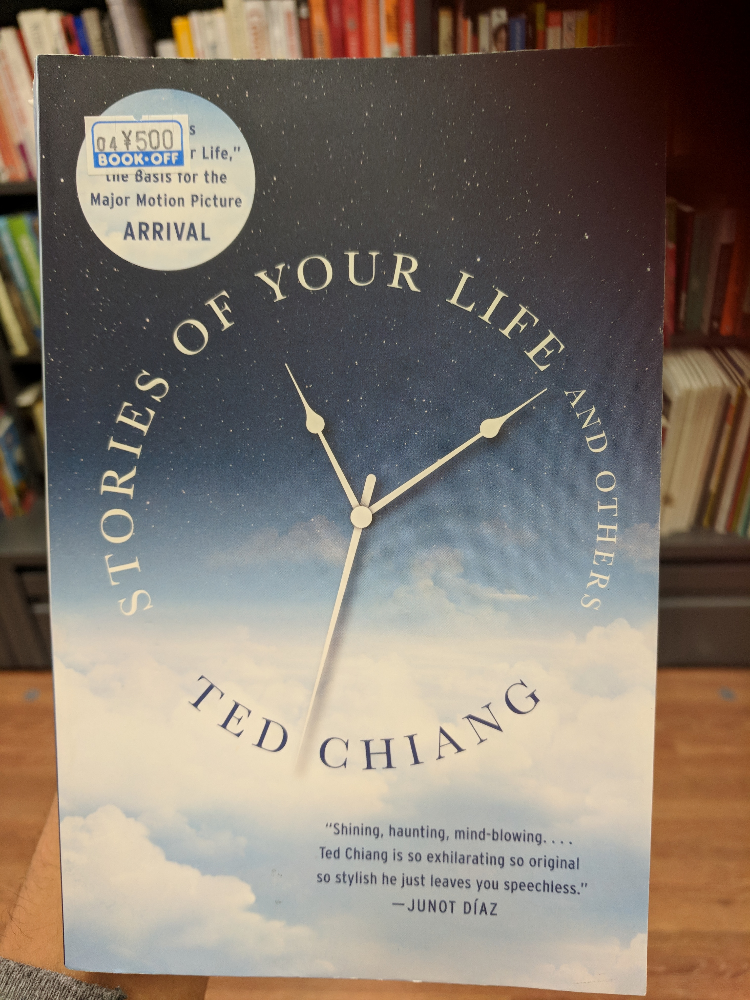

This is a collection of eight short stories, most with a realistic science-fiction theme. I read a PDF of the most famous one ([*Story of Your Life*](http://www.kameli.net/~raimu/rnd/ted-chiang-story-of-your-life-2000.pdf)) on Monday because a friend of mine sent it to me. Then I was perusing my local used book store on Tuesday when I coincidentally came across this collection. I sat at the bookstore for a few hours and finished five of the stories. I bought the book, and just finished the other two today (Wednesday).

*Tower of Babylon* - hate to bring up spoilers, but the ending of this story reminds me of the ending of Paulo Coelho's *The Alchemist*. 

*Understand* - this one made me face my superiority complex. Scary, and not a good look. Reminds me of [the thoughts I had on pride as my cardinal sin](https://www.rshah.org/blog/posts/12-books-12-months-2017.html#mere-christianity-by-c.s.-lewis-september) when I was reading *Mere Christianity* last year. 

*Division by Zero* - this story also brought me back to *Mere Christianity*, and the way that ["Math with a capital M"](https://www.rshah.org/blog/posts/12-books-12-months-2017.html#mere-christianity-by-c.s.-lewis-september) is the most divine thing I've come across in this lifetime. 

*Story of Your Life* - this is the story that started it all when my fascinating friend Mindy Chi recommended it to me. I'll just reproduce my Facebook messenger conversation I had with her (ommitting the spoilers, where two slashes represent a new message):

> It is making me uncomfortable and I don't know why // I don't like how [REDACTED] // That creeps me out // Also I'm reading this at home alone at night so it feels like it is supposed to be a scary story so I'm like bracing myself for [REDACTED] or [REDACTED] or something terrible // Dude // That was so trippy // I just finished it // <i class="em em-crescent_moon"></i> // I can't sleep now <i class="em em-grimacing"></i>

*Seventy-Two Letters* - this story was a weird mix of murder-mystery, illuminati-vibes, hebrew-mysticism, class-struggle, and industrial-revolution. My conclusion: it was just kind of a weird story. 

*The Evolution of Human Science* - I didn't really care much for this one, until I read the author's note in the back. It mentioned the quote by William Gibson that inspired this story "The future is already here; it's just not evenly distributed". 

*Hell Is the Absense of God* - In this story and in *Tower of Bablyon* I feel like people in the story give the God of their story too much credit. That God seems to be just kind of doing their thing, and the characters use their human ingenuity to assign divine meaning to the mundane design decisions of their creator. 

*Liking What You See: A Documentary* - this one was probably my favorite story. It imagines a world in which we could program our brains to ignore an individuals beauty (or lack thereof). It asks whether or not the benefits of beauty (aesthetic pleasure, personal satisfaction, and the status quo), outweigh the cons of beauty (what the story refers to as "lookism", and the commercialization of beauty). I liked how the story gave a glimpse of a dozen or so perspectives, rather than considering the two fundamental sides of controversy in depth. I personally would never turn off my ability to perceive attractiveness, but I enjoyed the thought experiment. 

### *Hiroshima Mon Amour* by Marguerite Duras (August Bonus Round!)

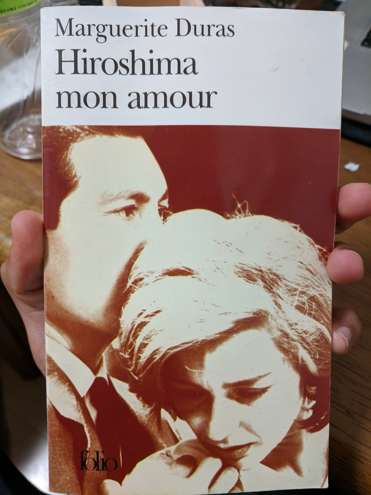

This is the screenplay for a movie of the same name, and earned Marguerite Duras an Oscar nomination for Best Original Screenplay. The story is set in the years just after WWII and follows the conversation between a Japanese man and a French actress as they have an affair. I stumbled on the book at my favorite used book store by my apartment in Tokyo (Book Off Gotanda). 

I wasn't really sure what the screenplay was when I bought it. I got home around midnight and googled the title, etc. I found the original movie online, and used the book to catch any dialogue I missed as I watched the movie. I decided to start that night with the expectation that I would stop halfway through when I got tired and finish later. I ended up finishing it all in one sitting, and didn't go to sleep until 2AM even though it was a weeknight. It was good practice for improving my French listening skills, because usually when I read books in French I only hear my own flawed pronunciation reading out loud. 

It was a heavy topic (WWII as experienced by a French person and a Japanese person), I had to strain to comprehend the French dialogue, and I ended up staying up pretty late. I was glad I did it. But I went to sleep absolutely exhausted that night. 

### *In Fed We Trust* by David Wessel (August Bonus Round!)

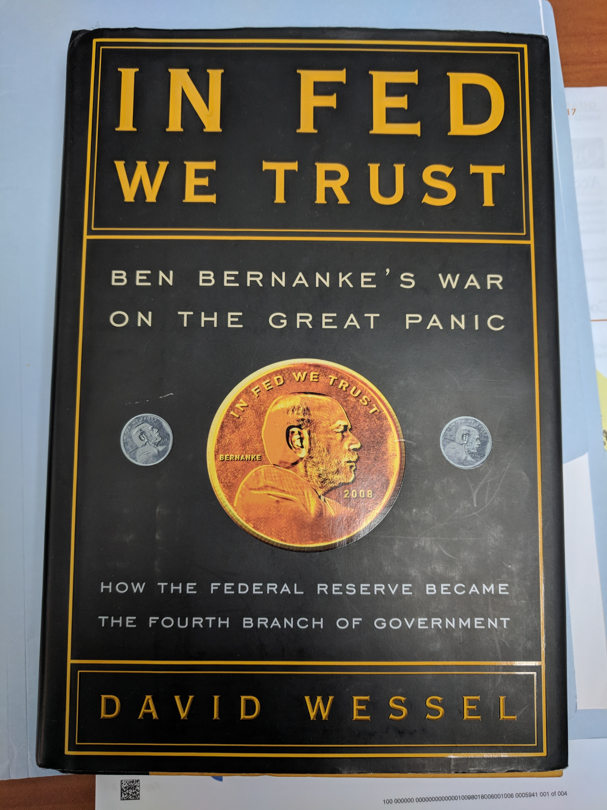

I love non-fiction. Every time I read a non-fiction book, I'm reminded how much I love non-fiction. Non-fiction books can have all the drama of fiction books, but the cool thing is you're not just reading about someone else's imagination. It took millions and millions of people operating independently to act out the story in this book about the 2008 financial panic. You literally can't make this stuff up, because it actually happened. 

I took AP Microeconomics and AP Macroeconomics in high school. I went into the classes thinking I would love econ. I came out of the classes thinking the subjects were too vague and hand-wavey for my taste. I always felt like economics got the worst of both worlds when it came to theoretical versus applied studies. It is too applied to lead to an elegant theoretical formulation, but it's not enough of an applied science for us to make consistent empirical assertions. 

Reading this book casually was fun, though! I love public policy, so hearing about the nitty-gritty of macroeconomic policy was fascinating. I was glad I had a strong foundation of knowledge from my classes so I could understand most of the jargon, and the book filled in the gaps in my knowledge well. I decided I like hearing from experts about economics and all and think it is plenty interesting, but I am really glad I will never be more involved than just listening to the experts. 

The book also raised important political science questions. When we have a smart Fed chairperson, the Fed as a whole operates smoothly and can address important economic issues. This autonomy is valuable in reacting quickly to possible crises. But how do we ensure that we have a smart Fed chairperson? The book claims that in our current economic system, the Fed chairperson heads a fourth branch of government without explicit checks and balances with the other three branches of government. That is a scary thought. 

### *The Samurai's Garden* by Gail Tsukiyama (September)

This was a surprisingly melancholic novel about a Chinese boy sent to a quiet seaside Japanese town during WWII. It was the last book I got from my local used book store in Japan (Book Off Gotanda) and I finished it after I got back to school. 

### *Naruto* by Masashi Kishimoto (October/November)

I had started this manga series when I was in elementary school, but it wasn't even close to being completed by then. Nostalgia made me revisit it, so I read all 700 chapters. It was cute and entertaining -- I was glad to tie up that loose end. 

### *Negroes With Guns* by Robert F. Williams (November)

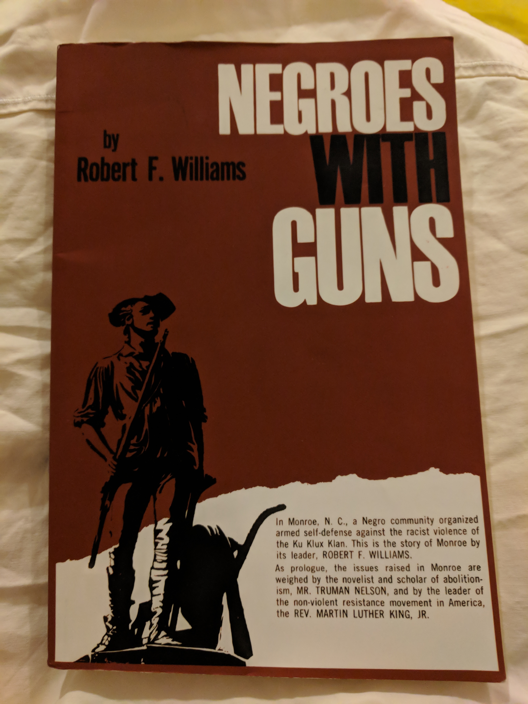

> "[Martin Luther King Jr.] quotes approvingly certain remarks of Gandhi which are as repulsive as any made by the most jingoistic of sword-rattling generals, calling for sacrifice and death. 'Rivers of blood may have to flowe before we gain our freedom, but it must be our blood,' says Gandhi. 
<br>
I find this utterly disgusting. Why should Gandhi, or any other human being, throw a whole people, bound and gagged against physical resistance, into the slaughter pen to submit and bleed until the slaughterer gets tired and puts off his killing clothes and goes about some other business, unpunished, even unquestioned, for his shedding of innocent blood. Who is Gandhi to decide whose blood is to be expendable?" (page 24)

In this book, the president of NAACP in Monroe, North Carolina in the 1950s describes how his community was forced to militarize to protect itself from the attacks of the Ku Klux Klan when the local and state police refused to defend blacks. Williams rebuts the case for pacifism and claims that self-defense is necessary and justified for blacks in the US in light of racist violence and lynchings.

The second amendment protects a well regulated militia because it is neccessary for the security of a free State. This story seems like the most straightforward application of the second amendment I've ever come across. The black community's safety and freedom was threatened, the State refused to intervene, and only a well regulated militia was able to discourage further bloodshed by the KKK. And yet, I doubt the average campus-carry frat brother in Texas is invested in protecting the rights of *Negroes With Guns*.    

I was raised in a household where non-violence was a huge family value. My family is culturally [Jain](https://en.wikipedia.org/wiki/Jainism), but we aren't particularly religious. The only one of the three pillars of our religion I was really taught as I was growing up was non-violence. For example, we are all vegetarian and when we see bugs in our house we capture and release them into the wild rather than kill them. But we have used insecticide for wasp's nests, called exterminators, and I am not even close to being vegan yet. So I guess my morality is partially parameterized on its convenience. As I was reading this book, I was forced to acknowledge that I identify more closesly with the ideology of self-defense than I do with pacifism. I hark back to my thoughts from when I read [*On Civil Disobedience*](https://www.rshah.org/blog/posts/12-books-12-months-2018.html#on-civil-disobedience-by-henry-david-thoreau-january-bonus-round) "I think I'm pretty dovish, but in my short life I've never been directly faced with the realities of international military conflict; I can't definitively say one way or the other how hawkish I really am."[^footnote5]

### *A Little Life* by Hanya Yanagihara (December)


<!-- > "Did *real* Haitians have studio space? Would it even occur to *real* Haitians to leave their large rent-free apartment, where they could have theoretically carved out their own corner to paint and doodle, only to get on a subway and travel half an hour (think how much work could be accomplished in those thirty minutes!) to a sunny dirty space? No, of course not. To conceive of such a luxury, you needed an American mind." (page 32) -->

> "the only trick of friendship, I think, is to find people who are better than you are -- not smarter, not cooler, but kinder, and more generous, and more forgiving -- and then to appreciate them for what they can teach you, and to try to listen to them when they tell you something about yourself, no matter how bad -- or good -- it might be, and to trust them, which is the hardest thing of all. But the best, as well." (page 240)

<!-- > "he knew JB was lonely, and unhappy, and uncertain, and that none of those sensations were familiar ones to him. He sensed that JB -- who had so loved college, its structures and hierarchies and micro-societies that he had known how to navigate so well -- was trying with every party to re-create the easy, thoughtless companinoship they had once had, when their professional identities were still foggy to them and they were united by their aspirations instead of divided by their daily realities." (page 253) -->

<!-- > "But how was one to be an adult? Was couplehood truly the only appropriate option? (But then, a sole option was no option at all.) 'Thousands of years of evolutionary and social development and this is our only choice?'" (page 256) -->

<!-- > "at the time, everything really did seem possible: he was twenty-three and everyone was young and attractive and smart and glamorous. Everyone though they would be friends for decades, forever. But for most people, of course, that hadn't happened. As you got older, you realized that the qualities you valued in people you slept with or dated weren't necessarily the ones you wanted to live with, or be with, or plod through your days with." (page 643) -->

My most enigmatic and intriguing friend <a href="https://www.linkedin.com/in/alec-blair-705a58172/">Alec Blair</a> let me borrow this behemoth of a novel (clocking in at a staggering 814 pages). It is a work of realistic fiction that follows the entire troubled life of Jude St. Francis and the peaks and troughs of the relationships he forms with the people around him. The book is hella sad. But I'm really glad I read it because it brought me closer to my friend. 

Here's to the books that shaped my 2018, and to all the books still out there for next year <i class="em em-clinking_glasses"></i>

<!-- It was an emotionally exhausting book to read, heavily featuring themes of trauma, rape, abuse, self-harm, and suicide.  -->

[^footnote1]: I never did win, but I remember one of my three best friends won our school's contest and went on to win the whole regional contest or something. 
[^footnote2]: FOMO: fear of missing out
[^footnote3]: Fun fact: "fouet" is the french word for the noun "whip".
[^footnote4]: Judging from the cover, this absolutely didn't strike me as her type of book. In retrospect, she shares numerous traits with the main character, so I admit I judged too soon. But hey, that sounds like a theme to me!
[^footnote5]: Williams was a big fan of Thoreau and says "Henry David Thoreau is idealized as an apostle of non-violence, the writer who influenced Gandhi, and through Gandhi, Martin Luther King, Jr. But Thoreau was not dogmatic; his eyes were open and he saw clearly." (page 122). Personally, I respect Thoreau's moral consistency, but don't see him as a significant role-model for my world view. 