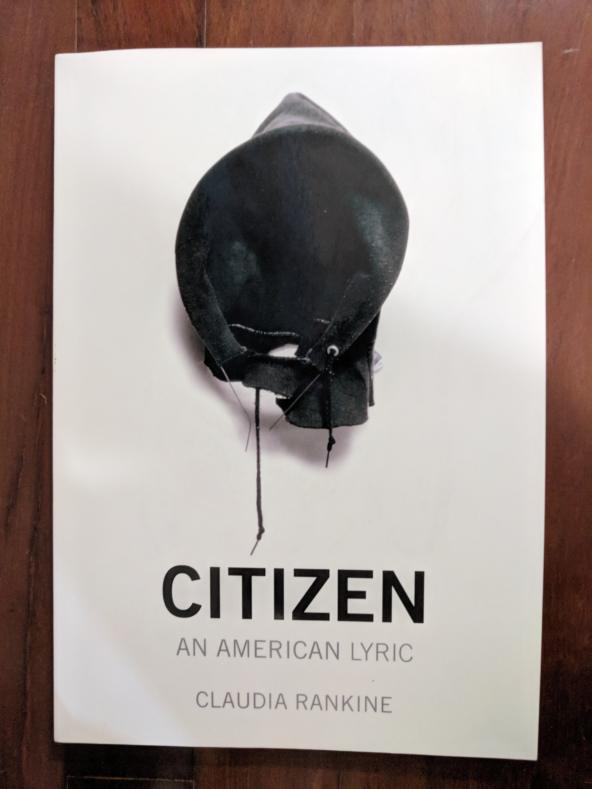
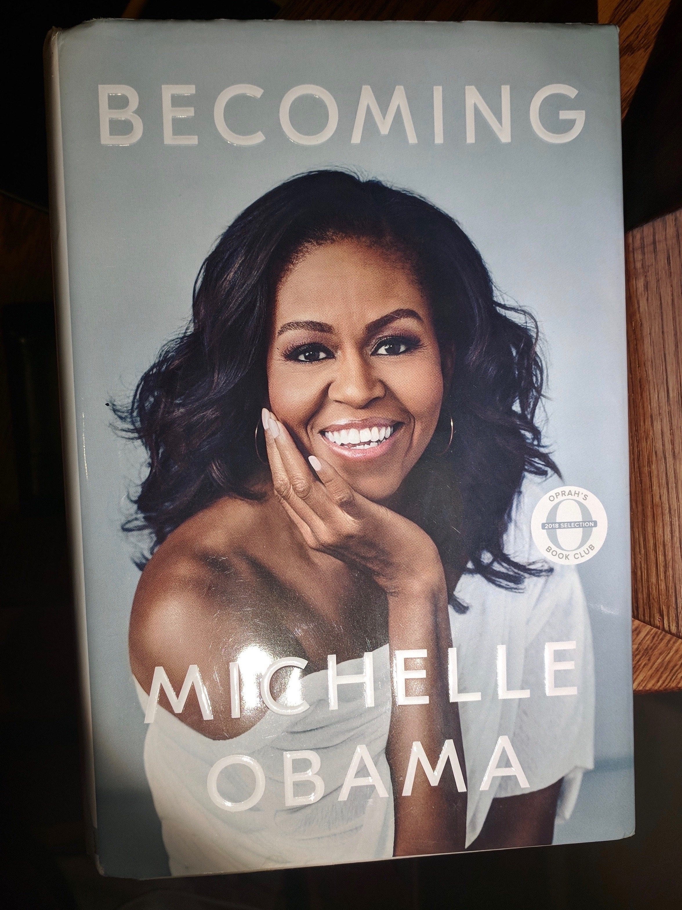
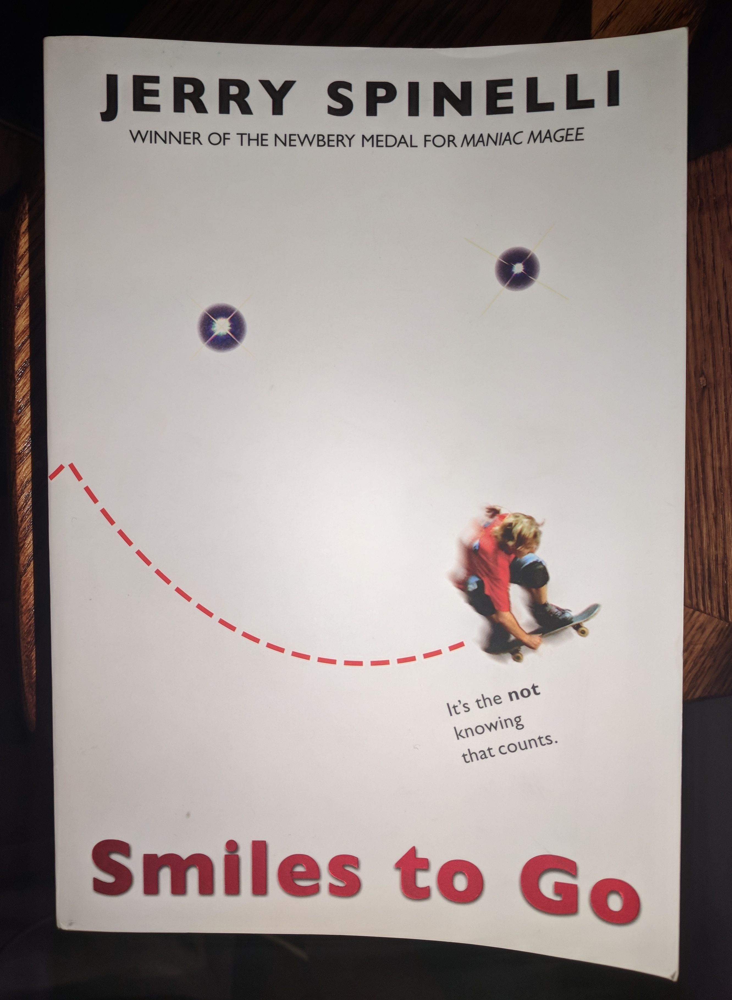
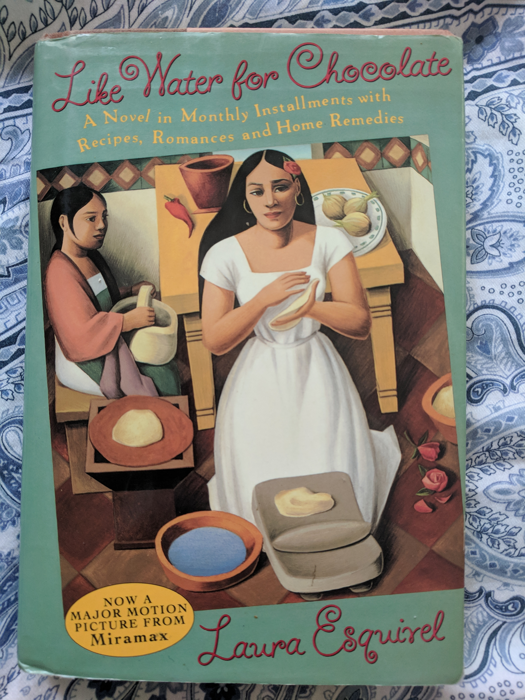
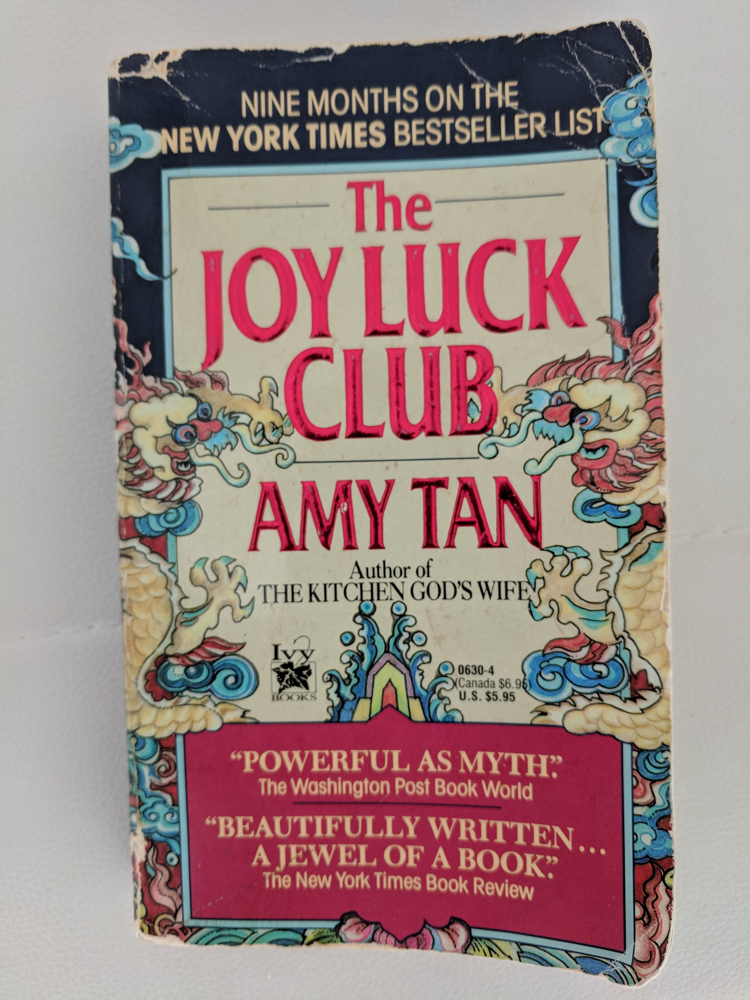

% (At Least) 12 Books in 12 Months - 2019
% Rushi Shah
% 10 January 2019

<link href="https://afeld.github.io/emoji-css/emoji.css" rel="stylesheet">

# (At Least) 12 Books in 12 Months - 2019

```
Things I've Been Silent About by Azar Nafisi (January)
Citizen: An American Lyric by Claudia Rankine (January Bonus Round!)
The Nest by Cynthia D'Aprix Sweeney (February)
Becoming by Michelle Obama (February Bonus Round!)
Smiles to Go by Jerry Spinelli (March)
The Love and Lies of Rukhsana Ali by Sabina Khan (March Bonus Round!)
Like Water for Chocolate by Laura Esquivel (April)
The Joy Luck Club by Amy Tan (May)
The Essence of Jainism by Kumarpal Desai + Pure Freedom: The Jain Way of Self Reliance by Amar Salgia (June)
Interpreter of Maladies by Jhumpa Lahiri (July)
Song of Solomon by Toni Morrison (August)
When Breath Becomes Air by Paul Kalanithi (September)
```

See also:  
 - [(At Least) 12 Books in 12 Months - 2017](https://www.rshah.org/blog/posts/12-books-12-months-2017.html)  
 - [(At Least) 12 Books in 12 Months - 2018](https://www.rshah.org/blog/posts/12-books-12-months-2018.html)

### *Things I've Been Silent About* by Azar Nafisi (January)

<!-- > "While she was alive I was too busy evading her and resenting her to understand how disappointed and alone she must have felt, how she was like so many other women about whom her best friend, Mina, used to say, with an ironic smile: 'Another intelligent woman gone to waste.'" -->

> "I do not mean this book to be a political or social commentary, or a useful life story. I want to tell the story of a family that unfolds against the backdrop of a turbulent era in Iran's political and cultural history. There are many stories about these times, between the birth of my grandmother at the start of the twentieth century and my daughter's birth at it's end, marked by the two revolutions that shaped Iran, causing so many divisions and contradictions that transient turbulence became the only thing of permanence." (Page xviii)

This book can best be described as a family memoir. It covered the author's life, the life of her father, and the life of her mother against the backdrop of Tehran, Iran.

The book paints a nuanced picture of Tehran and Iranian politics in the mid to late 1900s. I could feel Nafisi's patriotism through her writing: when her country faltered, her heart broke, but she didn't let that diminish her criticism. 

An individual's viewpoint of history-altering events is so interesting. It is at once myopic and self-centered, and yet also provides a much fuller picture than a Wikipedia page or news report can. Personal perspective can't provide insight about aggregated statistics (like how many people died, etc.) but can answer questions like "what events stood out to every day Iranians who attended Azar's mother's coffee chats?". For example, Azar talks extensively about her mother's voting record on legislation like the [Capitulation Law](https://en.wikipedia.org/wiki/Ruhollah_Khomeini#Opposition_to_capitulation) and the [Family Protection Act](https://en.wikipedia.org/wiki/Iran%27s_Family_Protection_Law), and yet those pieces of legislation aren't even mentioned in the [Wikipedia page on the Iranian Revolution](https://en.wikipedia.org/wiki/Iranian_Revolution). I wonder what I will remember about this time in our history.

The book also gave me a window into another family's internal politics. I listened to the audiobook during the one month I spend with my parents each year. Nafisi's characterization of her high-achieving family resonated with my perspective of my own family: sometimes it is hard to separate the tension and the love. How sustainable is it to confine such a density of passion to one roof? 

<!-- Her father was an up-and-coming politician whose career culminated with his role as the Mayor of Tehran. Her mother  -->

### *Citizen: An American Lyric* by Claudia Rankine (January Bonus Round!)



> "A woman you do not know wants to join you for lunch. You are visiting her campus. In the café you both order the Caesar salad. This overlap is not the beginning of anything because she immediately points out that she, her father, her grandfather, and you, all attended the same college. She wanted her son to go there as well, but because of affirmative action or minority something - she is not sure what they are calling it these days and weren't they supposed to get rid of it? - her son wasn't accepted. You are not sure if you are meant to apologize for this failure of your alma mater's legacy program; instead you ask where he ended up. The prestigious school she mentions doesn't seem to assuage her irritation. This exchange, in effect, ends your lunch. The salads arrive." (Page 13)

This isn't a book so much as it is a work of art. That's not just high praise, I mean it literally. It isn't printed on regular paper, it is "Manufactured by Versa Press on acid-free, 80# matte coated paper." And it isn't standard prose, either. Rather, I would categorize it as a collection of moments (some are merely a paragraph long, some are pages long) about the way the author has experienced her blackness.

She writes about black excellence and Serena Williams' legacy. She writes about Hurricane Katrina and our willful ignorance of black pain. She writes repeatedly about moments of black invisibility. She writes. 

I really liked how **deliberate** and **non-conformist** the work is. 

[Lili Loofbourow's piece in the Virginia Quarterly Review](https://www.vqronline.org/essays-articles/2018/03/male-glance) made me consider how **deliberate** the work was: 

> Even when we’re moved by the work ourselves, our assumption, time and again, tends to be that the effects these female texts produce are small, or imperfectly controlled, or, even worse, accidental. The text is doing something in spite of itself. This, too, is old. Mark Twain dismissed Jane Austen on the grounds that her characters were unlikeable: <br> 'Does Jane Austen do her work too remorselessly well? For me, I mean? Maybe that is it. She makes me detest all her people, without reserve. *Is that her intention? It is not believable.* Then is it her purpose to make the reader detest her people up to the middle of the book and like them in the rest of the chapters? That could be. *That would be high art*. [emphasis mine]' <br> The implication, naturally—Twain’s a master satirist—is that Austen is incapable of this brand of “high art.” No woman would intentionally conduct such an experiment. No, the effect she produces on Twain must be a combination of accident and his own powers of perception; his unreserved hatred of a particular character is due to his idiosyncrasy and superior social and literary taste, not her authorial control.

Rankine's brilliance was not an accident. Rankine intentionally conducted this experiment. The effect of this work produces is due to Rankine's authorial control. 

And Virginia Woolf's *A Room of One's Own* made me consider how **non-conformist** the work is: Woolf wrote about the importance of creating a (perhaps literal, but also definitely figurative) space for women in literature. She posits that the format of writing that can best express what women writers have to say might not have even been explored yet. Traditional writing formats, like the novel, may be insufficient. I like to think that Rankine's work is an important exploration of the space that Woolf was referring to.  

### *The Nest* by Cynthia D'Aprix Sweeney (February)

I was flying to Philadelphia with my competitive Bollywood-fusion dance team and looking through my library's online offerings for an audiobook to listen to on the plane. My good friend <a href="https://www.linkedin.com/in/tara-kuruvilla/">Tara Kuruvilla</a> recommended this work of modern fiction, which was short and entertaining. 

The book follows a family of four adult siblings who are planning to inherit a lump of money ("the nest") on their youngest sibling's fortieth birthday. I liked the book for how well it tied together a variety of characters; I didn't feel like any one of them was underdeveloped. But there were two storylines in particular (Bee's ultimate love interest, and the waitress Melinda's life after Leo) that I felt the author got lazy with. 

The book touched on themes of privilege, entitlement, and negotiations within a family structure. It seemed like the moral of the story was that if you stay reasonable, money stuff should just work itself out. That claim sounds nice, but I wonder how true it is? This seems like a fair assertion for a semi-successful NYC family: they really just need to make sure they are fiscally responsible enough to not blow their privilege.

One of the characters found happiness after their partner left them by learning to be alone. That was uncharacteristically mature of them. I don't want to live the trope of an individual who can't survive without a significant other, but I wonder if I've got that maturity myself yet?

One of the characters is a writer, and this book made it seem like such a sexy and glamarous profession. Maybe I'd like to write something some day. What would I even write about? 

**This paragraph is about to contain spoilers so beware.** In the end, the family's problems all seemed to be solved when Leo just left. (On a side note: Stephanie found happiness by taking what she needed from Leo, namely his family and his sperm, and then kicking him to the curb; good for her!) But what does that say about the family bonds if the only way to resolve their collective issues was to count Leo out of their family calculus? **End spoilers.**

### *Becoming* by Michelle Obama (February Bonus Round!)



> "I grew up with a disabled dad in a too-samll house with not much money in a starting-to-fail neighborhood, and I also grew up surrounded by love and music in a diverse city in a country where an education can take you far. I had nothing or I had everything. It depends on which way you want to tell it." (Page 416)

An ambitious friend of mine, <a href="https://www.linkedin.com/in/hubbul-rizvi/">Hubbul Rizvi</a>, let me borrow her copy of *Becoming*. It was interesting for me to compare Michelle Obama's book with Barrack Obama's and Hillary Clinton's books, both of which <a href="https://www.rshah.org/blog/posts/12-books-12-months-2017.html">I read back in 2017</a>. Overall, Michelle Obama lived a comparitively tame life, which makes sense because she has never been an elected official. This book was not a stump speech like Barrack's book, and was not a treatise on foreign policy like Hillary's book. Instead, it was a peek into Michelle's origin story and a peek into the life of a modern first family. 

I was struck most by how overwhelmingly normal the book made the Obamas seem. This makes sense. As they craft their legacy, it makes sense they would like to leave behind something to paint them in a personal light, rather than a strictly political light. And Michelle is uniquely positioned to tell this story with the perspective of an outsider who just happened to be along for the ride. 

When she spoke about her role as Executive Director for the non-profit Public Allies, she had something insightful to say about the privilege to be generous ("virtue discreetly underwritten by privilege"):

> "[...] Which led to a second revelation about certain nonprofits, especially young-person-driven start-ups like Public Allies, and many of the bighearted, tirelessly passionate people who work in them: Unlike me, it seemed they could actually afford to be there, their virtue discreetly underwritten by privilege, whether it was that they didn't have student loans to pay off or perhaps had an inheritance to someday look forward to and thus weren't worried about saving for the future." (Page 177)

I was brought back to a question I've been turning over in my head for a while now. Consider the following thought experiment: you are a puppetmaster who can directly control the actions of one privileged person. What actions do you have that person take? 

<!-- > "As long as I've known him, [Barrack]'s been this way: extra-vigilant when it comes to matters of money and ethics, holding himself to a higher standard than even what's dictated by law. There's an age-old maxim in the black community: *You've got to be twice as good to get half as far*." (Page 295) -->

<!-- > "a surreal pause between everything that's happened and whatever lies ahead. You've leaped but you haven't landed." (Page 274) -->

### *Smiles to Go* by Jerry Spinelli (March)



> "It's the _not_ knowing that counts."

I got this book from a book fair in like fifth grade of elementary school. This year I came home for spring break, and found it on my childhood bookshelf. The cover has the quote "it's the not knowing that counts", even though that quote is nowhere to be found in the book itself. I'm not a huge fan of the book, which is just a meandering story about middle-class childhood angst meant to keep ten year olds busy. But for some reason, that one quote has really stuck with me all these years. 

### *The Love and Lies of Rukhsana Ali* by Sabina Khan (March Bonus Round!)

This is a short work of fiction about a lesbian Muslim high schooler and her experience getting outed by her parents + their Bangladeshi culture's backlash. The work started out a little elementary with a young adult fiction writing style (which is totally fine! Just not what I was looking for.). As soon as I was about to give up on the book, about 25% of the way through when the ball dropped and the book got really intense. I read the next 25% in one sitting because it was a real page turner. Overall, the first 25% was a little underwhelming; I really enjoyed the section from 25%-75%; and I felt a little let down by the last 25% because it took the easy way out on resolving a few of the plotlines. 

### *Like Water for Chocolate* by Laura Esquivel (April)



The full title of this book is *Like Water for Chocolate: A Novel in Monthly Installments with Recipes, Romances and Home Remedies*. It uses magical realism to describe the life of a Mexican family and their ranch. The primary focus of the book is on the protagonist, Tita, who was born in (and seldom leaves) the kitchen. 

I like the subtle elements of magical realism: for example, the emotions of the chef are cooked into the food they serve. Food is my family's way of showing love, and I appreciate this consistency across cultures. 

### *The Joy Luck Club* by Amy Tan (May)



> "Now the woman was old. And she had a daughter who grew up speaking only English and swallowing more Coca-Cola than sorrow. For a long time now the woman had wanted to give her daughter the single swan feather and tell her. 'This feather may look worthless, but it comes from afar and carries with it all my good intentions.' And she waited, year after year, for the day she could tell her daughter this in perfect American English" (Preface to Feathers From a Thousand Li Away)

> "I saw what I had been fighting for: It was for me, a scared child, who had run away a long time ago to what I had imagined was a safer place. And hiding in this place, behind my invisible barriers, I knew what lay on the other side: Her side attacks. Her secret weapons. Her uncanny ability to find my weakest spots. But in the brief instant that I had peered over the barriers I could finally see what was really there: an old woman, a wok for her armor, a knitting kneedle for her sword, getting a little crabby as she waited patiently for her daughter to invite her in." (Waverly Jong // Four Directions, Page 204)

This book is split into four sections each with four chapters all of which follow four pairs of Chinese mothers and daughters and recounts vignettes from their life. I really liked it. 

I tried to get my mother to read the book, so I let her borrow my copy. She got almost exactly halfway through the book and gave up. When I asked her why she said "I don't want to spend my time reading depressing things". Which is fair. This book has its dark moments for sure. But I think it also speaks to the immigrant experience in a way that I haven't read before. It captures the ways in which a parent's immigration to America is felt by their American children and the things about their parent's flight they will never fully comprehend.

The alternation between mother and daugther perspectives said interesting things about the mother-daughter family dynamic. What thoughts, feelings, and emotions don't need words to convey between a mother and her daughter because of their shared experiences? Conversely, what thoughts, feelings, and emotions get lost in translation between a mother and daughter despite their best efforts? 

### *The Essence of Jainism* by Kumarpal Desai + *Pure Freedom: The Jain Way of Self Reliance* by Amar Salgia (June)


I'm gonna be honest with you. I didn't really sit down and read an entire book this month. That's not to say I didn't read. I just started and subsequently abandoned a lot of books: *Dark Matters* by Simone Browne which was too heavy for my headspace at the time but to which I'm hoping to return someday; *Triumph of Justice* by Daniel Petrocelli which was a second-rate OJ Simpson book because it was about the civil trial rather than the criminal trial; *The God of Small Things* by Arundhati Roy which was not clicking for me as an audiobook but might work better if I hunt down a physical copy. 

I also read a lot of things that were not books. Among others things I read a lot of blog posts about how to apply to CS PhD programs, and this cool long-form article called [Behold, The Millenial Nuns](https://www.huffpost.com/highline/article/millennial-nuns/) by Eve Fairbanks (who is an alum of my high school!). 

I also have a lot of life updates in this month that justify my lack of focus. I traveled to Phoenix for Programming Languages Design and Implementation (PLDI 2019) where [I co-authored a paper](http://www.cs.utexas.edu/~isil/pldi19b.pdf). I traveled to the bay area to visit friends and literally ran into some high school friends while I was walking down the street. I traveled to LA for a convention on Jainism, which ended up being 100\% a social event for anyone under the age of 27 rather than even remotely related to spiritualism. And finally, I got a breath-taking [girlfriend](https://www.linkedin.com/in/naoko-susan-ward) so I've been spending a lot of time on adventures with her rather than just reading.

With that being said, I am making up for my failure by reading a series of pamphlets on Jainism. As I mentioned when I read [Negroes With Guns](https://www.rshah.org/blog/posts/12-books-12-months-2018.html#negroes-with-guns-by-robert-f.-williams-november), my family is culturally Jain but not particularly religious. I've spent some time reading about other religions (for example, [Mere Christianity](https://www.rshah.org/blog/posts/12-books-12-months-2017.html#mere-christianity-by-c.s.-lewis-september)), so I wanted to do the same for Jainism, and an aunt gave me some reading material from a previous Jainism convention. What I learned is that Jainism as it has been popularly described to me is pretty different from the traditional teachings of Jainism. The pop-culture jainism, (with its non-violence, vegetarianism, and particular dietary restrictions) is all together pretty palatable. The traditional jainism, though, (with its karmic particles, and soteriological reflections) is a pretty radical metaphysical theory. 

The pamphlets I read really focused on how the soul is shrouded by karmic particles and needs to be liberated from its worldly body by steadily reducing your attachment to this physical world. It kind of sounded like a lot of hocus-pocus. This contrasted from the much more tame view of jainism I had been taught growing up: just kind of like be a good person and don't hurt animals and stuff and you're good. From what I understand based on these readings, nonviolence ([ahimsa](https://en.wikipedia.org/wiki/Ahimsa)) is much less of a pillar in traditional jainism than the actual pillar of jainism which is non-attachmentedness ([aparigraha](https://en.wikipedia.org/wiki/Aparigraha)).

I think it is important to recognize that these pamphlets may be unnecessarily focused on specific aspects of Jainism that are interesting to the authors rather than providing a wholesome view of the entire religion. I will continue learning, but I definitely saw a new side of Jainism through these readings, one that I didn't find particularly compelling. With that being said, I did learn a lot of factual information about my cultural relgion, which was valuable! For example, I learned the extent to which the actions of monks and nuns are more strictly determined than the actions of laypeople (for example celibacy, as defined for laypeople, is basically just avoiding adultery). 

I practiced a multiplicity of viewpoints ([anekantavada](https://en.wikipedia.org/wiki/Anekantavada)) when reading these pamphlets and was able to find the grains of truth interspersed within the pages even if I didn't agree with everything. 

### *Interpreter of Maladies* by Jhumpa Lahiri (July)

*A Temporary Matter* - young married couple deals with a stillborn baby and begins to speak to each other again in the romanticism of nightly electrical blackouts of their neighbourhood. Ends with divorce. 

*When Mr. Pirzada Came to Dine* - Pakistani man comes to dine repeatedly with Indian family in America to reminisce and watch the news as a war rages between India and Pakistan. He misses his seven daughters he left behind. He's eventually reunited, and the two families never see each other again. 

*Interpreter of Maladies* - driver for tourists in India is infatuated with tourist wife, who is intrigued by his job as translator (Gujarati!) for a doctor. Wife confesses third son is illegitimate but they all save him from a monkey.

*A Real Durwan* - Poor old lady in flat sweeps and speaks of a time when she was rich. Family gets wealthy, others get jealous and buy things, stuff gets stolen and old lady gets blamed. 

*Sexy* - from perspective of the mistress of a husband. Her friend's cousin is also being cheated on. Mistress babysits the son and realizes she doesn't need the man. 

*Mrs. Sen's* - South Indian babysitter, husband is a math professor. She misses home and loves fish. No autonomy, tries and fails to drive to fish market. Mom doesn't allow kid to go back after that. 

*This Blessed House* - young wealthy bachelor gets arranged marriage because he has more money than he can spend himself. Couple moves into fancy house and discovers a ton of Christian paraphanelia. They're Hindu, so he's annoyed, but she loves the stuff, which reveals rifts in the relationship. 

*The Treatment of Bibi Haldar* - girl plauged by seizures can't get married because of her condition, but someone predicts she just needs to have sex. Her life detioriates until one day she's revealed to be pregnant despite no one coming forward as the father. She no longer has seizures. 

*The Third and Final Continent* - immigrant from India comes to Boston and works at a library at MIT. Starts renting apartment with an old white lady the day we walk on the moon for the first time. She's obsessed, and he goes out of his way to be nice to her. He moves out when his wife arrives in America, but that apartment is the first time he started to love his wife. Modern day and his son goes to Harvard, and he is sentimental about everything on this planet and beyond.  

I found the first and last stories particularly moving. The stories are oddly unsatisfying because they describe rather mundane scenarios in the most depressing way possible. Even when the stories make you happy you're just happy because the sadness and hurt of the world can occasionally be beautifully portrayed in literature. 

This book came recommended to me by the lovely [Michelle Ma](https://michellema1208.github.io/), who has been a valuable friend ever since we were both interns in New York City during the Summer of 2017. We would philosophize together and she gave me the push I needed to finally publish [this blog post](https://www.rshah.org/blog/posts/charity_match_2017.html). 

### *Song of Solomon* by Toni Morrison (August)


### *When Breath Becomes Air* by Paul Kalanithi (September)

