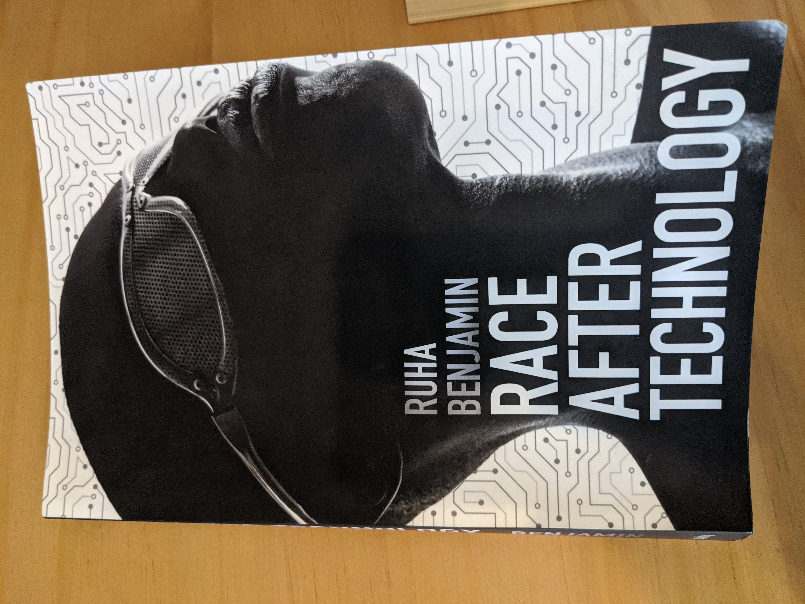

% (At Least) 12 Books in 12 Months - 2020
% Rushi Shah
% 26 March 2020

<link href="https://afeld.github.io/emoji-css/emoji.css" rel="stylesheet">

# (At Least) 12 Books in 12 Months - 2020

```
In Cold Blood by Truman Capote (January)
Are Prisons Obsolete by Angela Davis (February)
The Future of Crime and Punishment by William R. Kelly (March)
Basilica by R. A. Scotti (April)
A Gentleman in Moscow by Amor Towles (April Bonus Round!)
If Beale Street Could Talk by James Baldwin (May)
Race After Technology by Ruha Benjamin (May Bonus Round!)
Circe by Madeline Miller (June)
We Should All Be Feminists by Chimamanda Ngozi Adichie (June Bonus Round!)
The Fire Next Time by James Baldwin (June Bonus Round!)
The White Tiger by Aravind Adiga (July)
Sula by Toni Morrison (August)
Abolition Democracy by Angela Davis (September)
Watchmen by Alan Moore, Dave Gibbons, and John Higgins (October)
Global Population by Alison Bashford (November)
Beyond Survival by Ejeris Dixon and Leah Lakshmi Piepzna-Samarasinha (December)
```

See also:  
 - [(At Least) 12 Books in 12 Months - 2017](12-books-12-months-2017.html)  
 - [(At Least) 12 Books in 12 Months - 2018](12-books-12-months-2018.html)  
 - [(At Least) 12 Books in 12 Months - 2019](12-books-12-months-2019.html)  
 - [(At Least) 12 Books in 12 Months - 2021](12-books-12-months-2021.html)  
 - [(At Least) 12 Books in 12 Months - 2022](12-books-12-months-2022.html)

### *In Cold Blood* by Truman Capote (January)

Whenever I participate in a secret santa I always ask for my secret santa's favorite book. For the TX Votes secret santa in 2018 I received this book from Jacob Springer. It sat on my bookshelf for an entire year before I read it, mainly because I doubted I would enjoy the true crime genre. 

This book was the story of the Clutter-family murderers. Two men killed a family of four in cold blood. They were executed for their crimes. The writing was flowery, and it described the murder, the murderers' flight, the detectives' investigation, and the ultimate trial. 

The book was easy enough to read, but I did not find it particularly interesting. It was odd how the author went out of his way to paint one of the murderers in a nuanced positive light while painting the other as a straightforward villain. I don't feel like I learned anything notable by reading this book, and I didn't particularly enjoy the process. 

### *Are Prisons Obsolete* by Angela Davis (February)


I've been meaning to read this book since I read *The New Jim Crow* [exactly two years ago](https://www.rshah.org/blog/posts/12-books-12-months-2018.html#the-new-jim-crow-by-michelle-alexander-february). It came up again when I attended an incredibly powerful conference at UT Austin's School of Law on [Prison Abolition, Human Rights, and Penal Reform](https://law.utexas.edu/humanrights/events/prison-abolition-human-rights-and-penal-reform-from-the-local-to-the-global/). The book is a classic in prison abolitionism literature, and the author accessibly outlines the flaws in our societal assumptions about incarceration. 

This first chapter introduces the difference between prison reform and prison abolition. It argues that immediate reform strategies can overshadow more fundamental conversations about the existence of prisons in the first place. 

> 'As important as some reforms may be - the elimination of sexual abuse and medical neglect in
women’s prison, for example - frameworks that rely exclusively on reforms help to produce the
stultifying idea that nothing lies beyond the prison. Debates about strategies of decarceration,
which should be the focal point of our conversations on the prison crisis, tend to be marginalized
when reform takes the center stage. The most immediate question today is how to prevent the
further expansion of prison populations and how to bring as many imprisoned women and men
as possible back into what prisoners call the free world.'

The second chapter draws a parallel between prison abolition and the abolition of slavery, lynching, and segregation. The central claim is that prison abolition may seem radical, but it is nonetheless necessary. 

> 'Slavery, lynching, and segregation are certainly compelling examples of social institutions that, like the prison, were once considered to be as everlasting as the sun. Yet, in the case of all three examples, we can point to movements that assumed the radical stance of announcing the obsolescence of these institutions. It may help us gain perspective on the prison if we try to imagine how strange and discomforting the debates about the obsolescence of slavery must have been to those who took the "peculiar institution" for granted-and especially to those who reaped direct benefits from this dreadful system of racist exploitation.'

The third chapter explains how we got here. Incarceration was introduced as a reform over former coroporal punishment alternatives. However, modern prisons have clearly failed their ostensible goal of reforming inmates. Instead, prisons have regressed to cruelly incapacitating inmates until they inevitably return to society, worse off than when they entered. 

> 'What was once regarded as progressive and even revolutionary represents today the marriage of technological superiority and political backwardness. No one-not even the most ardent defenders of the supermax-would try to argue today that absolute segregation, including sensory deprivation, is restorative and healing. The prevailing justification for the supermax is that the horrors it creates are the perfect complement for the horrifying personalities deemed the worst of the worst by the prison system. In other words, there is no pretense that rights are respected, there is no concern for the individual, there is no sense that men and women incarcerated in supermaxes deserve anything approaching respect and comfort.'

The fourth chapter explores the relationship between gender and incarceration. It examines the practices of women's prisons, but also points out how limiting it is to consider men's prison practices as the standard.

> 'prison and police officers are vested with the power and responsibility to do acts
which, if done outside of work hours, would be crimes of sexual assault. If a person does not
consent to being stripped naked by these officers, force can lawfully be used to do it... These
legal strip searches are, in the author’s view, sexual assaults within the definition of indecent
assault'

> 'late-twentieth-century "reforms" have relied on a "separate but equal" model. This "separate but equal" approach often has been applied uncritically, ironically resulting in demands for more repressive conditions in order to render women’s facilities "equal" to men’s.'

The fifth chapter outlines the integral relationship between prisons and corporate profit. For example, the chapter highlights how the spectre of slavery is reminiscient in prison labor disproportionately carried out by black men. Another important point here was that the prison industrial complex is an intricate web of corporations that profit from incarceration. Unfortunately, these corporations are not limited exclusively to the for-profit prisons that actually house inmates. 

> 'For private business prison labor is like a pot of gold. No strikes. No union organizing. No health benefits, unemployment insurance, or workers’ compensation to pay. No language barriers, as in foreign countries. [...] Prisoners do data entry for Chevron, make telephone reservations for TWA, raise hogs, shovel manure, and make circuit boards, limousines, waterbeds, and lingerie for Victoria’s Secret, all at a fraction of the cost of ’free labor.’'

> 'the variety of corporations making money from prisons is truly dizzying, ranging from Dial Soap to Famous Amos cookies, from AT&T to health-care providers [...] Private prisons are direct sources of profit for the companies that run them, but public prisons have become so thoroughly saturated with the profit-producing products and services of private corporations that the distinction is not as meaningful as one might suspect.'

Finally, the sixth chapter outlines abolitionist alternatives to incarceration. By this point, I was convinced their were problems, and looking for a magic bullet. Unfortunately, no such magic bullet exists. There is no one policy or law that can solve our incarceration problem. However, we can evaluate policy options with an abolitionist perspective to determine whether or not they are moving us in the right direction. 

> 'An abolitionist approach that seeks to answer questions such as these would require us to imagine a constellation of alternative strategies and institutions, with the ultimate aim of removing
the prison from the social and ideological landscapes of our society. In other words, we would
not be looking for prison like substitutes for the prison, such as house arrest safeguarded by
electronic surveillance bracelets. Rather, positing de-carceration as our overarching strategy, we
would try to envision a continuum of alternatives to imprisonment-demilitarization of schools,
revitalization of education at all levels, a health system that provides free physical and mental
care to all, and a justice system based on reparation and reconciliation rather than retribution
and vengeance'

As with *The New Jim Crow*, I am having trouble summarizing the main takeaways because I found the entire book so insightful. I think it was worth a read, even if it left me unsatisfied on specific abolitionist alternatives to incarceration.  


### *The Future of Crime and Punishment* by William R. Kelly (March)

In *The Future of Crime and Punishment* by Professor William R. Kelly, he talks about "smart policies for reducing crime and saving money". I took his class "Sociology of Criminal Justice" this semester, and this book was assigned reading. The class was basically just the book spoken out loud, which did not add a ton of value. With that being said, I think the content was useful in providing factual background on the operations of the criminal justice system. The class/book was ultimately worth my time because I am interested in the subject, but it wasn't outstanding. 

Here is one thought I kept returning to during the book and class. He clearly acknowledges that the criminal justice system is racially discriminatory, as evidenced by occassional jabs:

> "Would we be so entrenched in a failed policy that takes as its primary premise that drug use is criminal if the demographics of drug use in the United States were different?"

But he refuses to explicitly examine it in any detail. He delineates sections of his analysis with chapters, headings, and subheadings, none of which explicitly mention race. I believe this is the worst of both worlds, because his preaching to the choir is unsatisfactory, and skeptical readers aren't presented with strong arguments to weigh. Everybody will just continue to believe whatever they believe about racial bias in criminal justice and either accept or reject his ethos based on how closely his idealogy aligns with theirs. Furthermore, he is a white male writing about the criminal justice system reform! He should be using his platform to elevate the disproportionate effects on black and brown communities, rather than acting like the problem is an afterthought. 


### *Basilica* by R. A. Scotti (April)


> "For the first time in the building of St. Peter's, the three essential elements were in place. There was a clear plan to follow. There was a skilled engineer to ensure that construction was sound. And there was money to finance it. Finally, it seemed as if there were no impediments to construction." (Page 187)

Borrowed this book from my aunt's house for some quarantine reading, and I really liked it! It is a history of the building of St. Peter's Basilica in Rome with tons of drama between melodramatic Rennaissance artists and obsessive popes. I highly recommend it for a light-hearted non-fiction read. 

This book was strong because it painted a picture of the architects and popes that made the art happen. Michelangelo: the tortured-soul artist, Raphael: the epicurean prodigy, Pope Julius II (della Rovere): the gunner. And countless others including Sangallo, della Porta, Maderno, and Bernini. 

One takeaway from this book for me was that the papacy of catholicism in the rennaissance was just politics. Plain and simple. Rather than government as the vehicle, it was religion, but at the end of the day the cardinals and popes were just congresspeople and presidents. Believers were constituents, and tithes were taxes. Both determine how money is spent to represent the values of the time, and both provide drama for high society. And at the end of the day, hopefully, both leave things better than they were found. 

### *A Gentleman in Moscow* by Amor Towles (April Bonus Round!)

Personal news! I was accepted at Harvard Law School in March, and will be pursuing a JD at Harvard Law School and a PhD in Computer Science at Princeton in the Center for Information Technology Policy. Anyways, I met a lot of my future Harvard classmates through groupchats and I decided to organize a book club for us. This fiction was the first book we read. 

I personally thought the author didn't develop the characters well, didn't treat the described historical events with due nuance, and poorly paced the story. But it was cool to bond with newfound friends over Zoom and chat about the book. Also, for what it's worth, a lot of them really liked the book. 

### *If Beale Street Could Talk* by James Baldwin (May)

This was the second book my Harvard book club read together, and I liked it much more. I would recommend this book, and am hoping to read more works by the same author in the future. This book is, at the end of the day, a really great love story and I highly recommend it as such. 

With that being said, it is also has overarching themes of prison abolitionism which are effectively conveyed. In particular, Baldwin succinctly captured a critique of carceral feminism in this novel by showing how police and prison systems can exploit the tragedy of rape to advance their racist agenda. He portrays how this not only irreperably harms the wrongly-accused black man and his family, but also ultimately fails the victim of the rape because her rapist is never held accountable.

We also discussed the fact that Fonny's imprisonment occurs entirely before his trial, and even before his initial bail hearing. Despite being innocent until proven guilty (and in fact being innocent altogether), he faces the consequences of incarceration and their reprucussions on his life and his family's lives. We found this critique of pretrial incarceration particularly effective. 

### *Race After Technology* by Ruha Benjamin (May Bonus Round!)



<!-- > "abolitionist toolkit[s] [...] can be focused on computational interventions, but they do not have to be. In fact, *narrative tools* are essential. [...] Data, in short, do not speak for themselves and don't always change hearts and minds or policy" (Page 192) -->

I joined a Princeton book club in the Center for Information Technology Policy (CITP) and this is the book they had selected! I was incredibly excited to read it, because it describes a field I want to research during my PhD. Namely, the book talks about the role of technology in perpetuating existing social hierarchies (particularly along racial dimensions). It is subtitled "Abolitionist Tools for the New Jim Code", which references the modern prison abolition movement and references Michelle Alexander's *The New Jim Crow*, which [I read a few years ago and loved](https://www.rshah.org/blog/posts/12-books-12-months-2018.html#the-new-jim-crow-by-michelle-alexander-february). 

I had unreasonably high expectations for the book: I thought I could just read it and learn exactly what I should research in my PhD. Instead, the book provided a good sociological account of how technology has led to "engineered inequity", perpetuated "default discrimination", expanded "coded exposure", and backfired in "technological benevolence". In this way, the book was descriptive, rather than prescriptive. It described scenarios that have already played out, rather than giving a step-by-step on where to go from here. This focus was clearly intentional, but I didn't start the book with the right mindset. 

<!-- Also, I think the target of this book was not necessarily the attendees of the book club: professors, post-docs, and PhD students of technology. Instead, I think it was meant to have a broader audience, like folks completely unfamiliar with the field or folks coming from a social sciences/humanities background.  -->

One interesting tid-bit from the book, which I felt was an excellent example of the implicit bias of technology, was the exposure methods of the original Kodak cameras. 

> 'Shirley Cards produced by Kodak from the 1950 to 1990s [...] were an integral part of film exposure methods and used the image of a White woman to standardize the exposure process. Since the model's skin was set as the norm, darker skinned people in photographs would be routinely underexposed. In short, skin tone biases were embedded in the "actual apparatuses of visual reproduction." As one photographer recently put it, "It turns out, film stock's failures to capture dark skin aren't a technical issue, they're a choice."
>
>[...]
>
> But the hegemony of Whiteness is [...] also exposed through practices that are more explicitly political. In South Africa [during South African apartheid], for example, Polaroid's ID2 camera, with its added flash "boost button," was used to better capture Black citizens' images for the infamous passbooks that violently restricted the movement of Black people throughout the country.
' (Page 104-106)

The takeaway here is that, under the status quo, the presumption of whiteness will only be challenged in technology when it is convenient for upholding white supremacy. Technology will stay color-blind exactly up until it blinds itself against racism. 

Anyways, the search for the perfect PhD topic continues. If I may speak it into existence, my goal is to frame my thesis solidly within the abolitionist framework. In other news, during the book club I was also asked to start organizing the TechSoc (Technology and Society) reading group in CITP! I'm looking forward to more discussions, but intimidated at the prospect of determining what material everybody will read for the year. 

### *Circe* by Madeline Miller (June)


I was gifted a harcopy (!!!) of this book by the resolutely unwavering [Grace Liu](https://www.linkedin.com/in/graceysliu/) as a graduation present. It was an AWESOME reimagining of the myths surrounding the eponymous Greek witch. One of my favorite parts was how the author managed to weave so many different myths into one seamless story. It would have been easy to just make each chapter a different myth, but it was such an immersive tale this way. 

The earlier parts of the story, when Circe is still in the halls of Helios, are kind of disorienting because there are so many unfamiliar characters and power dynamics. But after Circe discovers her powers, the story gets moving *real* quick and becomes much easier to follow. It's been a while since I've enjoyed a fantasy book this much, and I think it is now my go-to light-hearted fiction recommendation. 

### *We Should All Be Feminists* by Chimamanda Ngozi Adichie (June Bonus Round!)

This was a good short book that my girlfriend was also reading at the time. I already agreed with everything the book said, but my girlfriend liked it because it was a concise meditation on the gender double standards in society. 

### *The Fire Next Time* by James Baldwin (June Bonus Round!)

<!-- > "In a society that is entirely hostile, and, by its nature, seems determined to cut you down- that has cut down so many in the past and cuts down so many every day-it begins to be almost impossible to distinguish a real from a fancied injury. One can very quickly cease to attempt this distinction, and, what is worse, one usually ceases to attempt it without realizing that one has done so. All doormen, for example, and all policemen have by now, for me, become exactly the same, and my style with them is designed simply to intimidate them before they can intimidate me. No doubt I am guilty of some injustice here, but it is irreducible, since I cannot risk assuming that the humanity of these people is more real to them than their uniforms. Most Negroes cannot risk assuming that the humanity of white people is more real to them than their colour." (Page 77) -->

This is a work of nonfiction by James Baldwin that includes two essays of his. It was another book from the CITP book club. I was surprised to find that a major topic of the book was the intersection of Abrahamic religions and social justice in America. In the past eight years (in high school and undergrad), most of my friends weren't raised on Abrahamic religions, and even those that were did not consider themselves particularly religious. (This contrasted the eight years before that (elementary and middle school), when everybody I knew identified as Christians.) So, when I read this book, I was reminded that Abrahamic religions exist and, in fact, are the topic of significant scholarship. 

At CITP, one thing that came up in our discussion of the recent protests for Black lives was the idea of "peaceful protests" and how to explain to people why there have been riots. As I've mentioned before, I'm culturally Jain, and I've recently joined a different reading group called "Jains for Justice". In that group, one Jain expressed this opinion

> "The vast majority of protests that have been organized were intended to be peaceful. As individual Jains we might choose not to loot in protest. Still, anekantvad, or multiplicity of views, teaches us that we cannot claim looting is an incorrect form of protest - while we don't condone it we cannot condemn it."

I think that is an accurate assesment of the Jain perspective on the protests, and is a pretty good starting point. With that being said, I am not particularly Jain, and I also happen to condone the acts of protest taken to secure Black liberation. My explanation is as follows.  

Firstly, calling a protest "peaceful" is a political decision, in the same way calling certain crimes "violent" is a political distinction. Peace and violence, in this context, are flawed political constructs that are used to harm Black folks. To call the protests violent is to equate the property damage carried out by the protestors with the bodily harm caused by the state. Smashing a window at a department store is not the same thing as murdering a Black man. 

Secondly, police are responsible for the escalation of violence at protests. Police have responded disproportionately to the protests and terrorized protestors with their weapons. The police are deploying their military-grade weaponry, including less-lethal ammunition and chemical weapons, on protesting citizens. In response to pushback against the way police choked a man to death, the police are literally blinding people with rubber bullets. The police are escalating the protests into riots. 

Thirdly, property damage is a strategic decision by the protestors. The situation for Black people is already unsustainable: they are killed daily. Including property damage in protest is a way to make the status quo unsustainable for everybody, which is the thing that will pressure media into covering it and politicians into fixing it. 

Fourthly, the looting is not altogether unrelated to the protests. A large component of the protests is a push against the economic systems at play. So looters are making a political statement by harming corporate profits that are prioritized over human life. Responding to property damage with physical violence, as the police do to protect corporate storefronts, is the problem the protests are trying to highlight. 

Anyways, these are some of the thoughts I have shared with my friends who have asked me to explain what's going on. It has helped shed some light for them into why the protests are proceeding the way they are. 

### *The White Tiger* by Aravind Adiga (July)


I returned to my childhood home, and my childhood bookshelf, this month. I have had this book on there for a while, and for some reason remember my dad recommending it highly. I read it, and really liked it. I told him I was reading it and turns out he had never heard of it before. It's quite the mystery why I imagined he had, but after I finished it he read it and did end up really liking it!

This is a fiction of a servant in India who takes matters into his own hands to secure wealth for himself. It was a sobering reminder of the India I've only seen glimpses of from my travels there. Big themes were the relationship between servants and their masters in India and the rigid caste system. It made me think a lot about how my family still keeps servants in India, and how exploitative that dynamic is. I wonder how I was perceived when I was visiting as a kid. In one sense, I was innocent because how much agency can a 9 year old be expected to have. But on the other hand, even as a 9 year old I had a top-tier status that demanded deference from everybody around me. 

It's uncomfortable to think what it would be like to go back now. I no longer can claim the innocence of youth. Is returning to my parent's hometowns tacitly endorsing servitude? Tacitly endorsing the caste system? Is there a way for me to stay connected with my culture without dedicating my life to ending the economic and cultural systems that animate servitude and caste and without remaining complicit in the same?

Who am I to say what needs to change about India? I feel jurisdiction over American problems because I was born and brought up here. I know American history, including it's sins and virtues. Indians living in India would probably hear me out about what I think about India, but it would justifiably be easy for them to dismiss what I have to say. What do I know about India?

### *Sula* by Toni Morrison (August)


> "She thought of looking out of the windows of all those trains and buses, looking at the feet and backs of all those people. Nothing was every different. They were all the same. All of the words and all of the smiles, every tear and every gag just something to do." (page 147)

My exceedingly pleasant new roommate, [Spencer Weinreich](https://history.princeton.edu/people/spencer-weinreich), let me borrow this short book. I thought I would fly through it. Even though I was ultimately very impressed by the book, I wouldn't consider it a page turner. The real strength of the book was the great payoff at the end. 

Toni Morrison revealed enough throughout the book that, in retrospect, you realize how blindingly obvious the point of the book is. But somehow, you end up waiting until the exact moment Morrison wants you to put the pieces together before you see it. Masterfully written, Morrison shows you that she was three steps ahead of you the whole time. The book might have had some slow chapters, but when I read this line and everything clicked, I realized how well the story was presented.

> "You. Sula. What's the difference? You was there. You watched, didn't you? Me, I never would've watched [...] It's awful cold in the water. Fire is warm." (page 168)

### *Abolition Democracy* by Angela Davis (September)


This book was a very short set of interview questions by Eduardo Mendieta and responses by Angela Davis. The book approached the concept of abolition democracy primarily by analyzing the Abu Ghraib prison scandal. It's another one from [Spencer](https://history.princeton.edu/people/spencer-weinreich)'s vast abolitionist bookshelf (he's my exeedingly pleasant new roommate). I'm looking forward to further exploring the books he's collected as a scholar of solitary confinement (I'm looking at you, *Golden Gulag*, and *Carceral Capitalism*). In the paragraphs that follow, I've collected some of the points from *Abolition Democracy* that particularly resonated with me. 

Davis cautioned against resting on the laurels of the civil rights movement. In other words, The New Jim Crow won't necessarily be overcome with the same tactics used against the old Jim Crow. This clarifies why abolition democracy encompasses more than just civil rights. She said:

> "I don't think it is helpful to assume that an agenda that gets established at one point in history will forever claim success on the basis of its initial victories. It is misleading to assume that this success will be enduring, that it will survive all of the changes and mutations of the future. The civil rights movement managed to bring about enourmous political shifts, which opened doors to people previosly excluded from government, corporations, education, housing, etc. However, an exclusively civil rights approach--as even Dr. King recognized before he died--cannot by itself eliminate structural racism. [...] The assumption that the placement of black people like Colin Powell and Condolezza Rice in the heart of government would mean progress for the entire community was clearly fallacious. [...] The civil rights movement demanded access, and access has been granted to some. The challenge of the twenty-first century is not to demand equal opportunity to participate in the machinery of oppression. Rather, it is to identify and dismantle those structures in which racism continues to be embedded. This is the only way the promise of freedom can be extended to masses of people." (page 26)

Davis pointed out that current US practice clearly can't be taken as the gold standard of democracy. She used the Abu Ghraib prison scandal and Bush-era foreign policy to convincingly argue that we should strive for something better (what she calls abolition democracy). She said: 

> "[Colin Powell] said that the military was the most democratic institution in our society and created a framework in which people could escape the constraints of race and, we can add today, gender as well. This notion of the military as a leveling institution, one that constitutes each member as equal, is frightening and dangerous, because you must eventually arrive at the conclusion that this equality is about equal opportunity to kill, to torture, to engage in sexual coercion. At the time I found it very bizarre the Powell would point to the most hierarchal institution, with its rigid chain of command, as the epitome of democracy. Today, I would say that such a conception of democracy reveals the problems and limitations of civil rights strategies and discourses" (page 60)

As an aspiring lawyer, I struggle often with identifying the role the law can and should play in abolition. Davis meditated on this theme throughout the book, which helped me explore some of my thoughts more deeply. She rightly recognized that law cannot be a panacea for structural racism. She said: 

> "we need to find ways of contesting the absolute authority of law. We might phrase the following question: how do we use the law as a vehicle of progressive change, while simultaneously emphasizing the importance of acknowledging the limits of the law" (page 88)

One point I really appreciated was how Davis articulated a way in which the race neutrality of our laws today may be a bug rather than a feature. She said: 

> "The grand achievement of civil rights was to purge the law of its references to specific kinds of bodies, thus enabling racial equality before the law. But at the same time this prcess enabled racial inequality in the sense that the law was deprived of its capacity to acknowledge people as being racialized, as coming from racialized communities. Because the person that stands before the law is an abstract, rights-bearing subject, the law is unable to apprehend the unjust social realities in which many people live. To give a more concrete example, one that relates to the formation of the prison-industrial-complex, I would say that precisely becaues the law is unable to take into consideration those social conditions that render certain communities much more susceptible to imprisonment than others, the mechanism of formal due process justifies the racist and class character of prison populations. The law does not care whether this individual had access to good education or not, or whether he/she lives under impoverished conditions because companies in his/his communities have shut down and moved to a third world country, or whether previously availibel welfare payments have vanished. The law does not care about the conditions that lead some communities along a trajectory that makes prison inevitable." (page 89)


<!-- > "I've always preferred to identify with the pan-Africanism of W. E. B. Du Bois who argued that black people in the West do have a special responsibility to Africa, Latina America, and Asia--not by virtue of a biological connection or a racial link, but by virtue of a political identification that is forged in struggle. We should be attentive to Africa not simply because this continent is populated by black people, not only because we trace our origins to Africa, but primarily because Africa has been a major target of colonialism and imperialism. What I also like about Du Bois's pan-Africanism is that it isnists on Afro-Asian solidarities. This is an important feature that has been concealed in conventional narratives of pan-Africanism. Such an apporach is not racially defined, but rather discovers its political identity in its struggles against racism." (page 25) -->

<!-- > "I don't think it is helpful to assume that an agenda that gets established at one point in history will forever claim success on the basis of its initial victories. It is misleading to assume that this success will be enduring, that it will survive all of the changes and mutations of the future. The civil rights movement managed to bring about enourmous political shifts, which opened doors to people previosly excluded from government, corporations, education, housing, etc. However, an exclusively civil rights approach--as even Dr. King recognized before he died--cannot by itself eliminate structural racism. What the civil rights movement did, it seems to me, was to create a new terrain for asking new questions and moving in new directions. The assumption that the placement of black people like Colin Powell and Condolezza Rice in the heart of government would mean progress for the entire community was clearly fallacious. In this, there were no guarantees, to borrow from Stuart Hall. The civil rights movement demanded access, and access has been granted to some. The challenge of the twenty-first century is not to demand equal opportunity to participate in the machinery of oppression. Rather, it is to identify and dismantle those structures in which racism continues to be embedded. This is the only way the promise of freedom can be extended to masses of people." (page 26) -->


<!-- --the limits of national law as well as international law. For example, we naturally assume that justice and equality are necessarily produced through the law. But the law cannot on its own create justice and equality. Here in the US, thirty years after the passage of what was considered unprecedented civil rights legislation, we are still plagued with many of the same problems of inequality relating to economics, race, and gender. In many instances, they are even more entrenched in the social order. There are ways in which law can successfully be taken up strategically and thus can enable popular movements and campaigns. The focus of the civil rights movement was precisely on effecting change in the prevailing laws. But at the same time, the law produced the limits of those possible changes, as we can see in the way that affirmative action legislation has, in states like California, enabled its own demise. -->

<!-- Interviewer was Eduardo Mendieta.  -->

### *Watchmen* by Alan Moore, Dave Gibbons, and John Higgins (October)

Great Halloween book. Hoping to watch the TV series eventually. Highly recommend for a work of gripping fiction. 

### *Global Population* by Alison Bashford (November)


This was a fascinating book that drew my eye from Spencer's bookshelf. He said I could have it, because he bought it for a class that never ended up using it. Although he hadn't read it, he said the other readings for the class were excellent, so he expected this book to be pretty good too. 

This book chronicled intellectual thought from the 1920s to the 1960s about issues related to global population. This was a monumental task in terms of the topics covered, the period of time covered, and the geographic scope covered. Topic wise, the book covered birth control, feminism, eugenics, malthusianism, agricultural development, immigration, (anti)colonialism, war, and global governance. Each of these topics, of course, implicated numerous subtopics (agricultural development led to discussions of nutrition, colonialism led to discussions of various nationalisms, and on, and on). Time period wise, the book covered a chaotic and eventful era which spanned WWII, decolonization, the formation of the League of Nations, various immigration control acts, the invention of scalable birth-control, widespread acceptance of Darwinian evolution, and parts of the first and second waves of feminism. Geography wise, the book covered the geopolitical issues of Japan, Europe, Australia, India, and remote regions of the Artic. Drawing out the relationships between such disparate topics on such massive scales made this book incredibly ambitious and incredibly informative. 

Personally, I loved this book. Growing up, I internalized fears of population growth and global carrying capacity. I remember learning about carrying capacity in elementary school, and not getting satisfying answers about how that theory relates to human populations. Over the years I frequently turned the issue over in my mind and was always shocked by how depressing my conclusions were. As I saw it, population would grow exponentially if it could, but it is checked by logistical limits on resources which causes it to hit an asymptote. I viewed technological progress as an unsatisfying pursuit in this regard, because technological progress could only marginally raise the asymptote, without fundamentally resolving scarcity. I didn't know what to do with these thoughts of scarcity because they seemed so insurmountable. After reading this book, the problems certainly don't feel solved, but the book has given me historical context, rigourous clarity, and validation. It felt like so many of my curiosities, piece by piece, were being put into words on a page as I read. 

I expected to identify with one scholar or intellectual tradition and I was hoping I could use that as a starting point to read more like-minded stuff. But I was surprised that there was no scholar or school of thought I could completely get on board with. By centering the scholar's own words rather than her own, Bashford was very good at conveying nuance. That nuance allowed me to pick and choose which contributions to take and which to leave. For example, I expected to wholeheartedly support Indian anticolonials, like Radhakamal Mukerjee. But I hesitated at the concerning level of Indian nationalism baked into his anticolonial work. Conversely, I would occasionally read someone's quote and really resonate with it, only to later blanch at that speaker's other eugenic, racist, or sexist background or contributions. For example, Margaret Sanger was instrumental in advocating for widespread access to birth control (good!), but did so largely with eugenic or racist justifications (bad). As Bashford put it:  

> "The politics of [the post World War I] global population scene were highly unpredictable: Anglophone advocates of eugenics could be, and were, racist geneticists, antiracist and cosmopolitan geneticists, or anticolonial social scientists who nonetheless ignored indigenous people. Eugenicists could be entitled and benevolent white colonials or Indian anticolonial nationalists." (Page 263)

Playing within that nuance is helpful for me to have a foundation to build on, but not feel limited by the prejudices of intellectual ancestors. Here are some quotes (far from comprehensive) on topics I want to reference in the future:

On scientific racism:

> "'Is White Australia Possible?' This was a research question pursued systematically by pathologists and physiologists, who sampled and analyzed young, white laborers' sweat, urine, bile, and blood for evidence of resilience, decline, or adaptation. Long interpreted by historians within a national and occasionally imperial framework, this physiological inquiry had in fact a much larger global and international import. Can white men live and labor in the tropics? Many Australian scientists tended to answer affirmatively; given what was at stake, this is perhaps unsurprising. Viable tropical physiologocal and reproductive functioning was shown to be quite possible, Australian scientists concluded, a little too insistently." (Page 148)

On birth control:

> "Some of these authors, as we shall see below, thought through birth control and birthrates in terms of gender, some even through feminist conceptions of gender. But others, and this is possibly the more important point, pressed forward birth control without considering women or gender, let alone contemporary feminism at all. Warren Thomspon, the demographer most often credited with formulating the earliest versions of fertility transition theories, is notable in this respect. He strongly politicized population growth, exploitive colonialism, and birth control without considering women or gender in the least. There is no discussion of women in *Danger Spots in World Population*, no entry for women in the index, not even under 'mortality', when it was well understood that maternal mortality, alongside infant mortality, was critical for projective demographic trends. At the same time, this book made one of the strongest pitches for birth control of all the comparable texts. Indeed, Thompson thought birth control one of the great technological developments of humankind, as significant in the history of human affairs as fire, printing, or electricity." (page 216)


On eugenics: 

> "Mental and physical dis/ability was eugenics' core problem. On the question of race, however, 'eugenecists' presented any number of scientific and political faces, from strident segregationism and insistence on hierarchized difference, to equally strident absorptionism that would obliterate difference, to public and passionate antiracism with its own complicated and unpredictable relationship to the new genetics. The antiracism of some of the key players in the Anglophone biopopulation establishment--Julian Huxley or Radhakamal Mukerjee, for example--by no means precluded a sharp valuation of human differences on other axes, especially the classic and persistent eugenic issues of intelligence, disability, and class. Their positions were always complicated. Warren Thompson, for example, made a career in active oppositionto presumptions of superiority built into both eugenics and various race sciences that were consolidating in this period, even as he actively wrote out indigenous people from any geopolitical solution to overpopulation. Nothing in the linked population-race-eugenics triad was predictable or can be presumed, so multiple were the agendas, the politics, and the sciences of population, so plyvalent the actual practices of reproductive management." (page 240)

> "'The Neo-Malthusian movement dealt with the quality as well as the quantity of children'. As president of the Malthusian League, and as a member of the British Eugenics Society until 1961, Charles Vickery Drysdale wrote columinously and thought carefully about neo-Malthusianism and eguenics as complementary. Most importantly, he often understood the two population movements as successive; the reduction in the birthrate was a necessary precondition for successful eugenics. Far from being oppositional, in this view, 'quality' and 'quantity' aspects of population problems and population laws were interdependent [...] Eugenics was, in other words, phase two of the temporal program of population improvement; quantity would be dealt with first, then quality." (page 242)

Page 244 is also a good reference. It talks a little bit about quantity versus quality, and a little bit about the freedom to use birth control versus the state compulsion to do so.  

The following quote feels related to modern day immigration policy based on "highly skilled labor":

> "In addition to the well-documented racial eugenics of immigration, almost all of the immigration acts then proliferating in multiple settler-colonial contexts encoded the powers to exclude individuals on the grounds of physical, mental, and sometimes moral unfitness, irrespective of race or nationality. Thus, in thinking about what constituted 'world eugenics', there needs to be an extension of understanding of the eugenics of immigration restriction beyond racial politics alone. Indeed the immigration acts were rarely, if ever, solely mechanisms to keep out 'colored aliens'; they also functioned to exclude a range of other undesirable or unfit entrants. Many New World nations were hurriedly writing and rewriting the exclusion of the Old World 'feeble-minded' into statutes, policies, and regulations as a means by which their own national populations might be improved. The 'unfit' individual of the same 'race' was to be excluded. More strictly eugenic than any race-based exclusion, then, were the clauses that sought to screen out the white physically and mentally 'unfit' who would otherwise be permitted to enter: the feeble-minded, syphilitic, criminally inclined, or alcoholic. This is the less familiar legacy of eugenics on the international bioregulation of global movement." (page 247)

On Malthusianism:

> "The extent to which the Geneticists' Manifesto was also about world population is barely recognized at all. In fact, most of the document only makes sense in the light of broadly Malthusian argument for birth control, notwithstanding the Marxism of some of its key signatories.  
The biologists were replying to the Washington's Science Service's question: 'How could the world's population be improved most effecctively genetically?' The scientifict respondents showed their collective left-wing hand immediately. Economic and political leveling needed to be implemented before any other kind of 'improvement' can be appropriately implemented: 'There can be no valid basis for estimating and comparing the intrinsic worth of different individuals, without economic and social conditions which provide approximately equal opportunities for all members of society instead of stratifying them from birth into classes with widely different privileges'. And the second great hindrance to world population improvement, they insisted, was ongoing racial prejudice based on unscientific doctrines that presumed good or bad genes to be the monopoly of particular peoples. That idea needed eliminating, they said. [...]  
Their answer to how 'the world's population could be improved' was birth control. The biologists argued that the improvement of future generations required the economic security of parents, that women should be offered 'special protection' so that reproduction would not interfere with their larger social participation. It called directly for the legalization, universal dissemination, and scientific investigation of fertility regulation: volunatary temporary or permanent sterilization, contraception, abortion ('as a third line of defence'), control of fertility and the 'sexual cycle', and artificial insemination. All this would be 'always voluntary', they insisted, in what was to become the important pattern for postwar eugenics. The famous Geneticists' Manifesto, then, was also a manifesto for world-scale birth control. Indeed, given that the descriptor 'Geneticists' Manifesto' was only ever retrospectively applied, it might well be retitled the 'Malthusians' Manifesto'." (Page 262)

### *Beyond Survival* by Ejeris Dixon and Leah Lakshmi Piepzna-Samarasinha (December)


<hr>

In retrospect: I think my favorite books this year were *Basilica* by R. A. Scotti (April), *If Beale Street Could Talk* by James Baldwin (May), *Circe* by Madeline Miller (June), *Abolition Democracy* by Angela Davis (September), *Watchmen* by Alan Moore, Dave Gibbons, and John Higgins (October), *Global Population* by Alison Bashford (November), and *Beyond Survival* by Ejeris Dixon and Leah Lakshmi Piepzna-Samarasinha (December). Here's to the books that shaped my 2020, and to all the books still out there for next year <i class="em em-clinking_glasses"></i>