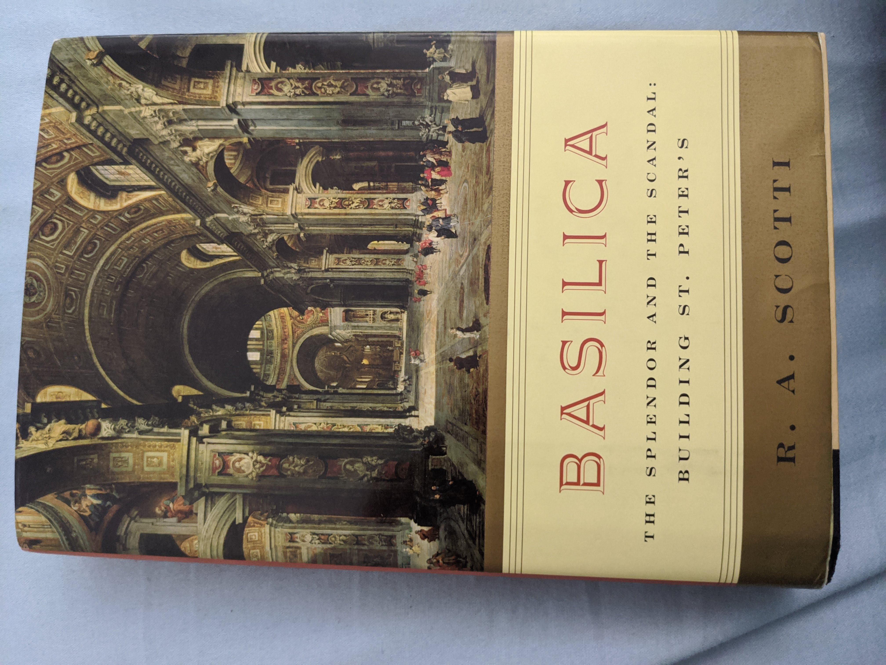

% (At Least) 12 Books in 12 Months - 2020
% Rushi Shah
% 26 March 2020

<link href="https://afeld.github.io/emoji-css/emoji.css" rel="stylesheet">

# (At Least) 12 Books in 12 Months - 2020

```
In Cold Blood by Truman Capote (January)
Are Prisons Obsolete by Angela Davis (February)
The Future of Crime and Punishment by William R. Kelly (March)
Basilica by R. A. Scotti (April)
A Gentleman in Moscow by Amor Towles (April Bonus Round!)
If Beale Street Could Talk by James Baldwin (May)
Race After Technology by Ruha Benjamin (May Bonus Round!)
Circe by Madeline Miller (June)
```

See also:  
 - [(At Least) 12 Books in 12 Months - 2017](https://www.rshah.org/blog/posts/12-books-12-months-2017.html)  
 - [(At Least) 12 Books in 12 Months - 2018](https://www.rshah.org/blog/posts/12-books-12-months-2018.html)  
 - [(At Least) 12 Books in 12 Months - 2019](https://www.rshah.org/blog/posts/12-books-12-months-2019.html)

### *In Cold Blood* by Truman Capote (January)

Whenever I participate in a secret santa I always ask for my secret santa's favorite book. For the TX Votes secret santa in 2018 I received this book from Jacob Springer. It sat on my bookshelf for an entire year before I read it, mainly because I doubted I would enjoy the true crime genre. 

This book was the story of the Clutter-family murderers. Two men killed a family of four in cold blood. They were executed for their crimes. The writing was flowery, and it described the murder, the murderers' flight, the detectives' investigation, and the ultimate trial. 

The book was easy enough to read, but I did not find it particularly interesting. It was odd how the author went out of his way to paint one of the murderers in a nuanced positive light while painting the other as a straightforward villain. I don't feel like I learned anything notable by reading this book, and I didn't particularly enjoy the process. 

### *Are Prisons Obsolete* by Angela Davis (February)


I've been meaning to read this book since I read *The New Jim Crow* [exactly two years ago](https://www.rshah.org/blog/posts/12-books-12-months-2018.html#the-new-jim-crow-by-michelle-alexander-february). It came up again when I attended an incredibly powerful conference at UT Austin's School of Law on [Prison Abolition, Human Rights, and Penal Reform](https://law.utexas.edu/humanrights/events/prison-abolition-human-rights-and-penal-reform-from-the-local-to-the-global/). The book is a classic in prison abolitionism literature, and the author accessibly outlines the flaws in our societal assumptions about incarceration. 

This first chapter introduces the difference between prison reform and prison abolition. It argues that immediate reform strategies can overshadow more fundamental conversations about the existence of prisons in the first place. 

> 'As important as some reforms may be - the elimination of sexual abuse and medical neglect in
women’s prison, for example - frameworks that rely exclusively on reforms help to produce the
stultifying idea that nothing lies beyond the prison. Debates about strategies of decarceration,
which should be the focal point of our conversations on the prison crisis, tend to be marginalized
when reform takes the center stage. The most immediate question today is how to prevent the
further expansion of prison populations and how to bring as many imprisoned women and men
as possible back into what prisoners call the free world.'

The second chapter draws a parallel between prison abolition and the abolition of slavery, lynching, and segregation. The central claim is that prison abolition may seem radical, but it is nonetheless necessary. 

> 'Slavery, lynching, and segregation are certainly compelling examples of social institutions that, like the prison, were once considered to be as everlasting as the sun. Yet, in the case of all three examples, we can point to movements that assumed the radical stance of announcing the obsolescence of these institutions. It may help us gain perspective on the prison if we try to imagine how strange and discomforting the debates about the obsolescence of slavery must have been to those who took the "peculiar institution" for granted-and especially to those who reaped direct benefits from this dreadful system of racist exploitation.'

The third chapter explains how we got here. Incarceration was introduced as a reform over former coroporal punishment alternatives. However, modern prisons have clearly failed their ostensible goal of reforming inmates. Instead, prisons have regressed to cruelly incapacitating inmates until they inevitably return to society, worse off than when they entered. 

> 'What was once regarded as progressive and even revolutionary represents today the marriage of technological superiority and political backwardness. No one-not even the most ardent defenders of the supermax-would try to argue today that absolute segregation, including sensory deprivation, is restorative and healing. The prevailing justification for the supermax is that the horrors it creates are the perfect complement for the horrifying personalities deemed the worst of the worst by the prison system. In other words, there is no pretense that rights are respected, there is no concern for the individual, there is no sense that men and women incarcerated in supermaxes deserve anything approaching respect and comfort.'

The fourth chapter explores the relationship between gender and incarceration. It examines the practices of women's prisons, but also points out how limiting it is to consider men's prison practices as the standard.

> 'prison and police officers are vested with the power and responsibility to do acts
which, if done outside of work hours, would be crimes of sexual assault. If a person does not
consent to being stripped naked by these officers, force can lawfully be used to do it... These
legal strip searches are, in the author’s view, sexual assaults within the definition of indecent
assault'

> 'late-twentieth-century "reforms" have relied on a "separate but equal" model. This "separate but equal" approach often has been applied uncritically, ironically resulting in demands for more repressive conditions in order to render women’s facilities "equal" to men’s.'

The fifth chapter outlines the integral relationship between prisons and corporate profit. For example, the chapter highlights how the spectre of slavery is reminiscient in prison labor disproportionately carried out by black men. Another important point here was that the prison industrial complex is an intricate web of corporations that profit from incarceration. Unfortunately, these corporations are not limited exclusively to the for-profit prisons that actually house inmates. 

> 'For private business prison labor is like a pot of gold. No strikes. No union organizing. No health benefits, unemployment insurance, or workers’ compensation to pay. No language barriers, as in foreign countries. [...] Prisoners do data entry for Chevron, make telephone reservations for TWA, raise hogs, shovel manure, and make circuit boards, limousines, waterbeds, and lingerie for Victoria’s Secret, all at a fraction of the cost of ’free labor.’'

> 'the variety of corporations making money from prisons is truly dizzying, ranging from Dial Soap to Famous Amos cookies, from AT&T to health-care providers [...] Private prisons are direct sources of profit for the companies that run them, but public prisons have become so thoroughly saturated with the profit-producing products and services of private corporations that the distinction is not as meaningful as one might suspect.'

Finally, the sixth chapter outlines abolitionist alternatives to incarceration. By this point, I was convinced their were problems, and looking for a magic bullet. Unfortunately, no such magic bullet exists. There is no one policy or law that can solve our incarceration problem. However, we can evaluate policy options with an abolitionist perspective to determine whether or not they are moving us in the right direction. 

> 'An abolitionist approach that seeks to answer questions such as these would require us to imagine a constellation of alternative strategies and institutions, with the ultimate aim of removing
the prison from the social and ideological landscapes of our society. In other words, we would
not be looking for prison like substitutes for the prison, such as house arrest safeguarded by
electronic surveillance bracelets. Rather, positing de-carceration as our overarching strategy, we
would try to envision a continuum of alternatives to imprisonment-demilitarization of schools,
revitalization of education at all levels, a health system that provides free physical and mental
care to all, and a justice system based on reparation and reconciliation rather than retribution
and vengeance'

As with *The New Jim Crow*, I am having trouble summarizing the main takeaways because I found the entire book so insightful. I think it was worth a read, even if it left me unsatisfied on specific abolitionist alternatives to incarceration.  


### *The Future of Crime and Punishment* by William R. Kelly (March)

In *The Future of Crime and Punishment* by Professor William R. Kelly, he talks about "smart policies for reducing crime and saving money". I took his class "Sociology of Criminal Justice" this semester, and this book was assigned reading. The class was basically just the book spoken out loud, which did not add a ton of value. With that being said, I think the content was useful in providing factual background on the operations of the criminal justice system. The class/book was ultimately worth my time because I am interested in the subject, but it wasn't outstanding. 

Here is one thought I kept returning to during the book and class. He clearly acknowledges that the criminal justice system is racially discriminatory, as evidenced by occassional jabs:

> "Would we be so entrenched in a failed policy that takes as its primary premise that drug use is criminal if the demographics of drug use in the United States were different?"

But he refuses to explicitly examine it in any detail. He delineates sections of his analysis with chapters, headings, and subheadings, none of which explicitly mention race. I believe this is the worst of both worlds, because his preaching to the choir is unsatisfactory, and skeptical readers aren't presented with strong arguments to weigh. Everybody will just continue to believe whatever they believe about racial bias in criminal justice and either accept or reject his ethos based on how closely his idealogy aligns with theirs. Furthermore, he is a white male writing about the criminal justice system reform! He should be using his platform to elevate the disproportionate effects on black and brown communities, rather than acting like the problem is an afterthought. 


### *Basilica* by R. A. Scotti (April)



> "For the first time in the building of St. Peter's, the three essential elements were in place. There was a clear plan to follow. There was a skilled engineer to ensure that construction was sound. And there was money to finance it. Finally, it seemed as if there were no impediments to construction." (Page 187)

Borrowed this book from my aunt's house for some quarantine reading, and I really liked it! It is a history of the building of St. Peter's Basilica in Rome with tons of drama between melodramatic Rennaissance artists and obsessive popes. I highly recommend it for a light-hearted non-fiction read. 

This book was strong because it painted a picture of the architects and popes that made the art happen. Michelangelo: the tortured-soul artist, Raphael: the epicurean prodigy, Pope Julius II (della Rovere): the gunner. And countless others including Sangallo, della Porta, Maderno, and Bernini. 

One takeaway from this book for me was that the papacy of catholicism in the rennaissance was just politics. Plain and simple. Rather than government as the vehicle, it was religion, but at the end of the day the cardinals and popes were just congresspeople and presidents. Believers were constituents, and tithes were taxes. Both determine how money is spent to represent the values of the time, and both provide drama for high society. And at the end of the day, hopefully, both leave things better than they were found. 

### *A Gentleman in Moscow* by Amor Towles (April Bonus Round!)

Personal news! I was accepted at Harvard Law School in March, and will be pursuing a JD at Harvard Law School and a PhD in Computer Science at Princeton in the Center for Information Technology Policy. Anyways, I met a lot of my future Harvard classmates through groupchats and I decided to organize a book club for us. This fiction was the first book we read. 

I personally thought the author didn't develop the characters well, didn't treat the described historical events with due nuance, and poorly paced the story. But it was cool to bond with newfound friends over Zoom and chat about the book. Also, for what it's worth, a lot of them really liked the book. 

### *If Beale Street Could Talk* by James Baldwin (May)

This was the second book my Harvard book club read together, and I liked it much more. I would recommend this book, and am hoping to read more works by the same author in the future. This book is, at the end of the day, a really great love story and I highly recommend it as such. 

With that being said, it is also has overarching themes of prison abolitionism which are effectively conveyed. In particular, Baldwin succinctly captured a critique of carceral feminism in this novel by showing how police and prison systems can exploit the tragedy of rape to advance their racist agenda. He portrays how this not only irreperably harms the wrongly-accused black man and his family, but also ultimately fails the victim of the rape because her rapist is never held accountable.

We also discussed the fact that Fonny's imprisonment occurs entirely before his trial, and even before his initial bail hearing. Despite being innocent until proven guilty (and in fact being innocent altogether), he faces the consequences of incarceration and their reprucussions on his life and his family's lives. We found this critique of pretrial incarceration particularly effective. 

### *Race After Technology* by Ruha Benjamin (May Bonus Round!)


<!-- > "abolitionist toolkit[s] [...] can be focused on computational interventions, but they do not have to be. In fact, *narrative tools* are essential. [...] Data, in short, do not speak for themselves and don't always change hearts and minds or policy" (Page 192) -->

I joined a Princeton book club in the Center for Information Technology Policy (CITP) and this is the book they had selected! I was incredibly excited to read it, because it describes a field I want to research during my PhD. Namely, the book talks about the role of technology in perpetuating existing social hierarchies (particularly along racial dimensions). It is subtitled "Abolitionist Tools for the New Jim Code", which references the modern prison abolition movement and references Michelle Alexander's *The New Jim Crow*, which [I read a few years ago and loved](https://www.rshah.org/blog/posts/12-books-12-months-2018.html#the-new-jim-crow-by-michelle-alexander-february). 

I had unreasonably high expectations for the book: I thought I could just read it and learn exactly what I should research in my PhD. Instead, the book provided a good sociological account of how technology has led to "engineered inequity", perpetuated "default discrimination", expanded "coded exposure", and backfired in "technological benevolence". In this way, the book was descriptive, rather than prescriptive. It described scenarios that have already played out, rather than giving a step-by-step on where to go from here. This focus was clearly intentional, but I didn't start the book with the right mindset. 

<!-- Also, I think the target of this book was not necessarily the attendees of the book club: professors, post-docs, and PhD students of technology. Instead, I think it was meant to have a broader audience, like folks completely unfamiliar with the field or folks coming from a social sciences/humanities background.  -->

One interesting tid-bit from the book, which I felt was an excellent example of the implicit bias of technology, was the exposure methods of the original Kodak cameras. 

> 'Shirley Cards produced by Kodak from the 1950 to 1990s [...] were an integral part of film exposure methods and used the image of a White woman to standardize the exposure process. Since the model's skin was set as the norm, darker skinned people in photographs would be routinely underexposed. In short, skin tone biases were embedded in the "actual apparatuses of visual reproduction." As one photographer recently put it, "It turns out, film stock's failures to capture dark skin aren't a technical issue, they're a choice."
>
>[...]
>
> But the hegemony of Whiteness is [...] also exposed through practices that are more explicitly political. In South Africa [during South African apartheid], for example, Polaroid's ID2 camera, with its added flash "boost button," was used to better capture Black citizens' images for the infamous passbooks that violently restricted the movement of Black people throughout the country.
' (Page 104-106)

The takeaway here is that, under the status quo, the presumption of whiteness will only be challenged in technology when it is convenient for upholding white supremacy. Technology will stay color-blind exactly up until it blinds itself against racism. 

Anyways, the search for the perfect PhD topic continues. If I may speak it into existence, my goal is to frame my thesis solidly within the abolitionist framework. In other news, during the book club I was also asked to start organizing the TechSoc (Technology and Society) reading group in CITP! I'm looking forward to more discussions, but intimidated at the prospect of determining what material everybody will read for the year. 

### *Circe* by Madeline Miller (June)


I was gifted a harcopy (!!!) of this book by the resolutely unwavering [Grace Liu](https://www.linkedin.com/in/graceysliu/) as a graduation present. It was an AWESOME reimagining of the myths surrounding the eponymous Greek witch. One of my favorite parts was how the author managed to weave so many different myths into one seamless story. It would have been easy to just make each chapter a different myth, but it was such an immersive tale this way. 

The earlier parts of the story, when Circe is still in the halls of Helios, are kind of disorienting because there are so many unfamiliar characters and power dynamics. But after Circe discovers her powers, the story gets moving *real* quick and becomes much easier to follow. It's been a while since I've enjoyed a fantasy book this much, and I think it is now my go-to light-hearted fiction recommendation. 
