% (At Least) 12 Books in 12 Months - 2023
% Rushi Shah
% 3 June 2023

<link href="https://afeld.github.io/emoji-css/emoji.css" rel="stylesheet">

# (At Least) 12 Books in 12 Months - 2023

```
These Trees, Those Leaves, This Flower, That Fruit by Hayan Charara (January)
Circe by Madeline Miller (February)
The Song of Achilles by Madeline Miller (February Bonus Round!)
Homie by Danez Smith (March)
Felon by Reginald Dwayne Betts (April)
Humane by Samuel Moyns (April Bonus Round!)
Room Where I Get What I Want by S. Whitney Holmes (April Bonus Round!) 
Study Break by Aashna Avachat (May)
The Namesake by Jhumpa Lahiri (June)
Wade in the Water by Tracy K. Smith (June Bonus Round!)
The Kenyon Review May/June 2018 (June Bonus Round!)
Writers and Lovers by Lily King (July)
The Bluest Eye by Toni Morrison (July Bonus Round!)
The Library Book by Susan Orlean (August)
Blackacre by Monica Youn (August Bonus Round!)
Build Yourself a Boat by Camonghne Felix (August Bonus Round!)
Holy Moly Carry Me by Erika Meitner (August Bonus Round!)
Citizen Illegal by José Olivarez (August Bonus Round!)
The Bell Jar by Sylvia Plath (September)
Customs by Solmaz Sharif (September Bonus Round!)
A Visit from the Goon Squad by Jennifer Egan (October)
I Do Everything I'm Told by Megan Fernandes (October Bonus Round!)
The Secret History by Donna Tartt (October Bonus Round!)
Fall of the House of Usher collection by Edgar Allan Poe (October Bonus Round!)
Hostile Homelands by Azad Essa (November)
Body Work by Melissa Febos (December)
Don't Call Us Dead by Danez Smith (December Bonus Round!)
Interior Chinatown by Charles Yu (December Bonus Round!)
The Taming of the Shrew by William Shakespeare (December Bonus Round!)
```

See also:  
 - [(At Least) 12 Books in 12 Months - 2017](12-books-12-months-2017.html)  
 - [(At Least) 12 Books in 12 Months - 2018](12-books-12-months-2018.html)  
 - [(At Least) 12 Books in 12 Months - 2019](12-books-12-months-2019.html)  
 - [(At Least) 12 Books in 12 Months - 2020](12-books-12-months-2020.html)  
 - [(At Least) 12 Books in 12 Months - 2021](12-books-12-months-2021.html)  
 - [(At Least) 12 Books in 12 Months - 2022](12-books-12-months-2022.html)  
 - [(At Least) 12 Books in 12 Months - 2024](12-books-12-months-2024.html)


### *These Trees, Those Leaves, This Flower, That Fruit* by Hayan Charara (January)

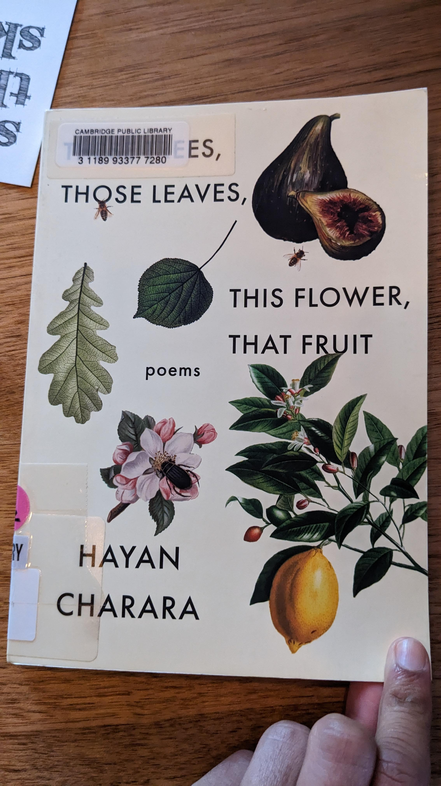

Checked this book out from the Cambridge Public Library because I liked the cover, the title, and because it was published by Milkweed (a press I really like that also published *Braiding Sweetgrass* which I read back in March 2021). I read it mostly over the course of a weekend ski trip with Antony, Angeni, and others. I love the vibe of taking a day off from skiing to read in a cozy cabin instead. 

The collection was unexpectedly dark and gloomy. A lot of the poems were about war. For one of the poems, I thought it ended on a happy note, but when I went to recite the poem to others, I realized the ending was actually the exact opposite of what I had originally thought it was. But the collection was also really good. 

Some poems I liked from this collection: *Older*; *Some Sentences*; *All These Questions You Ask*; *Fugue*; *Self-Portrait with Woman on the Subway*. 

### *Circe* by Madeline Miller (February)

I re-read this book, which I had originally read back in June of 2020 when it was given to me as a gift. I'm usually not huge on re-reading books, but my friend was reading it too and I wanted to remind myself of the plot. 

This book stood up well to re-reading. I really like it. It insightfully explores themes of solitude, power, and motherhood. And I feel like the main character makes sense -- I understand her motivations and why she does what she does. 

This book remains one of my go-to recommendations for light-hearted fiction!

### *The Song of Achilles* by Madeline Miller (February Bonus Round!)

Borrowed this book from my friend Tala Alfoqaha after chatting with her about re-reading *Circe* (both of which are written by Madeline Miller). Tala prefers *The Song of Achilles*, but to be honest I quite strongly disagree.

Madeline Miller wrote *Song of Achilles* first; it is an entertaining and emotional gay love story. And somewhere (I think in the foreward of *Circe*?) she talks about how, after *Song of Achilles* was well-received, she took some time to write a book that was more personal. The result was *Circe*, which I consider her *chef d'oeuvre*. I think *Circe* was better written, more memorable, more insightful, and more interesting. For example, consider the difference in the time scale presented in each book: *Song of Achilles* follows two mortal characters in their love story over the course of a few years. Cool. In contrast, *Circe* follows the emotional growth of an immortal character over the course of *centuries*! 

Don't get me wrong, *Song of Achilles* was a quick and entertaining novel. But I don't think I will still be thinking about it three years from now like I did with *Circe*.

### *Homie* by Danez Smith (March)

Diana invited me to attend a poetry reading by Danez Smith at the Barker Center with her. It was my first poetry reading ever, and it was i c o n i c.

Danez Smith is so cool. They were an incredibly charismatic but intimate reader and poet. There was an intimidating bust of a historical white man on the wall, and they made a well-received joke about how that man would react to this type of queer Black reading. I cried multiple times in like 45 minutes and I was not alone. The energy at the reading was so great, and I wonder about all the intriguing and beautiful strangers I saw there. I'm so curious about who ends up attending a poetry reading like this, and what path they took to get there? What lives do they lead? Who are they? 

I also met Diana's partner for the first time at the poetry reading and he seemed cool!

Some poems I liked from this collection: *what was said at the bus stop*. There are more I liked, but I just bookmarked my hardcopy and I don't have it on hand right now. 

### *Felon* by Reginald Dwayne Betts (April)

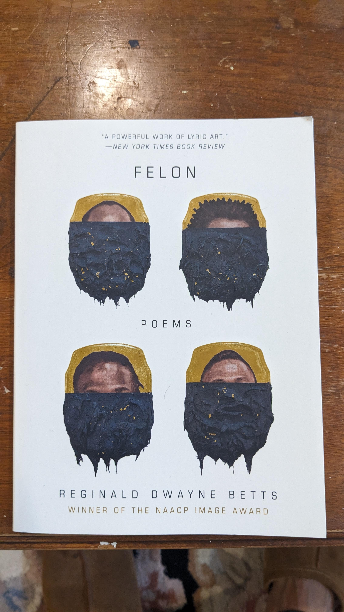

I got this book from another one of the poetry readings like the Danez Smith one from March. It was also really good! Almost all the same thoughts as above. I hope to attend more of these readings and become one of the intriguing, beautiful strangers who frequent them. 

Some poems I liked from this collection: *Triptych*. There are more I liked, but I just bookmarked my hardcopy and I don't have it on hand right now. 

### *Humane* by Samuel Moyns (April Bonus Round!)

I read this book in the process of researching for an [independent writing project on prison ablition and prisoners of war](./abolishing-prisoners-of-war.pdf) supervised by Professor Modirzadeh. The book describes the history of International Humanitarian Law (IHL), the branch of law that tries to make the waging of war less despicable. It also describes how pacifists (broadly speaking, those who are opposed to the waging of war itself) lost to the humanitarians. Instead of abolishing war in the 20th century, we merely tried to legitimize it through the law. 

One of the interesting things about this book for me was that it also did a deep dive into Leo Tolstoy's perspectives on this matter. That was interesting for me because I really liked reading Tolstoy's *Anna Karenina* back in January 2017 (the first book I ever reflected on in this blog series!). He's a pretty interesting dude, and I respect him for evolving in his perspective over the course of his lifetime as he thought about issues more deeply. For example, he went from being a hunter to becoming vegetarian (I don't mention that because I'm happy with his ultimate decision, I mention it because I think it is hard to remain philosophically flexible like that).  

I didn't end up referencing this book much in my paper because I cut out an entire section I wanted to write about the relationship between the history of IHL reforming war in the same way that mass incarceration reformed corporal punishment. Writing the paper, though, gave me a really valuable experience getting to reflect on my personal philosophy with respect to war. I still don't think I have come to satisfying answers for myself.

I checked this book out from the Lamont Library, and learned that we actually get semester long rentals from the Harvard library system (including the summer when renting in the Spring).

### *Room Where I Get What I Want* by S. Whitney Holmes (April Bonus Round!) 

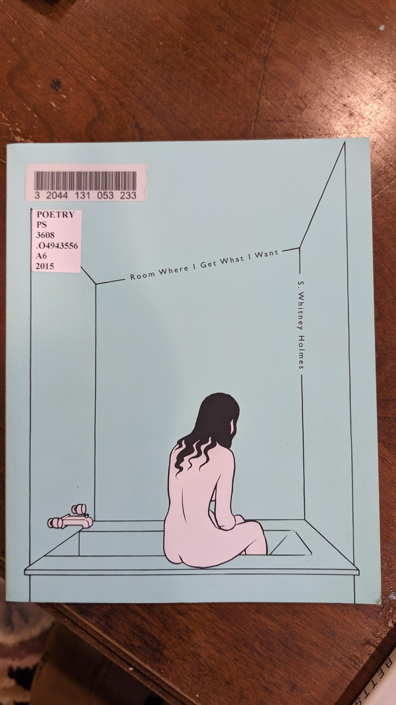

I checked this out from the poetry reading room at the Lamont Library. I got a bunch of other collections too, but didn't finish any of the others before I had to leave for the summer. And I had to return this one before I could write down which poems I liked. The collection was an appropriate distance outside of my comfort zone for me to grow as a poetry reader. Which is to say, I don't think I fully understood most of the poems, but that's on me.

### *Study Break* by Aashna Avachat (May)

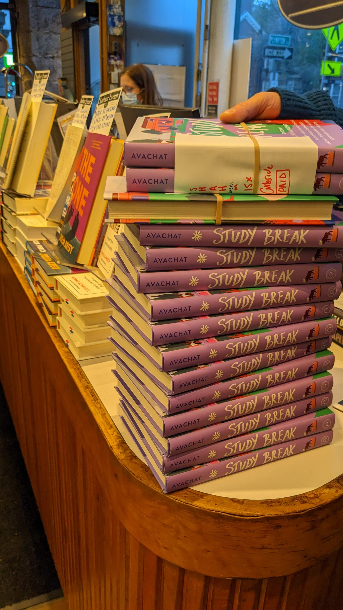

My zoomer friend from SALSA and Defenders, Aashna Avachat, edited this book! It is such a cute collection of short stories about college kids who all attend the same fictional college. The characters (and their respective authors) are all casually diverse in a way that doesn't feel heavy-handed and really adds to the depth of the stories. This book has become my go-to recommendation for my younger cousin. Even though I had a lovely signed copy from Aashna, I actually decided to give my copy to one of my cousins as a gift when I visited them this summer. 

Honestly, it was so refreshing to read young-adult fiction again! This book was able to move me and make me feel strongly, without requiring the plot to contain devastating and heartbreaking elements. As I was reading, I noted that I was having a visceral reaction to the stories by expectantly dreading when the happy story would turn sour at the last moment. Of course, this isn't that type of book, so that never happened. Which was, like, really comforting actually! Clearly I need to diversify my reading because I currently have such trust issues when consuming a story (I'm looking at you *The Minister* by Erin O. White and *The Interpreter of Maladies* by Jhumpa Lahiri). 

I read this book during finals szn, which was a perfect time to do so. It was, literally, a study break. 

### *The Namesake* by Jhumpa Lahiri (June)

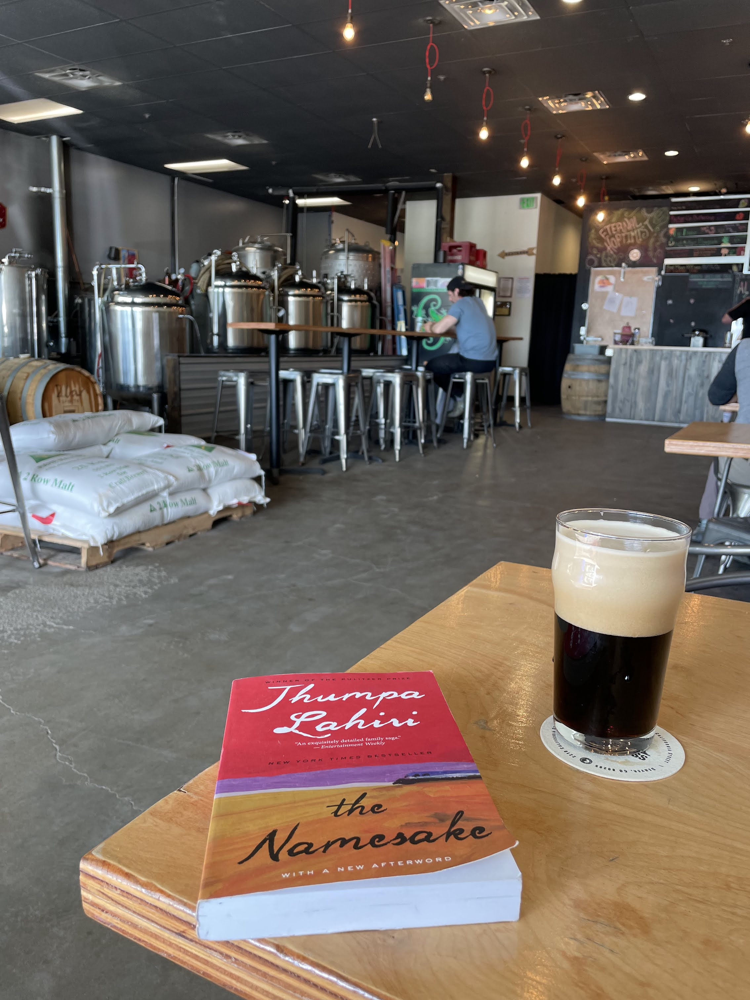

My unbelievably kind friend Hina Uddin gifted this book to me for my birthday when she saw me studying during finals at the library one day and it was truly the sweetest thing ever. I had heard her (and my other friend Aliya Zuberi) talking about *The Namesake* throughout the year. It seems like most of the important South Asian women I know have read this book, including at least, I would later learn, my sister Shefali Shah, my aunt, and my high-school friend Shohini Gupta). I'm happy to have finally joined the club!

I had read another book (*Interpreter of Maladies*) by Jhumpa Lahiri back in June 2019, and to be honest, I hadn't loved it. But I liked this book much more! All I remember aobut *Interpreter of Maladies* was they were short stories that were perhaps artistically written but always seemingly pointlessly depressing. I think reading one longer novel--as opposed to a collection of short stories--helped make the deppressive air of the book feel a little bit more justified because the heartbreaks were contributing to an ultimate cohesive whole rather than just micro-dosing depression. 

The novel is a coming-of-age story. Different chapters are told from different perspectives in one family over the course of decades. But the titular character is a Bengali boy to immigrant parents who is named after a Russian author the father had been reading at the time of a tragic train crash. I felt, at particular points in the book, that I was at the analagous moment in my life as the character was at in his. Which makes me want to reread it at different times because I think I would get very different things out of it based on what I am going through when I read it. I talked to Shefali and Shohini about this a lot. 

Aliya mentioned the book in reference to the trope of brown mens' dating styles. Without being more specific, I will say that I did feel a little bit over-perceived/seen by this book <i class="em em-see_no_evil"></i>. 

### *Wade in the Water* by Tracy K. Smith (June Bonus Round!)

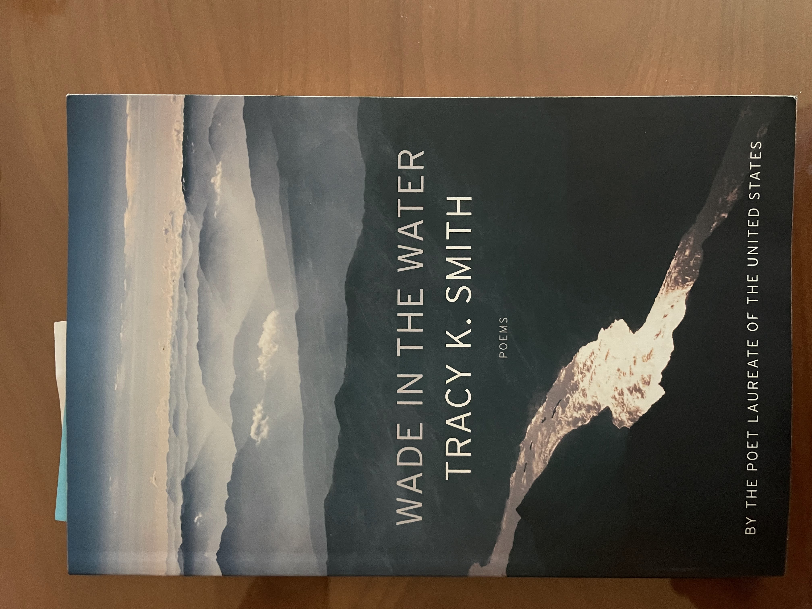

Found this book at a used book store in Anchorage while I was on a bike ride! Bought it because (1) it was used, (2) I didn't have a conveniently accessible library, (3) it was small enough to carry back easily without too much weight.

### *The Kenyon Review* from May/June 2018 (June Bonus Round!)

Found this book at a very cute Anchorage spot called Writers' Block. It is a book store, cafe, bar, restaurant, and local performance venue all wrapped into one! 

I have said this before and I will say this again. I love literary journals. They are such neat little collections of curated work. How convenient to find a range of high quality work beautifully packaged for my convenience. 

Diana mentioned heavy hitting authors looking back five years later. She mentioned many names, and I recognized a few of them like Reginald Dwayne Betts and Jorie Graham.   

My favorites from this collection were: *The Minister* by Erin O. White; *Aguacero* by Patricia Engel; *Interior Landscape: 6:00 a.m.* by Jill Bialosky; *A Grove of Trees* by Marsha de la O; *From* July by Kathleen Ossip; *Parable of the Groundhog* by Reginald Dwayne Betts; and *Two Autumns, Saint Louis* by Dana Levin.

### *Writers and Lovers* by Lily King (July)


Listened to this audiobook from the library while my parents, sister, and extended family visited for an RV trip around Alaska. I had tried to read it back when I first moved to Cambridge, but this time was actually able to get through it. Especially in the beginning of the book, I kind of imagine Diana speaking as the main character. 

I tried to make bookmarks through the app as I was reading for things I wanted to mention in the blog, but since the book has been returned to the library I believe those bookmarks are lost <i class="em em-cry"></i>. One of them, I vaguely remember, was about the difference between "fireworks or coffee in bed" in relationships. I think the book had really interesting observations about working in the service industry. I also thought the author wrote very romantically about the starving artist/service-industry worker life. I liked the book better in the beginning when the potential "lovers" had more potential/were less concretely defined. After the book focused in on the guy with kids I got a lot less interested because I found him uninteresting from the jump. That was really just a matter of personal preference, though. 

### *The Bluest Eye* by Toni Morrison (July Bonus Round!)


Another audiobook from the library, this time read by author which was really cool! It was cool to see the book presented the way it was meant to be, where the inflections are, what the pronunciations are, etc. Unfortunately, same comment from above about having lost my bookmarks when the book returned to the library. 

To be honest, not my favorite Toni Morrison! Chronologically, I've read *Song of Solomon*, *Sula*, and *The Bluest Eye*. In terms of publication order, *The Bluest Eye* (1970) was the first book she published, *Sula* (1973) was the second, and *The Song of Solomon* (1977) was the third. In terms of my personal preferences, I would rank them *Sula* (a *chef d'œvre*), *Song of Solomon* (really good!), and then *The Bluest Eye* (meh). I like having read multiple of her works to see how she grew over time as a writer. 

There was a short author's note that described Toni Morrison's personal critiques of this early work of hers. I strongly agree with her author's note. She wanted the novel to critique the beauty standards her characters covet, but I'm not sure if she was successful, or it is even possible to do so with this approach.

### *The Library Book* by Susan Orlean (August)

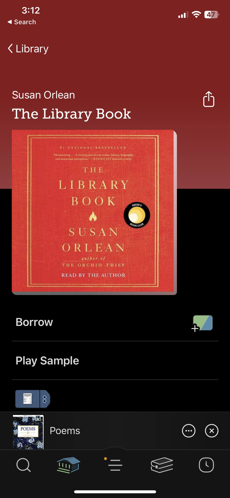

Saw my friend Halena Ngo recommend this book on Instagram right around when I was finishing *The Bluest Eye*, so I checked out the audiobook! I had it on in the background as I packed up for the summer and prepared to depart Alaska. This work of nonfiction is a nostalgic tribute to libraries told through the story of the 1986 fire that destroyed the Los Angeles public library and the subsequent investigation.

There were some times in the book that I picked up on some questionably moderate politics of the author -- in the way she describes homelessness, poverty, and Los Angeles. I wish I had my bookmarks to make this comment a bit more concrete. It wasn't anything bad, but just revealed the author's assumptions about who the reader would be and the ways they would agree with her that rubbed me the wrong way. 

Some of my favorite parts of the book were the descriptions of physical architecture! It reminded me of reading *Basilica* back in April 2020, which I really really enjoyed. I think I like reading deep-dives on the architecture of beautiful and culturally significant buildings! Quite the niche I'll keep an eye out for in the future.

Reading this book in the middle of a streak of reading library books back to back to back felt like a real vibe. I once had a casual conversation with my roommate -- Sebastian Miller -- about what book we would ideally take an oath on. I, perhaps obviously, struggled with that question given my ambivalence about religious texts, and my broad range of literary interests. I landed on an answer that I found quite compelling: I think the perfect book to be sworn in on would be a hardcopy of the local library's catalog. It represents many many books across every genre, a sense of public access, some light-hearted reverence, a rejection of the premise, a refusal to put any one book on a pedestal, and an expression of hyper-locality. Don't hold me to that answer, though <i class="em em-stuck_out_tongue"></i>

### *Blackacre* by Monica Youn (August Bonus Round!)

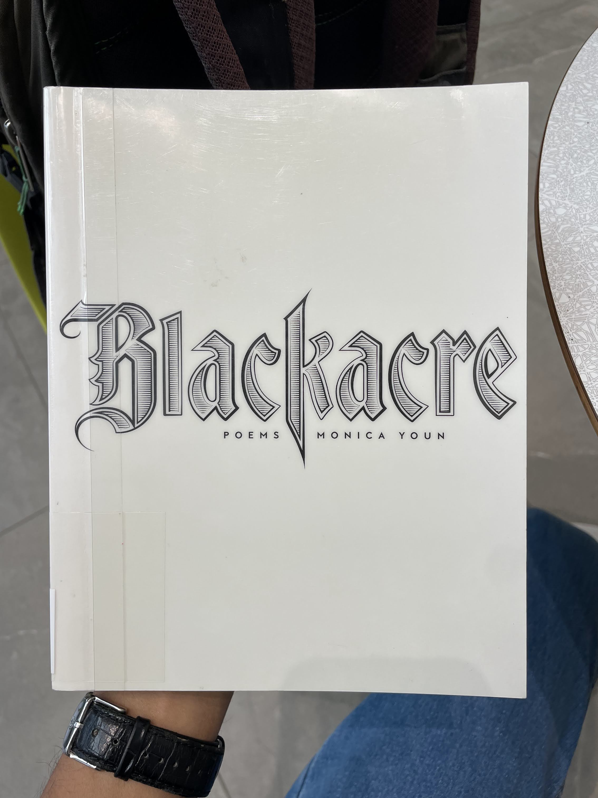

Got this book because I recognized the word "blackacre" from 1L Property as I was browsing the Anchorage Public Library's poetry shelf. The cover was also sick, which pushed the book over the edge for getting checked out. 

Blackacre did in fact refer to the legal term. Asking around, I also heard the author had a federal clerkship offer and a prestigious writing fellowship and chose the fellowship and the federal judge was salty about it. These worlds are funny. 

I read the poems, and wasn't sure I knew what I was reading. Then I read the notes at the end of the book, and then returned to the poems and got a lot more out of the poems. For example, Part I was a series of poems about a hanged man, which the notes explained were "loosely based on François Villon's 1462 poem 'Ballade des pendus' ('Ballad of the Hanged Men')." 

Part III was a series of poems titled with a combination of a color + the word "acre" (e.g. "Greenacre," "Brownacre," "Goldacre," etc.), which I thought was a fun naming scheme.

Once again, I dogeared the pages of the poems I liked, but returned the book before I wrote them down. I really need to get a better system, I'll admit. 

### *Build Yourself a Boat* by Camonghne Felix (August Bonus Round!)

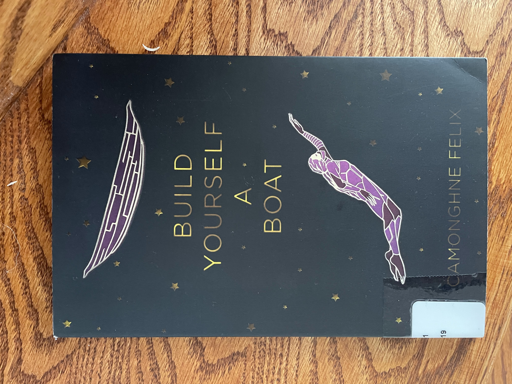

This book was good! I returned it to the library before noting my favorite pieces. 

I love reading acknowledgements sections, and this was a particularly good one. The acknowledgements section alluded to a network of poets who I imagine to be friends and similar ages writing about similar themes with their unique perspectives (I've read pieces by Safia Elhillo, Camonghne Felix, and José Olivarez). They seem supported by similar institutions (Urban World NYC, Break Beat Poets, etc.). I have no idea how these things work, and how accurate my inferences are, and I don't feel motivated to google to fact check. Instead, I think it is just nice to imagine that they are in fact friends, who form such  a fascinating crowd. The books of poetry and the acknowledgements sections let me feel like a fly on the wall of their lives. 

### *Holy Moly Carry Me* by Erika Meitner (August Bonus Round!)

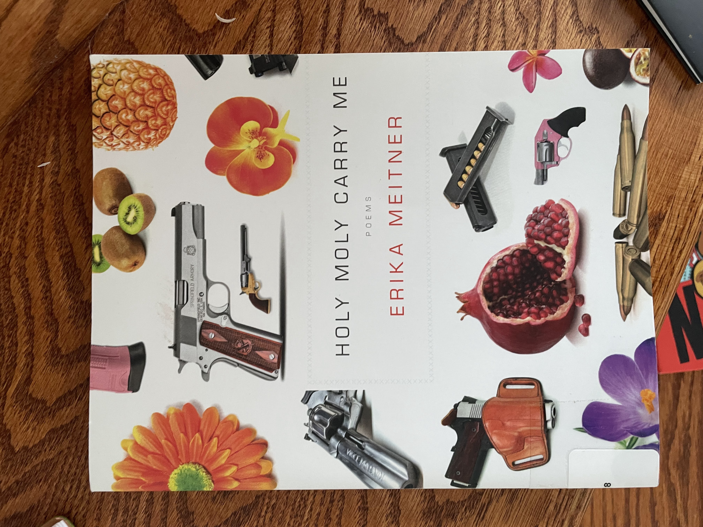

I loved loved loved this collection of poems! I think it is one of the first times I picked up a book from the library and feel like I actually chose very wisely! Which is funny, because of all the books I took from the library all at once, this one was the one the closest to the chopping block. Funny how things work out sometimes. 

My favorites from this collection were: *HolyMolyLand*; *Continuation*; *Diaspora*; *Dollar General*; *Elegy for the Body Before It's Released from Grief and into Light*; *Peregrinus*; *The Clock of the Long Now*; *Your Rivers, Your Margins, Your Dimunitive Villages*; *Poem with Warehouse Fire & Disaster Recovery Team*; Too Strong; *Insane Flying Machines*; *Threat Assessment*; *Jackhammering Limestone*.

### *Citizen Illegal* by José Olivarez (August Bonus Round!)

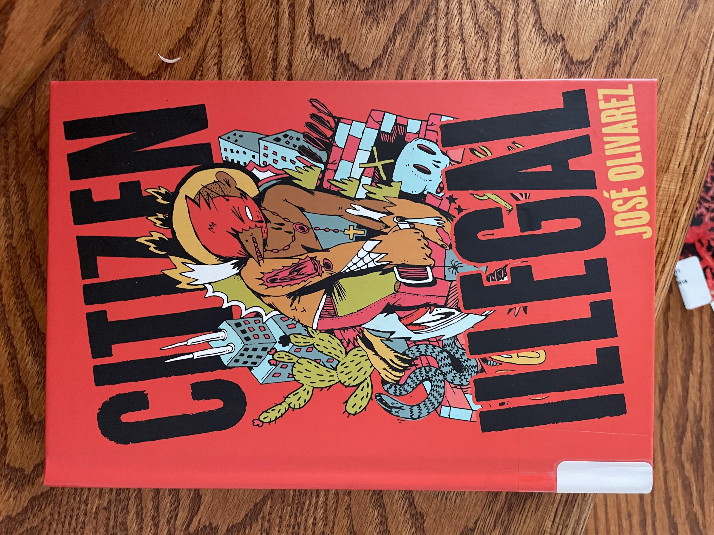

Same comments as for *Build Yourself a Boat*. Fascinating collection I devoured from the library while I was at my parents' home at the end of summer. Had to return it before I left for school, and didn't note my favorite poems before doing so. Also saw the same names bouncing around the acknowledgements section, if I recall correctly!

### *The Bell Jar* by Sylvia Plath (September)


I've been trying to work my way through this other academic text I borrowed from a friend in Defenders called *Decarcerating Disability* by Liat Ben-Mosh. Wasn't able to get fully into it while on the train from D.C. to Boston. But it mentioned *The Bell Jar*, which felt like an important part of the cultural conscious, and felt more my speed in that moment as a work of fiction I could listen to rather than read. 

Got a copy of the audiobook from Hoopla by the Alaska public library! I think I've mentioned this before, but hoopla is such a game changer because it has a lot of titles I can't find on libby from my libraries. Highly recommend, even though I later learned from an Anchorage Public Library email that Hoopla charges per checkout rather than licensing the book to the library in general. Library administration and politics seems so interesting.

Tried to bookmark notable passages, but, as usual, the book returned before I could note them. This, of course, also makes my reflections on the book rather sparse because I am writing my blog so much later. 

I didn't know anything about Sylvia Plath before I read this book, and I valiantly fought the urge to google her before I finished the book to avoid spoilers. Every time I told people this, if they knew about Sylvia Plath, they gave me such a strange look that piqued my curiosity further. After I finished the book, I also heard a helpful afterword included in the book to provide the context I sought. 

I learned from Diana, after reading it, that the Bell Jar's 60th anniversary is coming up! I also heard that it is important to read Plath's poetry, not just this work of her fiction. So, I googled a bit and found [this poetryfoundation.org explainer](https://www.poetryfoundation.org/articles/70268/sylvia-plath-selections), which was very enlightening. I liked how it linked to the poem for me to read myself, after which I could read a short, pedagogically-valuable explanation of what I just read. 

### *Customs* by Solmaz Sharif (September Bonus Round!)

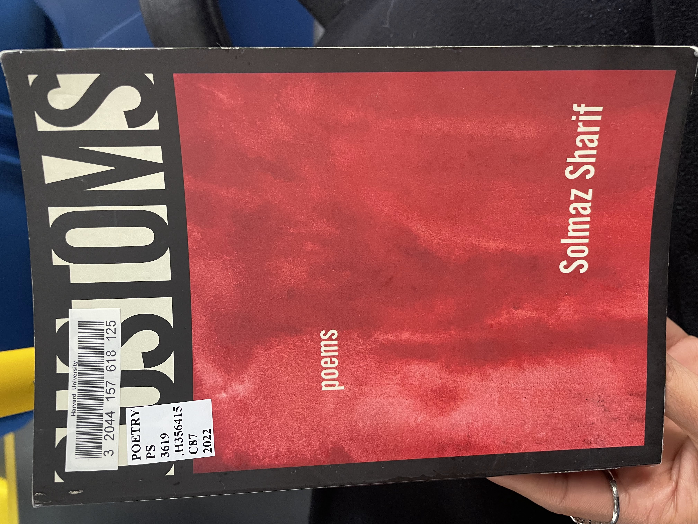

I really really liked this collection! Borrowed it from Diana, who had in fact borrowed it from the Harvard library, so I will return it directly to the library haha. Read it on the 66 bus from campus to CJI orientation at Roxbury courthouse/Nubian station (the end of the line). It took me through a remarkably diverse portion of town, which reminded me of the bubble it is my responsibility to branch out of. 

Some notable motifs: bridges (*Now What*); date palms (*Without Which*; *Planetarium*); tanneries (*Without Which*; *Now What*); Ethel Rosenberg (*Dear Aleph,* on page 13; *The Master's House*). 

Some themes: language and pronunciation *Dear Aleph,* on page 7 and the relationship between Palestinians and the pejorative use of the word "philistine" today; *Learning Persian*; *The Master's House* 
```
To recall the Texan that held a shotgun to your father's chest, 
    sending him falling backward, pleading, and the words came  
    to him in Farsi  
To be jealous of this, his most desperate language  
To lament the fact of your lamentations in English, English being
    your first defeat
```

State power: *Social Skills Training*; *Visa*; *Planetarium*; *He, Too*. 

The role of the poet: *He, Too*; *Patronage*.

Diaspora insecurity: *The Master's House*; *An Otherwise*.

The repeated references to Ethel Rosenburg remind me of the passages referencing the Rosenburgs in *The Bell Jar* by Sylvia Plath which I read last month. I think both author's mean something by this reference that I do not have access to. 

*America* is like a palindrome, with 12 sentences of merely three words each. Really cool observation I had not understood until reading [this book review](https://www.zyzzyva.org/2022/03/03/customs-by-solmaz-sharif-the-complicity-of-speech/). I came across this explanation when trying to understand the three poems all titled *Dear Aleph,*. The book review also claims that the three *Dear Aleph,* poems are "written to an imagined detainee held at Guantanamo Bay, the U.S. Navy base located in Cuba," which I believe, but I don't know how/where the book reviewer learned that? 

I really like *The End of Exile* because it resonates with my diaspora feelings of returning to my family's home on my dad's side in Gujarat. (`"[...] I come \ to the city I am of. \ Am without. \\ To watch play out around me \ as theater--`).

*Without Which* is a longer poem. It is punctuated by `]]`, which I admit I do not understand. I liked this verse: 
```
*Would you have knocked for me?*  
I ask the neighbor.  
  
*I have been*, he said  
  
Then I felt his knocking  
  
  
    ]]  
  
inside my chest.  
```

The first time I read *Social Skills Training*, I thought it was about state power and police violence in America. But, reading the piece in the context of the broader narrative, I see that it is more about the speaker's relationship with her mother. See generally, e.g., *An Otherwise*. For example,
```
*Maybe I shouldn't have taken you there*  
she said of our trip 
to her childhood home.
For years I wrote of the bumps  

left by the tanks
churning over her roads  
as *braille messages from the martyrs*,  

which meant I missed  
it entirely,  
the only  
it:  

my mother's face 
turned out  
the passenger window,  

just looking. 
```

*An Otherwise* is the last poem of the book, and it is much longer than the rest. It combines the themes from each of the other pieces in the collection into one culmination. Beautiful, but most beautiful as a revalatory reward for having grappled with the earlier pieces, and perhaps as a roadmap for how to return to them. 

My favorites from this collection were: *Dear Aleph,* (page 7); *Learning Persian*; *Visa*; *Now What*; *The End of Exile*; *The Master's House*; *An Otherwise*.

### *A Visit From the Goon Squad* by Jennifer Egan (October)


Borrowed this book from my Ames partner, frequent and challenging interlocutor, and very good friend Heather Pincus because we were talking about short stories as a genre. She said one of her favorite things about the book was that it reflects how an individual can be many different people throughout their life. 

I have lots of thoughts about it, and generally really liked the book. It hit the sweet spot of borrowing my my friends' favorite books. I learned from Diana how widely read the book was when and after it came out. 

The book was very much situtated in the post-9/11 moment. Maybe I am being unfair to the author, but I felt rubbed the wrong way by some of her perspectives on that moment, especially in light of what I learned from *See No Stranger* by Valarie Kaur back in May 2021. 

The last chapters got into speculative fiction territory, which I didn't love. It feels a bit cringe, in the way that sci-fi sometimes can.

I really like the short story *Safari*, which I later learned was published independently before the book was written around it. I also liked *X's and O's*. My favorite story was probably *Great Rock and Roll Pauses*. I thought that story would be gimicky because it is presented as a series of powerpoint slides rather than as prose, but it was actually very well done; yet another demonstration of the *A Room of One's Own* thesis that we will be lucky to experience all the innovation women authors will continue bringing to genres as they are given the space to write. 

### *I Do Everything I'm Told* by Megan Fernandes (October Bonus Round!)

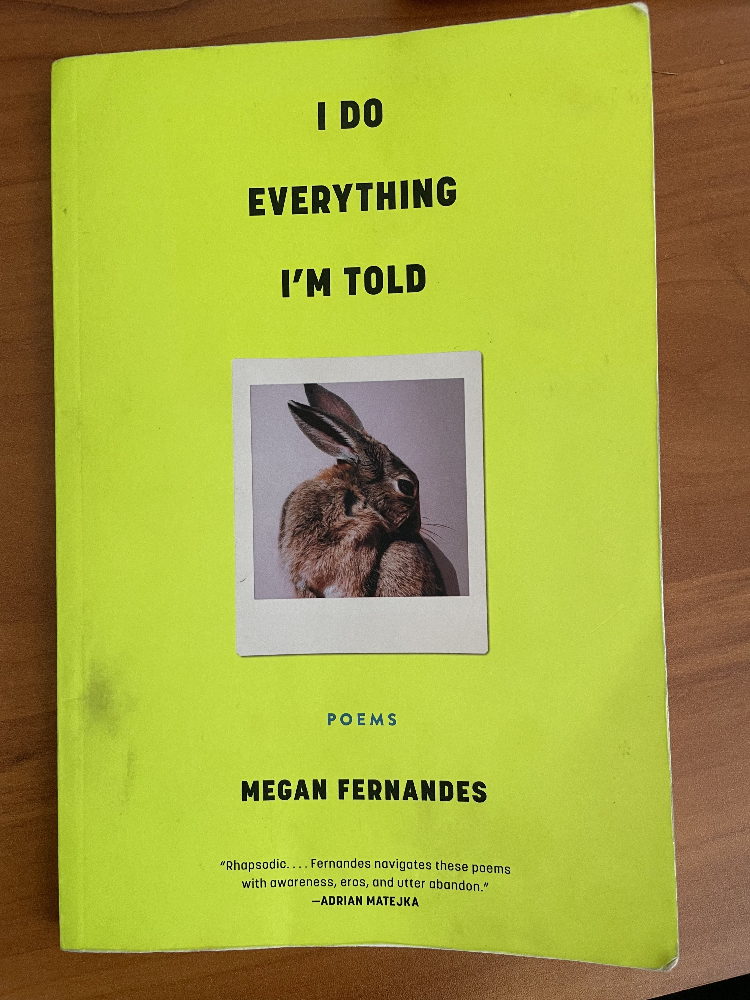

Loved this collection, borrowed from Diana. No time to reflect right now, but my favorites from this collection are: *Letter to a Young Poet*; *Orlando*; *The Trial*; *Brooklyn Sonnet*; *Wandering Sonnet*; *Do You Sell Dignity Here?*; *I'm Smarter Than This Feeling, But Am I?*; *Catskills*; *Get Your Shit Together and Come Home*; *Retrospect*; *Magical Realism in America*; *Company, Company*; *On Your Departure to California*; *Love Poem* (which I have read before and loved). 

Part II of the collection is titled "Sonnets of the False Beloveds with One Exception OR Repetition Compulsion." All the poems in this section are titled `[blank] Sonnet`, where the blanks are filled with city names, and conclude with being filled with "Wandering" and "Diaspora." As someone who is currently applying to jobs that are primarily differentiated by the city where I would live, this section was topical for me (and indicative of the broader theme of place in the book which also feels relevant). In particular, I got a lot out of the Brooklyn one (where I'm interviewing for a job) and the Wandering one.

### *The Secret History* by Donna Tartt (October Bonus Round!)


> I suppose at one time in my life I might have had any number of stories, but now there is no other. This is the only story I will ever be able to tell. (page 4)

I love the above quote because it reminds me, in an *extremely* different context, of the preface from *Kitchen* by Banana Yoshimoto I read in June 2018. 

I asked Diana to borrow a spooky szn read that is a novel rather than short stories and comes up frequently in the literature pop culture discourse. She understood the assignment!

I will say, it's a bit boring at times. I'm writing this at only page 429 of 559, but unless there is a huge twist at the end (which I have a side-eye to Camilla for) I feel that at least 30% of the book could have been cut down. When I mentioned the book to Ibrahim, he recognized it. I asked if he had read it, and he shrugged and said "I started it, but didn't finish it," which sounds about right. 

> "I never heard anybody complain so much about helping out a pal," [Bunny] finally said. "I tell you what it is. He's afraid of people taking advantage of him."  
"How do you mean?"  
He swallowed. "I mean, sombebody probably told him when he was little, 'Son, you have a load of money, and someday people are going to try to weasel it out of you.'" (page 151)  

### *Fall of the House of Usher* collection by Edgar Allan Poe (October Bonus Round!)

Don't know how to categorize this, but loved the Netflix series, and went back and reread/refreshed my memory about a lot of the pieces alluded to (Fall of the House of Usher, Annabel Lee, etc.). For the pieces I had not yet read (Gold Bug, Murder in the Rue Morgue), I read them for the first time. I was able to borrow a collection from Heather Pincus for some of the pieces while I went on a rainy retreat in Cape Cod with the org I am the president of. It was a stormy weekend in a massive but shaken beach home, which really added to the ambiance of macabre opulence. I also found the pieces online and put my browser in reading mode which worked really well. 

### *Hostile Homelands* by Azad Essa (November)

```
Military Industrial Complex (Chapter 2)
 - Nuclear tests
 - 26/11 ("India's 9/11" in 2008). Nine Israelis killed, and Israel capitalized on selling counter-terrorism domestic surveillance technology to India. (47)
    "Between 2003 and 2013, India became the single largest purchaser of Israeli arms, accounting for upwards of one-third of all arms exported out of the Jewish state. Israel had become India’s second largest arms supplier after Russia." (49)
 - India backing both horses based on what is convenient at the time 
    "In response to a question seeking clarity over India’s relationship with Israel in parliament in December 2013, Edappakath Ahamed, India’s Minister of State in the Ministry of External Affairs, replied: “India’s relations with Israel stand on their own and are not at the expense of strong, time-tested and historic ties with the Arab world. Notwithstanding growing ties with Israel, there has been no change in the traditional policy of strong support to the Arab and the Palestinian cause.” (50) 
 - "Whereas Congress needlessly pandered to minori-ties, especially Muslims, the BJP stood for all Indians. Modiwas presented as the antidote to hundreds of years of disap-pointment and wasted opportunity." (51)
 - 1992 
    - India normalizes relations with Israel
 - 2014 
    - Modi becomes PM
    - "Operation Protective Edge" in which "Israel flattened the Gaza Strip over a period of 50 days, killing 2,251 Palestinians, including 1,462 civilians. In Israel, 67 soldiers and six civilians were killed by Hamas rockets." (53)
 - "Colonial subjects turned Congress peons were now impatient consumers." (53)
 - "Israel’s sophisticated border technology, that included a network of “smart walls,” equipped with sensors, HD video surveillance, and unmanned fortified towers with remote controlled machine guns, were the envy of militarized states everywhere. Singh is said to have been impressed after he visited an Israeli posting close to the separation fence with the Gaza Strip. Within a year, Israel was helping Delhi build a “smart fence” on India’s western border with Pakistan" (57)
  - "political and economic pragmatism with Israel and charity for the compromised Palestinian leadership" (58)
  - "Netanyahu told Modi: 'I am a son of a historian. Our people have had thousands of years of history. India and Israel are two of the most ancient civilizations on earth. And yet, it is an amazing fact, that until you visited Israel, no leader of India, in 3,000 years of our own sovereign existence, and our history, has visited Israel.'99"
    - Israel had only existed for 70 years, so of course no leader of India had visited before
 - 2020 Abraham Accords
    - "On August 13, 2020, then U.S. President Donald Trump announced that the governments of the United Arab Emirates and Israel had agreed to the full normalization of relations. In what would be officially called the “The Abraham Accords: Declaration of Peace, Cooperation, and Constructive Dip- lomatic and Friendly Relations,” the White House said it ushered in a new era of bilateral agreements between “two of the Middle East’s most dynamic societies and advanced econ- omies” that would “transform the region.”104 In so doing, the UAE became the third Arab country, after Egypt and Jordan, to sign normalization agreements with the Jewish state. In September and December, Bahrain and Morocco would follow suit. Morocco was purportedly unable to resist an American promise to back its bid for sovereignty over the occupied Western Sahara.105 In January 2021, Sudan became the latest to normalize ties with Israel. Again, Trump offered hundreds of millions of dollars of aid, debt relief, and promised to delist Khartoum as a sponsor or terror.106" (61-62)
    - Egypt, Jordan, UAE, Bahrain, Morocco
    - Morocco as a colonized people but also as occupiers of Western Sahara
 - "Israel and the UAE in opposition to Iran and political Islam, as supported by Qatar and Turkey" (63)
    - how do we feel about theocracies? Jewish states? Muslim states? Hindu states? Is there a way to promote minority rights without packing them into an electoral group where they are the majority? 
 - "The characterizations served to expand the “good” and “bad” Muslim binary produced in large part by the logic of the U.S.-led War on Terror to “good” and “bad” Muslim-major- ity countries based primarily on their willingness to normalize relations with Israel." (64)
 - "With Pakistan’s growing affinity for Turkey and Qatar under former Prime Minister Imran Khan, and the cooling of ties between Islamabad and Abu Dhabi, it became convenient for Modi, Netanyahu, and Abdullah bin Zayed to slide into what observers like Mohammed Soliman called an “unlikely and unprecedented Indo-Abrahamic transregional order.”" (65) 
 - "The ORF itself is a cunning project; sponsored in large-part by Reliance, one of India’s richest conglomerates, and built, as novelist Arundhati Roy described it, in the image of the Rockefeller Foundation, the ORF exerts an inordinate influ- ence over Indian foreign policy. 118 The ORF presents itself as politically agnostic but routinely adopts and promotes posi- tions that are in support of large-scale neo-liberal policies that favor big capital and the military-industrial complex. That they partner with right-wing organizations like the Heritage Foundation in the U.S. is emblematic of their neocon agenda" (67)
 - "Having established both military and economic power, he said, Israel was now pursuing political power. “By political power, I mean the ability to make political alliances and relationships with many other countries.”119 Political alliances and relationships might sound banal. But if you merge economic, political, and military power under the vestige of a supreme power, the United States, this was the Empire itself." (68)
    - I recognize the anti-semitism that could underlie claims that Jewish people are trying to create a cabal that rules the world. But framing Israel's project in terms of "Empire" de-exceptionalizes the Jewish angle. Israel does not have impermissible motives because it is a Jewish state, it is merely the latest iteration of a repeating cycle of empire-building, which we consistently have retrospectively denounced.
 - "India, then, was part of the deep entanglement of economic and political interests to keep private capital in charge and the poor, disenfranchised, and marginalized per- petually pacified." (69)
 - "Whereas it had voted for the UNHRC to launch an inquiry following the “Operation Pro- tective Edge” in 2014 (and later refused to endorse the report which largely condemned Israel’s actions), fast forward to 2021, India wouldn’t even pretend to care about the details of Israeli crimes in Gaza during its eleven-day bombardment.130" (70) 
 - "India’s reluctance to join the chorus of condemnation of Russia over its invasion of Ukraine in March 2022, was indicative of Delhi’s determination to refrain from throwing in its entire lot with the U.S. Russia was still India’s largest arm supplier and important supplier of energy, too. This relationship was not about to sever overnight. Washington, despite its reservation over India’srefusal to sanction Russia, is resolute in keeping India in its pocket for its other fight with China. So much so that U.S. Congressman Ro Khanna introduced an amendment to the National Defense Authorization Act which called on lawmak- ers to ensure that India is not sanctioned for continuing to purchase weapons from Russia, as directed by the Countering America’s Adversaries Through Sanctions Act. 131 Khanna’s amendment called for the law to be waived in the case of India. He also called for the U.S. government “to assist India accelerate its transition from Russian arms.” In July 2022, Congress passed the amendment." (70-71)
 - "opposition leader Rahul Gandhi described the surveillance as an act of “treason,” but he stopped short of asking why Israel sold the software to the Indian government in the first place. “Pegasus is classified by the Israeli state as a weapon and that weapon is supposed to be used against terrorists” he said, as if it was any less egre- gious for the Indian state to weaponize the phones of anyone else in the name of national security." (72)
```

### *Body Work* by Melissa Febos (December)

I loved this collection of essays! It was creative nonfiction, part memoir and part craft book. It made me think of the stories we tell ourselves about ourselves, and how writing can help us evolve past them. There were also *Room of Ones Own* themes, and Borrowed from Diana Cao. Highly recommend! 

### *Don't Call Us Dead* by Danez Smith (December Bonus Round!)

### *Interior Chinatown* by Charles Yu (December Bonus Round!)

Borrowed this book from Diana, and read it over winter break. Honestly not my favorite! I think it attempted social commentary on gender, race (and proximity to whiteness), intersectionality, but I don't think it was particularly effective/sometimes missed the marks. One of the rare times I've read a book about fatherhood, though, which was pretty though-provoking. 

### *The Taming of the Shrew* by William Shakespeare (December Bonus Round!)

A stranger (Makenzie Stuard) I met over winter break said this was her favorite work of Shakespeare so I got the ebook from the library after I finished *Interior Chinatown*. I was shocked. I found the gaslighting in the book to be a bit triggering, to be honest! I suppose there's a way to read the gaslighting as descriptive/hyperbolized for dramatic effect, but I was pretty uncomfortable with what appeared to me to be a romanticization/apologism for psychological abuse. 

<hr>

In retrospect: I think my favorite books this year were *Homie* by Danez Smith; *Study Break* by Aashna Avachat; *Holy Moly Carry Me* by Erika Meitner; *Customs* by Solmaz Sharif; *Hostile Homelands* by Azad Essa; and *Body Work* by Melissa Febos. Here's to the books that shaped my 2023, and to all the books still out there for next year <i class="em em-clinking_glasses"></i>

