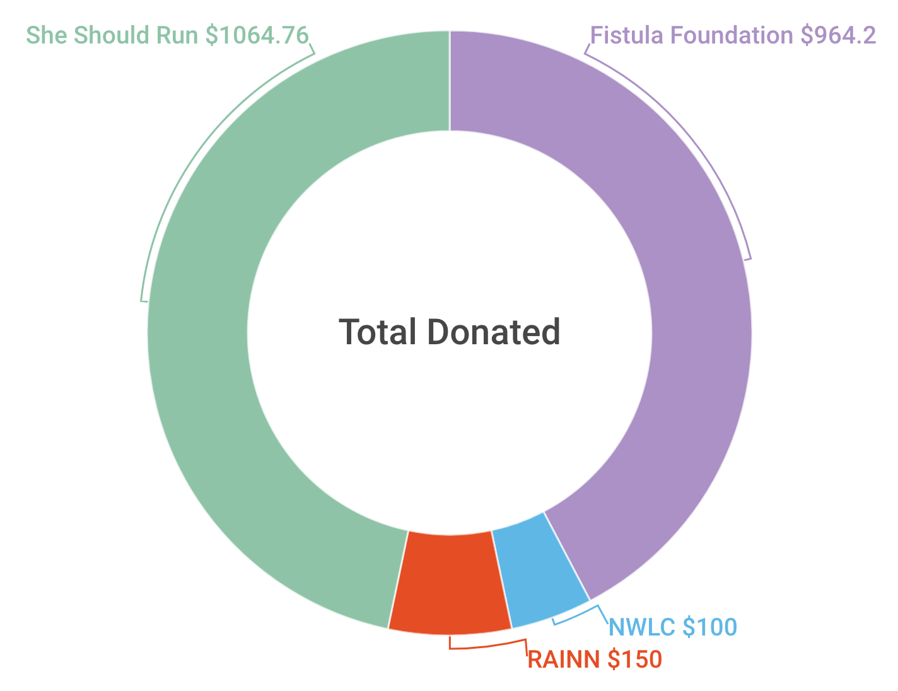

% Charity Match 2017 Retrospective
% Rushi Shah
% 15 January 2018

# Charity Match 2017 Retrospective
*Rushi Shah on 15 January 2018*
<!-- ### Started: 15 January 2018 -->

<link href="https://afeld.github.io/emoji-css/emoji.css" rel="stylesheet">



Back in August 2017 I published the following post on my blog and facebook: [TLDR: I'll match your donations to charity](https://www.rshah.org/blog/posts/charity_match_2017.html). The idea was simple: I wanted to donate money I earned at my internship to charity and I wanted my peers to do something similar. 

Overall, we raised close to a total of $2,780 for *[She Should Run](http://www.sheshouldrun.org/)*, *[The Fistula Foundation](https://www.thelifeyoucansave.org/Where-to-Donate/Fistula-Foundation)*, *[The Rape, Abuse & Incest National Network (RAINN)](https://www.rainn.org/)*, and *[The National Women's Law Center](https://nwlc.org/issues/)*. $2.2k might not sound like a lot compared to the amount these charities raise every year. But, I'm a 19 year old sophomore in college, so to me $2.2k sounds like "HELL YEAH 🚀"!

"Grassroots" doesn't even begin to describe this effort. 
```
 - The average donation was about $50. 
 - 13 out of the 17 donors may not legally consume alcohol in the US. 
 - Out of my ~1,000 facebook friends
	- ~10% of them liked the post
	- ~1% of them shared my post to their own timelines. 
 - At least three of my friends pledged to similarly match their friend's donations. 
```

### Acknowledgements

A ton of people came together to make this happen:

Firstly, and I can't emphasize this enough, I want to thank the 17 people who donated.

Madalyn Marebella was the moral compass, north star, and ultimate partner-in-crime for this whole project. Logistics wise, she eloquently pitched the Fistula Foundation, dug up high-quality research about charities and their efficacy that I could not have found in a million years, provided a cogent voice for the messaging of the project, and really helped craft the vision. Personally, she also helped me formulate what I wanted to do into a real plan, provided a friendly ear for my ramblings, and kept me honest in following through with the pipe dream. 

I am in no way financially independent, so, obviously, I call my parents about any large financial commitments. I want to thank them first for the shocked silence when I pitched the idea to them, and thank them second for their incredible support in encouraging me to pursue this opportunity.

This was pretty much all I could think of towards the end of the summer, so I also need to make a blanket "thank you" to everybody who humored me in brainstorming with them when we had a conversation. 

And finally, I want to pre-emptively thank everyone who participates in future internship charity matches like this. This isn't over!

### Onwards and Upwards

I was pleasantly surprised with how this year went, to say the least. In one of our many conversations about best/worst case scenarios, I told Madalyn that I would consider the entire thing a success if we even managed to raise $100 of outside money. I told myself if we met that modest goal, I would do a similar project after all my future summer internships. Here we are a few months later, more than $2,000 over the goal, and I am beyond pumped to keep my word.  

I was nervous about this experiment, and I am so proud of how far it came. I have big plans for my charity match in 2018. I'll point to this project's success when I try to get more of my friends to commit to similar donation matching projects for their internship money. Even after me and my youthful naïveté and optimism are long gone, I want this trend of donating a fraction of your internship salary to carry on. I'm hoping eventually it's just a normal thing that a lot of people do every year. Say what you will about "kids these days", but I have high hopes that we want to (and will!) help the world around us. 