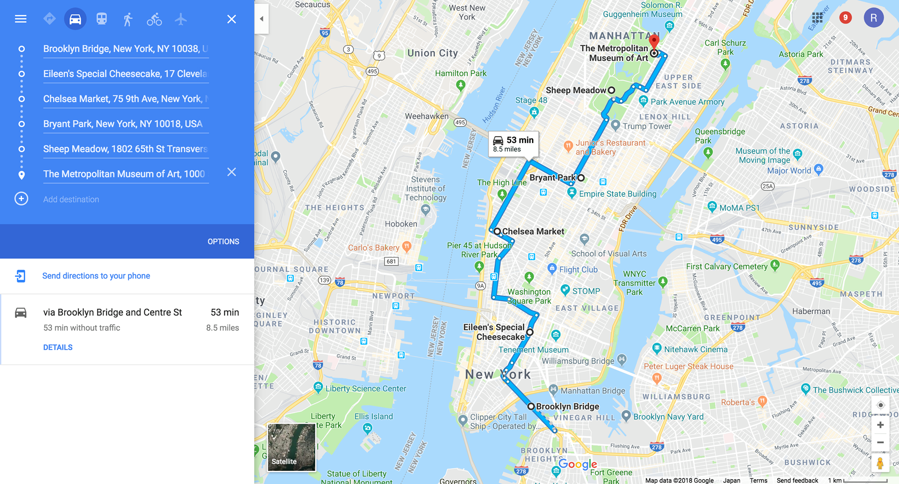

% Ideal NYC Weekend Itinerary
% Rushi Shah
% 21 November 2018

# Ideal NYC Weekend Itinerary

Here's a condensed perfect weekend itinerary. My friend asked for recommendations and I literally messaged this to her word for word: 

Bryant park is the halfway point both in terms of content and location, so you can split it up there between saturday and sunday.

1. the metropolitan museum of art 
2. central park in general, probably sheep meadow which is the classic scene like we have at zilker of the expanse of greenery and then the skyline in the background
3. midtown in general, which bryant park is a good center point for. There's waffles at one corner of the park that are worth checking out, and the library is at one corner which is impressive, and then just like look around at cool buildings new york style. Times square is a stones throw from here, if you feel like you have to do it, but otherwise just skip it tbh

----break for the night----

4. walk the highline, which is the most unique park NYC has tbh. It is a very narrow park built around old raised traintracks, and the south end is chelsea market where you can get food and stuff
5. eileen's cheesecake in SoHo, which is a really trendy area w like shopping and stuff. Who cares about shopping when you can have THE BEST CHEESECAKE OF YOUR LIFE. Tbh the thing I miss most about NYC I only went there once and I regret not showing Eileen how much I love her she's like the one that got away
6. aim to end by walking across the brooklyn bridge around sunset

This itinerary can be done in either direction (north to south or south to north). The argument for N to S is you will walk across the bridge around sunset, which is the best time. But you'll be going away from manhattan so you'll always be turning around to see the skyline. Ideally you would be going across the bridge S to N so you are walking into manhattan. Also a good reason to go S to N is you end at the met, which is good because you will be tired and only have so much time before it closes which will make you only spend time at art you appreciate and ignore all the noise (otherwise you'll feel like you have to see EVERYTHING and that'll just drain your time and energy)