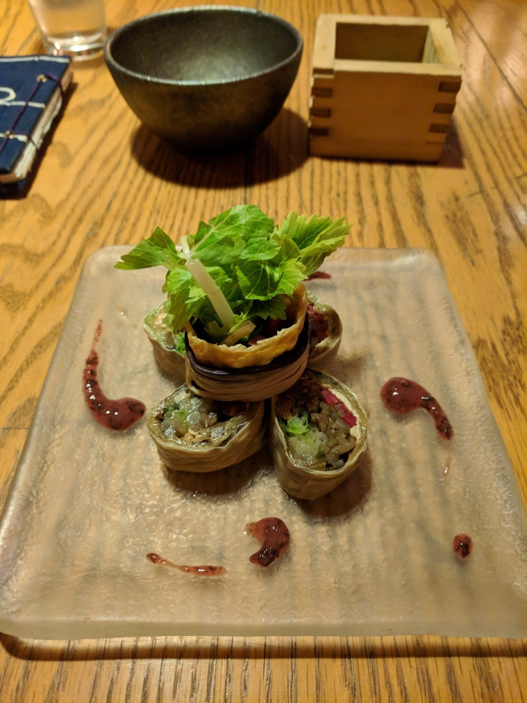

% Vegetarian & Vegan Food Diary Japan
% Rushi Shah
% 9 November 2018

# Vegetarian & Vegan Food Diary Japan

Notes: use the HappyCow app/website to find vegetarian/vegan friendly restaurants. Prices listed are in JPY. Most restaurants listed are in Tokyo and the location includes what district they are near. Convenience stores: get onigiri, which is rice balls with some filling. The pickled-plum onigiri are vegan friendly. 

### T's TanTan (Tokyo station & Ueno station & T's restaurant)

Tonkotsu was favorite, black sesame was eh, white sesame was good, shoyu was eh, gyoza was only good at T's restaurant. 800-1200 depending on which ramen and appetizer

[T's Restaurant Happy Cow](https://www.happycow.net/reviews/rainbow-bird-rendezvous-tokyo-22968)
[T's Tantan Tokyo Station Happy Cow](https://www.happycow.net/reviews/ts-tantan-tokyo-29533)
[T's Tantan Ueno Station Happy Cow](https://www.happycow.net/reviews/ts-tantan-tokyo-106436)

### Kyushu Jangara (Ginza & Ikebukero)
Pretty good ramen, soy sauce based. \~1000

[Ikebukero Happy Cow](https://www.happycow.net/reviews/kyushu-jangara-ramen-tokyo-103650)
[Ginza Happy Cow](https://www.happycow.net/reviews/kyushu-jangara-ramen-tokyo-107096)

### Sorano

Need a reservation, but I just bugged them enough about making one several weeks in the future that they seated me immediately. Tofu cheesecake was a game-changer, but I'm still salty they didn't take me seriously when I tried to get a table. 

### Sora No Iro (Tokyo Station)
Alright ramen, but pretty busy and maybe not worth waiting. 
[Happy Cow](https://www.happycow.net/reviews/sora-no-iro-tokyo-120511)

### Rainbow Bird Rendezvous (Naka-Meguro)
Ramen wasn't my favorite but lots of other options. \~1200

[Happy Cow](https://www.happycow.net/reviews/rainbow-bird-rendezvous-tokyo-22968)

### Toryanse (Asakusa)
DO NOT GO. salt-ramen that tastes like noodles in salty water. Saw huge roach at end of meal. 900+100 upsize

### Ippudo ramen (inside Narita airport terminal one)
Menu is clearly marked, and indicates that even vegetarian option has noodles made with eggs. Not great compared to Tokyo/Japan, but probably best you'll get in airport.

### The Counter (Roppongi)
Awesome build your own veggie burger. Order with pineapple and you'll get a thicc slice of grilled pineapple that really pulls the burger together. 

### Senjo Handmade Gyoza (Ikebukero)
Vegetarian black bean gyoza in a hole-in-the-wall. Good experience, but not highly recommended. Little under 1000 for 8-10 pieces of gyoza. 

[Google Maps](https://www.google.com/maps/place/WASH+handmade+dumpling+shop/@35.7362532,139.7027215,16z/data=!4m5!3m4!1s0x0:0xe253c88febc5fa40!8m2!3d35.7341247!4d139.7079782) and [Happy Cow](https://www.happycow.net/reviews/senjo-handmade-gyoza-shop-tokyo-39225)

### Hibiya Central Market 
Upscale izakaya has heavenly walnut dressing soba noodles. \~900, but might also get charged a \~400 cover that includes edmame if you don't eat at bar. Izakaya is on top floor, near a photograph shop. 

https://hibiya-central-market.jp/about/

### Taco Bell
Things at Taco Bell can be made vegetarian, but they don't use beans it's just Mexican rice. It is not fast food so much as it is fast casual. \~650 got a burrito

### Indian Restaurants
Hard to go wrong, but also hard to find standout restaurants. Use HappyCow to find the nearest Indian restaurant for convenience to get typical north indian food (surprisingly good naan, curries are mostly sauce with little paneer/vegetables)

### Katsu Midori Sushi (Shibuya) 
Conveyor belt sushi that is english and vegetarian/vegan friendly! Sushi has options like avacado, corn, cucumber, natto, radish (100 per plate). Also avacado tempura (250 per plate). Two of everything vegetarian cost about \~2000 which is enough to feed a small meal to four people. Can get busy, but we accidentally went *right* before closing so it wasn't busy at all. 

[Happy Cow](https://www.happycow.net/reviews/katsu-midori-sushi-shibuya-tokyo-84977)

### Ain Soph.Ripple (Shinjuku-ish)
Burger restaurant. Not great, but not bad. 
[Happy Cow](https://www.happycow.net/reviews/ain-soph-ripple-tokyo-67695)

### Falafel Brothers (Roppongi)
Good mediterranean food!

### City Noodle Shop (Omotesando)

[Happy Cow](https://www.happycow.net/reviews/cityshop-noodle-tokyo-94378)

### Las Dos Caras (Omotesando)
Sit-down mexican restaurant. Not bad, not iconic. 

### Shugetsu (Osaka)
Soy milk based ramen, but ambience was too authentic (no AC 😓) (960)

### Chabuton (Kyoto)
Lots of vegetables in ramen, gyoza was good too (~1000 for gyoza + ramen)

### Mimikou (Kyoto)
Nine different noodle options. Ranked: udon (awesome, def make sure you get it with tempura), then ramen (pretty good, but doesn't come with tempura so get that on the side), then curry (skip the curry versions, they're basically Maggi)

### Chant Vegan Restaurant (Izu)
Good ambiance, definitely worth checking out when in Izu. 

